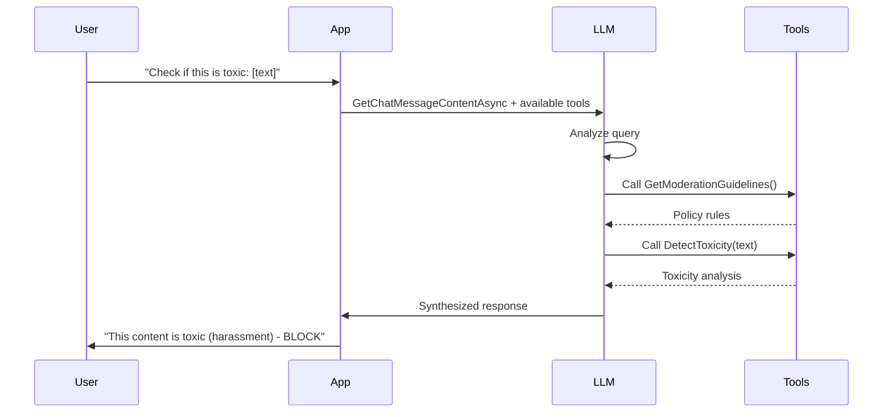

# Lab 06: Content Moderation Agent - Prompts as Functions (PAF)

## 🎯 Overview

Build a **Content Moderation Agent** that demonstrates the powerful pattern of using **prompt templates as callable function tools**. You'll create specialized prompt functions using **Handlebars** format and mix them with static C# functions, then let the LLM automatically orchestrate which tools to call based on user queries.

**Key Learning Objectives:**
- ✅ Create prompt functions using Handlebars template format
- ✅ Mix prompt-based functions with static C# functions
- ✅ Use `GetChatMessageContentAsync` with automatic function calling
- ✅ Understand how LLM selects appropriate tools based on descriptions
- ✅ See multi-function orchestration in action

**Estimated Time:** 20-25 minutes

---

## 📋 What You'll Build

A content moderation system with 4 specialized tools:

1. **SentimentAnalyzer** (Prompt Function) - Analyzes emotional tone
2. **ToxicityDetector** (Prompt Function) - Detects harmful content  
3. **LanguageDetector** (Prompt Function) - Identifies language
4. **GetModerationGuidelines** (Static C# Function) - Returns hardcoded policy rules

The LLM will automatically decide which functions to call based on the user's moderation request.

---

## 🏗️ Architecture

```
User Query: "Check if this is offensive: [text]"
    ↓
GetChatMessageContentAsync (with ChatHistory)
    ↓
LLM Analyzes Query → Decides to call:
    ├── GetModerationGuidelines() ← Static C# function
    └── DetectToxicity(text) ← Prompt function
    ↓
LLM Synthesizes Results → Final Response
```

---

## TODO 1 – Create SentimentAnalyzer

**Objective:** Create a prompt function using Handlebars format that analyzes text sentiment.

### Requirements

1. Create a `PromptTemplateConfig` object with:
   - **Template**: Multi-line Handlebars template
   - **TemplateFormat**: `"handlebars"`
   - **Name**: `"AnalyzeSentiment"`
   - **Description**: Clear description so LLM knows when to use this (e.g., "Analyzes emotional sentiment of text content")
   - **InputVariables**: Define parameter named `"text"`

2. The prompt template should:
   - Use `{{text}}` variable for input
   - Ask for sentiment classification (positive, negative, neutral)
   - Request confidence score (0.0 to 1.0)
   - Request brief reasoning
   - Specify output format as JSON

3. Return the function using:
   ```csharp
   return kernel.CreateFunctionFromPrompt(config, new HandlebarsPromptTemplateFactory());
   ```

### Example Template Structure

```
Analyze the sentiment of this text.
Return a JSON object with:
- sentiment: positive, negative, or neutral
- confidence: 0.0 to 1.0
- reason: brief explanation

Text: {{text}}

Output JSON only.
```

### Key Concepts

- **Handlebars syntax**: `{{variableName}}` for variables
- **PromptTemplateConfig**: Configuration object for structured prompts
- **InputVariables**: Define expected parameters with descriptions
- **HandlebarsPromptTemplateFactory**: Required factory for Handlebars templates

---

## TODO 2 – Create ToxicityDetector

**Objective:** Create a prompt function that detects harmful or policy-violating content.

### Requirements

1. Create a `PromptTemplateConfig` with:
   - **Template**: Handlebars format
   - **TemplateFormat**: `"handlebars"`
   - **Name**: `"DetectToxicity"`
   - **Description**: "Detects harmful, toxic, or policy-violating content"
   - **InputVariables**: `"text"` parameter

2. The prompt should check for:
   - Hate speech
   - Harassment
   - Violence
   - Adult content
   - Spam

3. Return JSON with structure:
   ```json
   {
     "isToxic": true/false,
     "categories": ["list of violations"],
     "severity": "low/medium/high/critical",
     "recommendation": "allow/flag/block"
   }
   ```

### Why This Matters

The LLM will use this function's **description** to determine when to call it. A clear description like "Detects harmful, toxic, or policy-violating content" helps the LLM understand this tool is for safety checks.

---

## TODO 3 – Create LanguageDetector

**Objective:** Create a prompt function that identifies the language of text.

### Requirements

1. Create a `PromptTemplateConfig` with:
   - **Template**: Handlebars format
   - **TemplateFormat**: `"handlebars"`
   - **Name**: `"DetectLanguage"`
   - **Description**: "Identifies the language of text content"
   - **InputVariables**: `"text"` parameter

2. The prompt should:
   - Detect the language
   - Return ISO 639-1 code (2 letters: en, es, fr, de, ja, zh, etc.)
   - Return **ONLY** the code (no extra text)

### Example Output

```
Input: "Bonjour, comment allez-vous?"
Output: "fr"

Input: "Hello, how are you?"
Output: "en"
```

---

## TODO 4 – Create ModerationPlugin

**Objective:** Create a static C# function that returns hardcoded moderation policy guidelines.

### Requirements

1. Add `[KernelFunction]` attribute to the method
2. Add `[Description("Returns the content moderation policy guidelines")]` attribute
3. Implement `GetModerationGuidelines()` method
4. Return a string containing the moderation policy

### Policy Structure

The returned string should include:

**BLOCK immediately:**
- Hate speech, harassment, threats
- Explicit violence or gore
- Adult/sexual content
- Spam or phishing attempts

**FLAG for review:**
- Borderline offensive language
- Political or controversial topics
- Unverified claims or misinformation

**ALLOW:**
- Constructive criticism
- Educational content
- Personal opinions (non-hateful)
- General discussions

### Why Static Functions?

This demonstrates mixing **dynamic prompts** (sentiment, toxicity) with **static data** (policy rules). The LLM can call both types of functions seamlessly.

---

## TODO 5 – RunModerationAgent

**Objective:** Orchestrate all functions using automatic function calling with `GetChatMessageContentAsync`.

### Requirements

1. **Create all prompt functions:**
   ```csharp
   var sentimentFunc = CreateSentimentAnalyzer(kernel);
   var toxicityFunc = CreateToxicityDetector(kernel);
   var languageFunc = CreateLanguageDetector(kernel);
   ```

2. **Register prompt functions as plugin:**
   ```csharp
   kernel.Plugins.AddFromFunctions("ModerationTools", new[]
   {
       sentimentFunc,
       toxicityFunc,
       languageFunc
   });
   ```

3. **Register static plugin:**
   ```csharp
   kernel.Plugins.AddFromType<ModerationPlugin>();
   ```

4. **Get chat completion service:**
   ```csharp
   var chatService = kernel.GetRequiredService<IChatCompletionService>();
   ```

5. **Create ChatHistory:**
   ```csharp
   var history = new ChatHistory();
   history.AddSystemMessage("You are a content moderation assistant. Use available tools to analyze content and make moderation decisions.");
   ```

6. **Add user message:**
   ```csharp
   if (!string.IsNullOrEmpty(contentToModerate))
   {
       history.AddUserMessage($"{userQuery}\n\nContent: {contentToModerate}");
   }
   else
   {
       history.AddUserMessage(userQuery);
   }
   ```

7. **Enable automatic function calling:**
   ```csharp
   var settings = new OpenAIPromptExecutionSettings
   {
       ToolCallBehavior = ToolCallBehavior.AutoInvokeKernelFunctions,
       Temperature = 0.0  // Deterministic function selection
   };
   ```

8. **Get response:**
   ```csharp
   var response = await chatService.GetChatMessageContentAsync(history, settings, kernel);
   return response.Content ?? "";
   ```

### How It Works



---

## 🧪 Testing

Run the lab:

```bash
cd lab/iter06
export OPENAI_API_KEY=your-key-here
dotnet run
```

**Expected Output:**
```
=== Content Moderation Agent Lab ===

Test 1: Create SentimentAnalyzer function
✓ PASS: SentimentAnalyzer created successfully

Test 2: Create ToxicityDetector function
✓ PASS: ToxicityDetector created successfully

Test 3: Create LanguageDetector function
✓ PASS: LanguageDetector created successfully

Test 4: Create ModerationPlugin with static function
✓ PASS: ModerationPlugin created with guidelines

Test 5: RunModerationAgent with function calling
✓ PASS: Agent responded: The sentiment of the review is positive...

=== Test Results: 5/5 PASSED ===
🎉 All tests passed! Lab complete!
```

---

## 🎓 Key Concepts

### Why Handlebars?

- **Standard format**: Industry-standard templating
- **Clear syntax**: `{{variable}}` is explicit
- **Validation**: SK validates templates at creation time
- **Consistency**: Matches other prompt template systems

### Prompts as Functions - The Power Pattern

This lab demonstrates **THE** critical pattern for building AI agents:

1. **Specialized Prompts**: Each function is an expert (sentiment, toxicity, language)
2. **Controlled Settings**: Each prompt has its own temperature, tokens, format
3. **LLM Orchestration**: AI decides which functions to call and when
4. **Composability**: Functions work together to solve complex tasks
5. **Mix Static + Dynamic**: Combine hardcoded data with AI-generated analysis

### When LLM Calls Functions

The LLM decides based on:
- **Function descriptions** (most important!)
- **User query content**
- **Conversation context**
- **Available parameters**

Example:
```
User: "What's the sentiment of this review?"
→ LLM calls: AnalyzeSentiment(text)

User: "Is this offensive?"
→ LLM calls: GetModerationGuidelines(), DetectToxicity(text)

User: "What language is this?"
→ LLM calls: DetectLanguage(text)
```

---

## 📚 Resources

- [Semantic Kernel Handlebars Templates](https://learn.microsoft.com/en-us/semantic-kernel/prompts/handlebars-templates)
- [Function Calling Documentation](https://learn.microsoft.com/en-us/semantic-kernel/agents/plugins/)
- [Chat Completion Reference](https://learn.microsoft.com/en-us/semantic-kernel/chat-completion)

---

## 🚀 Bonus Challenges

Once you complete all TODOs, try:

1. **Add ContentSummarizer** - Creates brief summaries of long content
2. **Add SpamDetector** - Detects promotional or spam content
3. **Multi-turn conversation** - Moderate multiple posts in one session
4. **Batch processing** - Analyze multiple pieces of content at once
5. **Confidence thresholds** - Only act on high-confidence results

---

**Good luck!** 🎉

Type `check` to validate your implementation without fixing errors.  
Type `explain` for hints on specific TODOs.
