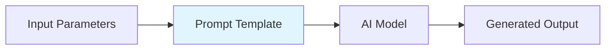
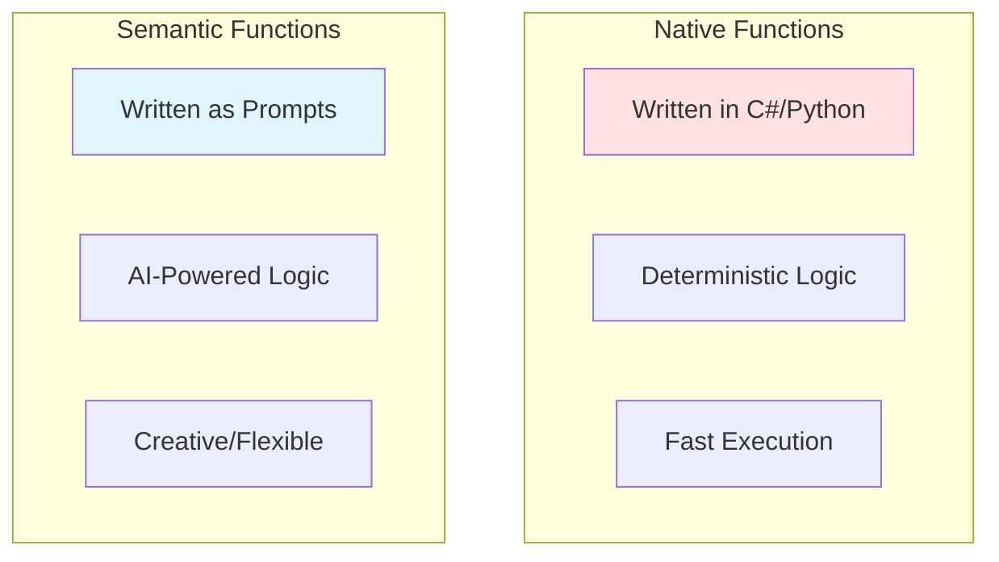
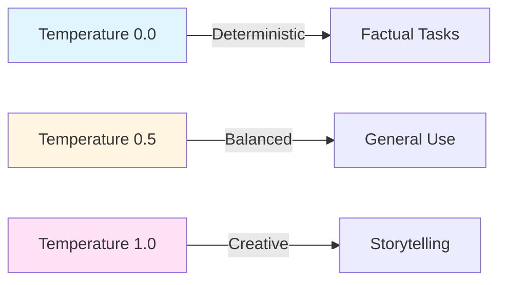
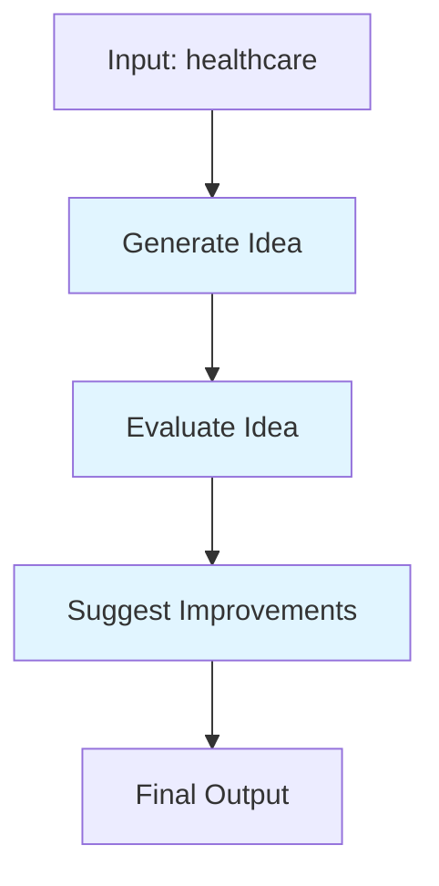
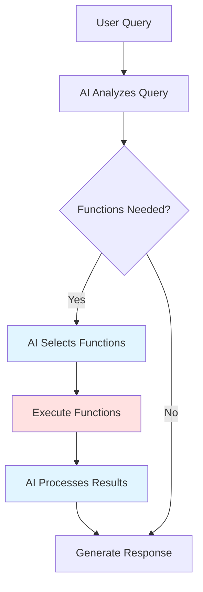

# Learning Materials: Prompt Engineering with Semantic Functions

**Iteration**: 02  
**Topic**: Prompt Engineering with Semantic Functions  
**Estimated Time**: ~20 minutes  
**Date**: December 1, 2025

---

## 📚 Overview

**Semantic Functions** are AI-powered functions defined by natural language prompts rather than code. They're the heart of prompt engineering in Semantic Kernel, allowing you to create reusable, configurable AI capabilities.

---

## 🎯 Core Concepts

### What is a Semantic Function?

A **Semantic Function** is a prompt template that:
- Takes input parameters
- Processes them through an AI model
- Returns generated text
- Can be reused across your application

Think of it as a **"prompt with superpowers"** – parameterized, version-controlled, and composable.



### Semantic vs Native Functions



---

## 🔧 Creating Semantic Functions

### Method 1: Inline Semantic Functions (Recommended for Simple Cases)

```csharp
using Microsoft.SemanticKernel;

var kernel = Kernel.CreateBuilder()
    .AddOpenAIChatCompletion("gpt-4o-mini", apiKey)
    .Build();

// Create an inline semantic function
var summarizeFunction = kernel.CreateFunctionFromPrompt(
    "Summarize the following text in 2-3 sentences: {{$input}}",
    functionName: "Summarize",
    description: "Summarizes text concisely"
);

// Execute it
var result = await kernel.InvokeAsync(summarizeFunction, 
    new() { ["input"] = "Long article text here..." });

Console.WriteLine(result);
```

**Key Points:**
- `{{$input}}` is a template variable
- Simple and quick for prototyping
- All configuration in one place

### Method 2: Prompt Template Configuration (Advanced)

```csharp
using Microsoft.SemanticKernel;
using Microsoft.SemanticKernel.Connectors.OpenAI;

var executionSettings = new OpenAIPromptExecutionSettings
{
    MaxTokens = 500,
    Temperature = 0.7,
    TopP = 0.9,
    FrequencyPenalty = 0.0,
    PresencePenalty = 0.0
};

var promptConfig = new PromptTemplateConfig
{
    Template = @"
        You are a creative storyteller.
        
        Create a {{$genre}} story about {{$topic}}.
        Keep it under {{$wordCount}} words.
    ",
    Name = "StoryGenerator",
    Description = "Generates creative stories",
};

promptConfig.ExecutionSettings.Add(executionSettings);

var storyFunction = kernel.CreateFunctionFromPrompt(
    promptConfig,
    functionName: "GenerateStory"
);

var story = await kernel.InvokeAsync(storyFunction, new()
{
    ["genre"] = "sci-fi",
    ["topic"] = "time travel",
    ["wordCount"] = "100"
});

Console.WriteLine(story);
```

---

## 🎨 Prompt Engineering Best Practices

### 1. **Be Specific and Clear**

❌ Bad:
```
Write something about {{$topic}}
```

✅ Good:
```
Write a professional 3-paragraph summary about {{$topic}}.
Include:
1. Overview
2. Key benefits
3. Use cases
```

### 2. **Use System Messages for Context**

```csharp
var promptConfig = new PromptTemplateConfig
{
    Template = @"
        <message role='system'>
        You are an expert software architect with 20 years of experience.
        Always provide practical, production-ready advice.
        </message>
        
        <message role='user'>
        {{$question}}
        </message>
    "
};
```

### 3. **Add Examples (Few-Shot Learning)**

```csharp
var translatorPrompt = @"
Translate technical terms to simple language:

Examples:
API → A way for programs to talk to each other
Database → Organized storage for information

Now translate: {{$term}}
";
```

### 4. **Control Output Format**

```csharp
var promptTemplate = @"
Analyze the sentiment of: {{$text}}

Return ONLY a JSON object:
{
  ""sentiment"": ""positive|negative|neutral"",
  ""confidence"": 0.0-1.0,
  ""reason"": ""brief explanation""
}
";
```

---

## 🧩 Template Variables

### Input Variable Types

```csharp
// 1. Simple input variable
"{{$input}}"

// 2. Named variables
"{{$name}}, {{$age}}, {{$city}}"

// 3. Using variables in context
var result = await kernel.InvokeAsync(function, new()
{
    ["name"] = "Alice",
    ["age"] = "30",
    ["city"] = "Seattle"
});
```

### Variable Syntax Rules
- Variables: `{{$variableName}}`
- Function calls: `{{pluginName.functionName}}`
- Nested properties: `{{$object.property}}`
- Case-sensitive
- No spaces in variable names

### Advanced Variable Features

```csharp
// 1. Default values
var prompt = "Hello {{$name ?? 'Guest'}}!";

// 2. Accessing nested properties
var context = new KernelArguments
{
    ["user"] = new { Name = "Alice", Age = 30 }
};
var greeting = "Hello {{$user.Name}}, you are {{$user.Age}} years old";

// 3. Calling functions in templates
var translatedGreeting = @"
    Original: {{$greeting}}
    Translated: {{TranslationPlugin.Translate greeting language='Spanish'}}
";
```

---

## 📊 Execution Settings Deep Dive

```csharp
var settings = new OpenAIPromptExecutionSettings
{
    // Maximum tokens in response (cost control)
    MaxTokens = 500,
    
    // Creativity level: 0.0 (focused) to 1.0 (creative)
    Temperature = 0.7,
    
    // Nucleus sampling: Consider top P% of tokens
    TopP = 0.9,
    
    // Reduce repetition (-2.0 to 2.0)
    FrequencyPenalty = 0.0,
    
    // Encourage new topics (-2.0 to 2.0)
    PresencePenalty = 0.0,
    
    // Stop sequences
    StopSequences = new[] { "END", "---" }
};
```

### Temperature Guide



**Use Cases:**

- **0.0-0.3**: Code generation, data extraction, factual Q&A
- **0.4-0.7**: Summaries, translations, general chat
- **0.8-1.0**: Creative writing, brainstorming, storytelling

---

## 🔌 Registering Semantic Functions as Plugins

One of the most powerful features in Semantic Kernel is the ability to register semantic functions as **plugins**. This makes them discoverable, reusable, and enables automatic function calling by planners.

### Why Register as Plugins?

**Benefits:**
- **Discoverability** - Planners can automatically find and use your functions
- **Organization** - Group related functions together
- **Invocation** - Cleaner syntax with plugin.function notation
- **Metadata** - Better descriptions for AI to understand function purpose
- **Composition** - Mix native C# and semantic functions in one plugin

### Method 1: Register Single Function as Plugin

```csharp
// Create a semantic function
var summarizer = kernel.CreateFunctionFromPrompt(
    "Summarize the following text in 2-3 sentences: {{$input}}",
    functionName: "Summarize",
    description: "Summarizes text concisely"
);

// Register it as a plugin
kernel.Plugins.AddFromFunctions("TextPlugin", new[] { summarizer });

// Invoke using plugin notation
var result = await kernel.InvokeAsync("TextPlugin", "Summarize",
    new() { ["input"] = "Long article text..." });
```

### Method 2: Create Plugin with Multiple Semantic Functions

```csharp
// Create multiple related functions
var writeEmail = kernel.CreateFunctionFromPrompt(
    "Write a professional email about: {{$topic}}",
    functionName: "WriteEmail",
    description: "Writes professional emails"
);

var summarizeEmail = kernel.CreateFunctionFromPrompt(
    "Summarize this email in one sentence: {{$input}}",
    functionName: "SummarizeEmail",
    description: "Summarizes email content"
);

var extractAction = kernel.CreateFunctionFromPrompt(
    "Extract action items from this email: {{$input}}",
    functionName: "ExtractActions",
    description: "Extracts action items from emails"
);

// Group them into one plugin
kernel.Plugins.AddFromFunctions("EmailPlugin", new[]
{
    writeEmail,
    summarizeEmail,
    extractAction
});

// Use them
var summary = await kernel.InvokeAsync("EmailPlugin", "SummarizeEmail",
    new() { ["input"] = emailText });
```

### Method 3: Mix Native and Semantic Functions

```csharp
// Create a class with native functions
public class TextPlugin
{
    [KernelFunction, Description("Converts text to uppercase")]
    public string ToUpper(string input) => input.ToUpper();

    [KernelFunction, Description("Counts words in text")]
    public int WordCount(string input) => input.Split(' ').Length;
}

// Register native plugin
kernel.Plugins.AddFromType<TextPlugin>("TextPlugin");

// Add semantic functions to complement it
var paraphraser = kernel.CreateFunctionFromPrompt(
    "Paraphrase this text: {{$input}}",
    functionName: "Paraphrase",
    description: "Rephrases text while preserving meaning"
);

kernel.Plugins.AddFromFunctions("TextPlugin", new[] { paraphraser });

// Now TextPlugin has both native (ToUpper, WordCount) and semantic (Paraphrase) functions
```

### Method 4: Invoke Plugin Functions from Templates

```csharp
// Register a translation plugin
var translator = kernel.CreateFunctionFromPrompt(
    "Translate to {{$language}}: {{$text}}",
    functionName: "Translate",
    description: "Translates text to specified language"
);

kernel.Plugins.AddFromFunctions("TranslationPlugin", new[] { translator });

// Use it in another prompt template
var multilingualGreeting = kernel.CreateFunctionFromPrompt(@"
    Original greeting: {{$greeting}}
    
    Spanish: {{TranslationPlugin.Translate greeting language='Spanish'}}
    French: {{TranslationPlugin.Translate greeting language='French'}}
");

var result = await kernel.InvokeAsync(multilingualGreeting,
    new() { ["greeting"] = "Hello, how are you?" });
```

### Method 5: Loading Prompts from Files (YAML/JSON)

Semantic Kernel supports loading prompt configurations from external files:

**prompt.yaml:**
```yaml
name: Summarizer
template: |
  Summarize the following text in {{$sentenceCount}} sentences:
  {{$input}}
description: Summarizes text to specified length
execution_settings:
  default:
    max_tokens: 500
    temperature: 0.3
```

**Loading the prompt:**

```csharp
var promptDirectory = Path.Combine(Directory.GetCurrentDirectory(), "Prompts");
var summarizer = kernel.CreateFunctionFromPromptYaml(
    File.ReadAllText(Path.Combine(promptDirectory, "prompt.yaml"))
);

kernel.Plugins.AddFromFunctions("FilePrompts", new[] { summarizer });
```

### Accessing Registered Functions

```csharp
// Get a specific function from a plugin
var function = kernel.Plugins.GetFunction("EmailPlugin", "WriteEmail");
var result = await kernel.InvokeAsync(function, new() { ["topic"] = "Meeting summary" });

// List all plugins
foreach (var plugin in kernel.Plugins)
{
    Console.WriteLine($"Plugin: {plugin.Name}");
    foreach (var function in plugin)
    {
        Console.WriteLine($"  - {function.Name}: {function.Description}");
    }
}
```

---

## 🔄 Chaining Semantic Functions

```csharp
// Create multiple functions
var generateIdea = kernel.CreateFunctionFromPrompt(
    "Generate a creative app idea for: {{$domain}}"
);

var evaluateIdea = kernel.CreateFunctionFromPrompt(
    "Evaluate this app idea and list 3 pros and 3 cons:\n{{$input}}"
);

var improveIdea = kernel.CreateFunctionFromPrompt(
    "Based on this evaluation:\n{{$input}}\n\nSuggest 3 improvements"
);

// Chain them
var idea = await kernel.InvokeAsync(generateIdea, 
    new() { ["domain"] = "healthcare" });

var evaluation = await kernel.InvokeAsync(evaluateIdea, 
    new() { ["input"] = idea.ToString() });

var improvements = await kernel.InvokeAsync(improveIdea, 
    new() { ["input"] = evaluation.ToString() });

Console.WriteLine(improvements);
```



---

## 💡 Real-World Examples

### Example 1: Email Composer

```csharp
var emailComposer = kernel.CreateFunctionFromPrompt(@"
    Write a professional email with the following:
    
    To: {{$recipient}}
    Purpose: {{$purpose}}
    Tone: {{$tone}}
    Key Points:
    {{$keyPoints}}
    
    Format as a complete email with subject line.
",
    new OpenAIPromptExecutionSettings
    {
        Temperature = 0.7,
        MaxTokens = 400
    }
);

var email = await kernel.InvokeAsync(emailComposer, new()
{
    ["recipient"] = "Engineering Team",
    ["purpose"] = "Announce new feature release",
    ["tone"] = "enthusiastic but professional",
    ["keyPoints"] = "- Launch date: Next Monday\n- New AI features\n- Training session available"
});
```

### Example 2: Code Reviewer

```csharp
var codeReviewer = kernel.CreateFunctionFromPrompt(@"
    Review this {{$language}} code for:
    1. Bugs and potential issues
    2. Best practices violations
    3. Performance concerns
    4. Security vulnerabilities
    
    Code:
    {{$code}}
    
    Provide specific, actionable feedback.
",
    new OpenAIPromptExecutionSettings
    {
        Temperature = 0.3,  // Low for accuracy
        MaxTokens = 1000
    }
);
```

### Example 3: Data Extractor

```csharp
var dataExtractor = kernel.CreateFunctionFromPrompt(@"
    Extract structured data from this text:
    {{$input}}
    
    Return ONLY valid JSON with these fields:
    - name
    - email
    - phone
    - company
    
    If a field is not found, use null.
",
    new OpenAIPromptExecutionSettings
    {
        Temperature = 0.0,  // Deterministic
        MaxTokens = 200
    }
);
```

---

## 🤖 Automatic Function Calling & Planners

One of Semantic Kernel's most powerful features is **automatic function calling** - the AI can automatically decide which functions to call and chain them together.

### Function Calling with Chat Completion

```csharp
using Microsoft.SemanticKernel;
using Microsoft.SemanticKernel.ChatCompletion;
using Microsoft.SemanticKernel.Connectors.OpenAI;

// Create semantic functions
var getWeather = kernel.CreateFunctionFromPrompt(
    "Return the weather for {{$city}} (simulated)",
    functionName: "GetWeather",
    description: "Gets current weather for a city"
);

var calculateTrip = kernel.CreateFunctionFromPrompt(
    "Calculate trip cost for {{$distance}} miles at {{$pricePerMile}} per mile",
    functionName: "CalculateTripCost",
    description: "Calculates travel cost based on distance"
);

// Register as plugins
kernel.Plugins.AddFromFunctions("TravelPlugin", new[] { getWeather, calculateTrip });

// Enable automatic function calling
var chatService = kernel.GetRequiredService<IChatCompletionService>();
var executionSettings = new OpenAIPromptExecutionSettings
{
    ToolCallBehavior = ToolCallBehavior.AutoInvokeKernelFunctions
};

var chatHistory = new ChatHistory();
chatHistory.AddUserMessage("What's the weather in Seattle and how much would a 50-mile trip cost at $0.50/mile?");

// AI will automatically call GetWeather and CalculateTripCost
var result = await chatService.GetChatMessageContentAsync(
    chatHistory,
    executionSettings,
    kernel
);

Console.WriteLine(result.Content);
```

### How It Works



### Manual Function Selection

```csharp
// Let AI choose but don't auto-execute
var executionSettings = new OpenAIPromptExecutionSettings
{
    ToolCallBehavior = ToolCallBehavior.EnableKernelFunctions
};

var result = await chatService.GetChatMessageContentAsync(
    chatHistory,
    executionSettings,
    kernel
);

// Inspect which functions the AI wants to call
foreach (var toolCall in result.ToolCalls)
{
    Console.WriteLine($"AI wants to call: {toolCall.PluginName}.{toolCall.FunctionName}");
    Console.WriteLine($"With arguments: {toolCall.Arguments}");
}
```

---

## 🎯 Advanced Patterns

### Pattern 1: Conditional Logic in Prompts

```csharp
var conditionalPrompt = @"
{{#if $includeExamples}}
Here are some examples:
- Example 1
- Example 2
{{/if}}

Process: {{$input}}

{{#if $verbose}}
Provide detailed explanation.
{{else}}
Keep response concise.
{{/if}}
";
```

### Pattern 2: Prompt Versioning

```csharp
// v1.0 - Basic
var v1Prompt = "Summarize: {{$input}}";

// v2.0 - Enhanced with structure
var v2Prompt = @"
Summarize the following with:
1. Main point (1 sentence)
2. Key details (bullet points)
3. Conclusion (1 sentence)

Text: {{$input}}
";

// Use appropriate version
var summarizer = kernel.CreateFunctionFromPrompt(
    useEnhanced ? v2Prompt : v1Prompt
);
```

### Pattern 3: Error Handling

```csharp
var robustPrompt = @"
Task: {{$task}}

Important: 
- If the task is unclear, respond with 'CLARIFICATION_NEEDED: [reason]'
- If the task is impossible, respond with 'CANNOT_COMPLETE: [reason]'
- Otherwise, complete the task normally

Response:
";
```

### Pattern 4: Streaming Responses

For long-running prompts, stream the response to show progress:

```csharp
var storyteller = kernel.CreateFunctionFromPrompt(
    "Write a detailed story about {{$topic}}",
    functionName: "WriteStory"
);

// Stream the response
await foreach (var chunk in kernel.InvokeStreamingAsync<string>(storyteller,
    new() { ["topic"] = "space exploration" }))
{
    Console.Write(chunk);  // Display as it generates
}
```

### Pattern 5: Prompt Filters & Middleware

Intercept and modify prompts before/after execution:

```csharp
public class LoggingFilter : IPromptRenderFilter
{
    public async Task OnPromptRenderAsync(PromptRenderContext context, Func<PromptRenderContext, Task> next)
    {
        Console.WriteLine($"Before: {context.RenderedPrompt}");
        await next(context);
        Console.WriteLine($"After: {context.RenderedPrompt}");
    }
}

// Add filter to kernel
var builder = Kernel.CreateBuilder();
builder.Services.AddSingleton<IPromptRenderFilter, LoggingFilter>();
var kernel = builder.Build();
```

### Pattern 6: Multi-Shot Prompting with Context

```csharp
var codeGenerator = kernel.CreateFunctionFromPrompt(@"
    You are an expert C# developer.
    
    Previous examples:
    User: Create a class for a person
    Assistant: 
    ```csharp
    public class Person 
    {
        public string Name { get; set; }
        public int Age { get; set; }
    }
```

    User: Add a method to greet
    Assistant:
    ```csharp
    public string Greet() => $""Hello, I'm {Name}"";
    ```
    
    Now help with this:
    User: {{$request}}
    Assistant:
",
    functionName: "GenerateCode",
    description: "Generates C# code based on examples"
);
```

---

## 📈 Testing & Iteration

### Test Your Prompts

```csharp
async Task TestPrompt(KernelFunction function, Dictionary<string, string> testCases)
{
    foreach (var testCase in testCases)
    {
        Console.WriteLine($"\n=== Test: {testCase.Key} ===");
        var result = await kernel.InvokeAsync(function, 
            new() { ["input"] = testCase.Value });
        Console.WriteLine(result);
    }
}

var tests = new Dictionary<string, string>
{
    ["Short text"] = "AI is cool.",
    ["Medium text"] = "Artificial intelligence transforms...",
    ["Empty"] = "",
    ["Numbers"] = "123 456 789"
};

await TestPrompt(summarizer, tests);
```

### Metrics to Track

1. **Response Quality** - Does it meet requirements?
2. **Consistency** - Same input → similar outputs?
3. **Token Usage** - Cost efficiency
4. **Latency** - Response time
5. **Error Rate** - Failure cases

---

## 🚀 Best Practices Summary

✅ **DO:**
- Start simple, iterate based on results
- Use low temperature (0.0-0.3) for factual tasks
- Include examples in prompts (few-shot learning)
- Specify output format explicitly
- Test with edge cases
- Version your prompts
- Set reasonable `MaxTokens` limits
- Register functions as plugins for discoverability
- Use descriptive function names and descriptions
- Enable automatic function calling when appropriate
- Stream responses for long-running prompts

❌ **DON'T:**
- Make prompts overly complex
- Use high temperature for deterministic tasks
- Assume the AI "knows" your context
- Ignore token costs
- Skip testing different parameter combinations
- Hardcode values that should be variables
- Forget to add descriptions to your functions (needed for AI to understand them)
- Mix too many unrelated functions in one plugin

---

## 📚 Additional Resources

### Official Documentation
- [Semantic Kernel Prompts Guide](https://learn.microsoft.com/en-us/semantic-kernel/prompts/)
- [OpenAI Prompt Engineering Guide](https://platform.openai.com/docs/guides/prompt-engineering)

### Video Tutorials
- [Semantic Kernel Getting Started](https://www.youtube.com/results?search_query=semantic+kernel+prompt+engineering)
- [Advanced Prompt Engineering Techniques](https://www.youtube.com/results?search_query=prompt+engineering+best+practices)

### Articles
- [Prompt Engineering Best Practices - OpenAI](https://help.openai.com/en/articles/6654000-best-practices-for-prompt-engineering)
- [A Complete Guide to Prompt Engineering](https://www.promptingguide.ai/)

---

## 🎓 Key Takeaways

1. **Semantic Functions = Prompts as Functions** - Create reusable AI-powered functions from natural language prompts
2. **Plugin Registration** - Register semantic functions as plugins for discoverability and automatic function calling
3. **Template Variables** - Use `{{$variableName}}` for dynamic inputs, `{{plugin.function}}` for function calls
4. **Temperature Controls Creativity** - 0.0 for facts, 1.0 for creativity
5. **Be Specific** - Clear instructions yield better results
6. **Test & Iterate** - Prompt engineering is experimental
7. **Chain Functions** - Break complex tasks into steps, or let AI auto-select functions
8. **Control Costs** - Set `MaxTokens` appropriately
9. **Streaming Responses** - Use streaming for long-running prompts to show progress
10. **Mix Native & Semantic** - Combine C# code and AI prompts in the same plugin

---

## ✨ Practice Challenge

Before moving to the quiz, try creating a semantic function for one of these tasks:

1. **Meeting Notes Summarizer** - Takes raw meeting notes and creates action items
2. **Code Explainer** - Takes code snippet and explains it in simple terms
3. **Sentiment Analyzer** - Analyzes customer feedback and categorizes it

When you're ready, type `next` to take the quiz!
