# Learning Materials: Microsoft Semantic Kernel with .NET C# and OpenAI

**Iteration**: 01  
**Topic**: Microsoft Semantic Kernel - .NET C# with OpenAI APIs  
**Estimated Time**: ~20 minutes  
**Date**: November 30, 2025

---

## 🎯 What is Semantic Kernel?

**Semantic Kernel (SK)** is an open-source SDK from Microsoft that acts as a **bridge** between your C# applications and AI services (like OpenAI). Think of it as the "glue" that makes it easy to integrate Large Language Models (LLMs) into your .NET apps.

### The Big Picture


**Key Intuition**: Instead of manually handling HTTP calls, parsing responses, and managing conversation context with AI APIs, Semantic Kernel does the heavy lifting for you.

---

## 🧩 Core Concepts (The Foundation)

### 1. **Kernel** - The Orchestrator

The `Kernel` is the central coordinator. It's like a **conductor of an orchestra** - it manages:
- AI services (OpenAI, Azure OpenAI, etc.)
- Plugins (your custom functions)
- Memory/context
- Execution flow

```csharp
// Creating a basic kernel
var builder = Kernel.CreateBuilder();
builder.AddOpenAIChatCompletion(
    modelId: "gpt-4",
    apiKey: Environment.GetEnvironmentVariable("OPENAI_API_KEY")
);
Kernel kernel = builder.Build();
```

### 2. **Prompts** - Talking to AI

Prompts are how you communicate with the AI. SK makes it easy:

```csharp
// Simple prompt
var result = await kernel.InvokePromptAsync("What is C#?");
Console.WriteLine(result);

// Prompt with variables
var prompt = "Translate '{{$text}}' to {{$language}}";
var result = await kernel.InvokePromptAsync(prompt, new() {
    ["text"] = "Hello",
    ["language"] = "Spanish"
});
```

### 3. **Plugins** - Extending AI with Code

Plugins let the AI **call your C# functions**. This is where the magic happens!

```mermaid
sequenceDiagram
    participant User
    participant AI
    participant Plugin
    
    User->>AI: "What's the weather in Seattle?"
    AI->>Plugin: GetWeather("Seattle")
    Plugin->>AI: "72°F, Sunny"
    AI->>User: "The weather in Seattle is 72°F and sunny!"
```



**Example Plugin:**

```csharp
public class WeatherPlugin
{
    [KernelFunction, Description("Get current weather for a city")]
    public string GetWeather(
        [Description("City name")] string city)
    {
        // Your weather API call here
        return $"Weather in {city}: 72°F, Sunny";
    }
}

// Register the plugin
kernel.ImportPluginFromObject(new WeatherPlugin(), "Weather");
```

### 4. **Planner** - AI That Plans

The Planner lets AI **decide which functions to call** to accomplish a goal.

```csharp
// AI automatically figures out it needs to:
// 1. Get weather
// 2. Suggest activities based on weather
var result = await kernel.InvokePromptAsync(
    "What should I do in Seattle today?",
    new() { 
        ToolCallBehavior = ToolCallBehavior.AutoInvokeKernelFunctions 
    }
);
```

---

## 🚀 Your First Semantic Kernel App (Step-by-Step)

### Prerequisites
- .NET 8.0 SDK
- OpenAI API key (you already have this!)
- VS Code or Visual Studio

### Step 1: Create a Project

```bash
dotnet new console -n MyFirstSKApp
cd MyFirstSKApp
dotnet add package Microsoft.SemanticKernel
```

### Step 2: Basic "Hello World" with OpenAI

```csharp
using Microsoft.SemanticKernel;

// Build the kernel
var builder = Kernel.CreateBuilder();
builder.AddOpenAIChatCompletion(
    modelId: "gpt-3.5-turbo",  // or "gpt-4"
    apiKey: Environment.GetEnvironmentVariable("OPENAI_API_KEY")
);
Kernel kernel = builder.Build();

// Chat with AI
var response = await kernel.InvokePromptAsync(
    "Explain Semantic Kernel in one sentence."
);
Console.WriteLine(response);
```

### Step 3: Add a Custom Plugin

```csharp
using System.ComponentModel;
using Microsoft.SemanticKernel;

// Define your plugin
public class MathPlugin
{
    [KernelFunction, Description("Add two numbers")]
    public int Add(
        [Description("First number")] int a,
        [Description("Second number")] int b)
    {
        return a + b;
    }
    
    [KernelFunction, Description("Multiply two numbers")]
    public int Multiply(int a, int b)
    {
        return a * b;
    }
}

// In your Program.cs
var builder = Kernel.CreateBuilder();
builder.AddOpenAIChatCompletion(
    modelId: "gpt-4",
    apiKey: Environment.GetEnvironmentVariable("OPENAI_API_KEY")
);
Kernel kernel = builder.Build();

// Import the plugin
kernel.ImportPluginFromObject(new MathPlugin(), "Math");

// Enable automatic function calling
var executionSettings = new OpenAIPromptExecutionSettings 
{ 
    ToolCallBehavior = ToolCallBehavior.AutoInvokeKernelFunctions 
};

// AI will automatically call your Math functions!
var result = await kernel.InvokePromptAsync(
    "What is 25 multiplied by 4, then add 10?",
    new(executionSettings)
);
Console.WriteLine(result);
```

**What happens behind the scenes:**
1. AI understands it needs to multiply 25 × 4
2. Calls `Math.Multiply(25, 4)` → returns 100
3. AI understands it needs to add 10
4. Calls `Math.Add(100, 10)` → returns 110
5. AI responds: "The result is 110"

---

## 🧠 Key Patterns & Best Practices

### Pattern 1: Chat History Management

```csharp
using Microsoft.SemanticKernel.ChatCompletion;

var chatService = kernel.GetRequiredService<IChatCompletionService>();
var history = new ChatHistory();

// Add system message
history.AddSystemMessage("You are a helpful coding assistant.");

// Conversation loop
while (true)
{
    Console.Write("You: ");
    var userInput = Console.ReadLine();
    if (string.IsNullOrEmpty(userInput)) break;
    
    history.AddUserMessage(userInput);
    
    var response = await chatService.GetChatMessageContentAsync(
        history, 
        kernel: kernel
    );
    
    history.AddAssistantMessage(response.Content);
    Console.WriteLine($"AI: {response.Content}");
}
```

### Pattern 2: Semantic Functions (Prompt Templates)

```csharp
// Define a reusable semantic function
var translateFunction = kernel.CreateFunctionFromPrompt(
    "Translate the following text to {{$language}}:\n{{$text}}",
    functionName: "Translate",
    description: "Translate text to target language"
);

// Use it
var result = await kernel.InvokeAsync(translateFunction, new() {
    ["text"] = "Good morning!",
    ["language"] = "French"
});
Console.WriteLine(result); // "Bonjour!"
```

### Pattern 3: Combining Multiple Plugins

```csharp
// Import multiple plugins
kernel.ImportPluginFromObject(new WeatherPlugin(), "Weather");
kernel.ImportPluginFromObject(new CalendarPlugin(), "Calendar");
kernel.ImportPluginFromObject(new EmailPlugin(), "Email");

// AI can now orchestrate across all plugins!
var result = await kernel.InvokePromptAsync(
    @"Check if I have any meetings tomorrow. If the weather is 
      good, send an email to john@example.com suggesting lunch outside.",
    new(executionSettings)
);
```

---

## 🔑 Important Configuration Details

### OpenAI Setup (What You're Using)

```csharp
var builder = Kernel.CreateBuilder();
builder.AddOpenAIChatCompletion(
    modelId: "gpt-4",  // or "gpt-3.5-turbo"
    apiKey: Environment.GetEnvironmentVariable("OPENAI_API_KEY")
);

// Optional: Add custom HTTP client for proxies, timeouts, etc.
builder.AddOpenAIChatCompletion(
    modelId: "gpt-4",
    apiKey: apiKey,
    httpClient: new HttpClient { Timeout = TimeSpan.FromSeconds(60) }
);
```

### Execution Settings (Control AI Behavior)

```csharp
var settings = new OpenAIPromptExecutionSettings
{
    Temperature = 0.7,        // Creativity (0.0 - 2.0)
    MaxTokens = 500,          // Response length limit
    TopP = 0.9,               // Nucleus sampling
    FrequencyPenalty = 0.5,   // Reduce repetition
    PresencePenalty = 0.5,    // Encourage new topics
    
    // Enable function calling
    ToolCallBehavior = ToolCallBehavior.AutoInvokeKernelFunctions
};

var result = await kernel.InvokePromptAsync(
    "Your prompt here",
    new(settings)
);
```

---

## 📊 Architecture Comparison

### Traditional Approach vs Semantic Kernel


**SK Benefits:**
✅ Automatic function calling  
✅ Built-in retry logic  
✅ Error handling  
✅ Multi-model support  
✅ Plugin architecture  
✅ Memory management  

---

## 🎓 Learning Checkpoint

You now understand:
1. ✅ What Semantic Kernel is and why it exists
2. ✅ The 4 core concepts: Kernel, Prompts, Plugins, Planner
3. ✅ How to create your first SK app with OpenAI
4. ✅ How to build custom plugins that AI can call
5. ✅ Chat history management
6. ✅ Configuration and execution settings

---

## 📚 Recommended Resources

**Video Tutorials:**
1. 🎥 [Global AI Bootcamp 2025 - Intro to Semantic Kernel in C#](https://www.youtube.com/watch?v=BeAJZAURlUo)  
   *Microsoft Reactor - Great overview of core concepts*

2. 🎥 [AI Agent Beginners Tutorial in C#](https://www.youtube.com/watch?v=H3ovjkBFOw4)  
   *Evan Gudmestad - Step-by-step from zero to AI agent*

**Documentation:**
- 📖 [Official Semantic Kernel Docs](https://learn.microsoft.com/en-us/semantic-kernel/)
- �� [Quick Start Guide](https://learn.microsoft.com/en-us/semantic-kernel/get-started/quick-start-guide)
- 📖 [.NET AI Samples](https://learn.microsoft.com/en-us/samples/dotnet/ai-samples/ai-samples/)

**Articles:**
- 📝 [Creating AI Agents with Semantic Kernel](https://thecodestreet.dev/post/how-to-create-your-first-agent-with-the-agentic-framework-in-semantic-kernel-and-.net/)

---

## 🚦 Next Steps

After reviewing these materials, you can:
- Type `next` to take a quiz on what you've learned
- Type `prev` to go back to topic selection
- Ask questions about any concept that's unclear

**Ready to test your knowledge? Type `next` when you're ready for the quiz!**
