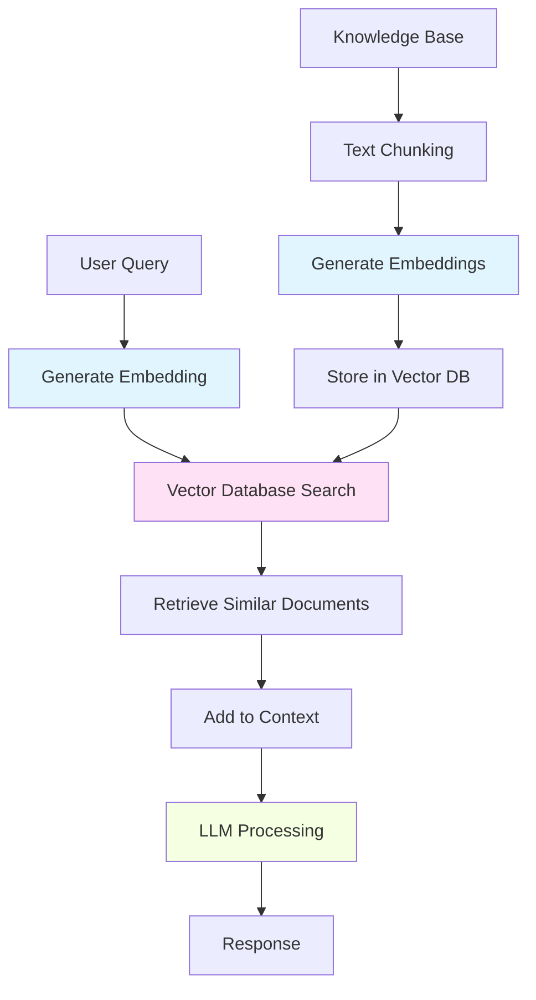
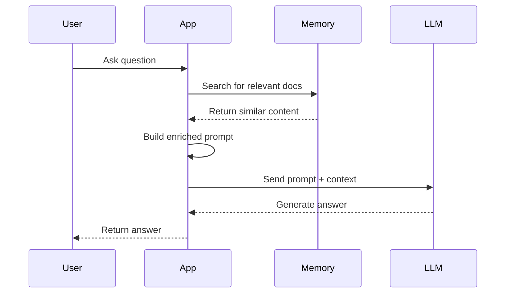
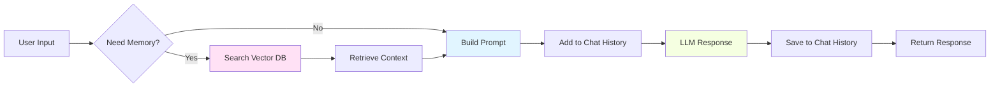

# Memory & Context Management in Semantic Kernel

## Overview
Memory and context management are essential for building AI applications that can remember past interactions, learn from data, and provide contextually relevant responses. In Semantic Kernel, you can manage conversation history, persist user context, and leverage semantic memory with embeddings and vector databases.

## Core Concepts

### 1. Chat History (Conversational Context)
Chat history maintains the context of a conversation between user and AI. This is crucial for multi-turn conversations where the AI needs to remember what was discussed previously.

**Key Points:**
- Stores messages from user and assistant
- Enables context-aware responses
- Can be limited by token constraints
- Usually managed in-memory or persisted to storage

### 2. Semantic Memory (Long-term Knowledge)
Semantic memory uses embeddings (vector representations) to store and retrieve information based on meaning rather than exact matches. This enables the AI to find relevant information even when queries use different wording.

**Key Points:**
- Uses embeddings to represent text as vectors
- Enables similarity search across large datasets
- Requires a vector database (e.g., Azure AI Search, Qdrant, Pinecone)
- Perfect for RAG (Retrieval Augmented Generation) patterns

### 3. Context Variables
Context variables are key-value pairs that flow through your SK pipeline, providing dynamic data to prompts and functions.

**Key Points:**
- Pass data between functions
- Inject dynamic values into prompts
- Can be updated during execution
- Scoped to a specific execution context

---

## Working with Chat History

### Basic Chat History Implementation

```csharp
using Microsoft.SemanticKernel;
using Microsoft.SemanticKernel.ChatCompletion;

var builder = Kernel.CreateBuilder();
builder.AddOpenAIChatCompletion("gpt-4", Environment.GetEnvironmentVariable("OPENAI_API_KEY"));
var kernel = builder.Build();

var chatService = kernel.GetRequiredService<IChatCompletionService>();
var chatHistory = new ChatHistory();

// System message to set behavior
chatHistory.AddSystemMessage("You are a helpful AI assistant that remembers our conversation.");

// Conversation loop
while (true)
{
    Console.Write("You: ");
    var userInput = Console.ReadLine();
    if (string.IsNullOrEmpty(userInput)) break;
    
    chatHistory.AddUserMessage(userInput);
    
    var response = await chatService.GetChatMessageContentAsync(chatHistory);
    chatHistory.AddAssistantMessage(response.Content);
    
    Console.WriteLine($"AI: {response.Content}");
}
```

### Chat History with System Prompts

```csharp
var chatHistory = new ChatHistory();

// Define the AI''s personality and behavior
chatHistory.AddSystemMessage(@"
You are a technical mentor specializing in C# and .NET.
- Be concise but thorough
- Use code examples when helpful
- Encourage best practices
");

chatHistory.AddUserMessage("How do I create a list in C#?");
var response = await chatService.GetChatMessageContentAsync(chatHistory);
chatHistory.Add(response);
```

---

## Semantic Memory Architecture



---

## Working with Semantic Memory

### Setting Up Memory with Vector Store

```csharp
using Microsoft.SemanticKernel;
using Microsoft.SemanticKernel.Connectors.OpenAI;
using Microsoft.SemanticKernel.Memory;

#pragma warning disable SKEXP0001, SKEXP0010, SKEXP0050

var builder = Kernel.CreateBuilder();

// Add chat completion
builder.AddOpenAIChatCompletion(
    "gpt-4",
    Environment.GetEnvironmentVariable("OPENAI_API_KEY")
);

// Add text embedding generation
builder.AddOpenAITextEmbeddingGeneration(
    "text-embedding-ada-002",
    Environment.GetEnvironmentVariable("OPENAI_API_KEY")
);

var kernel = builder.Build();

// Create memory store (in-memory for demo, use Azure AI Search or Qdrant for production)
var memoryBuilder = new MemoryBuilder();
memoryBuilder.WithOpenAITextEmbeddingGeneration(
    "text-embedding-ada-002",
    Environment.GetEnvironmentVariable("OPENAI_API_KEY")
);
memoryBuilder.WithMemoryStore(new VolatileMemoryStore());

var memory = memoryBuilder.Build();
```

### Adding Information to Memory

```csharp
// Collection name (like a table or index)
const string collectionName = "product-knowledge";

// Add multiple facts to memory
await memory.SaveInformationAsync(
    collection: collectionName,
    id: "product-1",
    text: "The ProductX API allows real-time inventory tracking with REST endpoints."
);

await memory.SaveInformationAsync(
    collection: collectionName,
    id: "product-2",
    text: "ProductX supports OAuth 2.0 authentication and requires API keys for all requests."
);

await memory.SaveInformationAsync(
    collection: collectionName,
    id: "product-3",
    text: "Rate limits for ProductX API are 1000 requests per hour for standard tier."
);

Console.WriteLine("✅ Memory populated with product knowledge");
```

### Searching Memory (Semantic Search)

```csharp
// User asks a question
var query = "How do I authenticate with the API?";

// Search memory for relevant information
var results = memory.SearchAsync(
    collection: collectionName,
    query: query,
    limit: 2,
    minRelevanceScore: 0.7
);

Console.WriteLine($"\n🔍 Searching memory for: {query}\n");

await foreach (var result in results)
{
    Console.WriteLine($"Relevance: {result.Relevance:P0}");
    Console.WriteLine($"Text: {result.Metadata.Text}");
    Console.WriteLine();
}
```

**Output:**
```
🔍 Searching memory for: How do I authenticate with the API?

Relevance: 85%
Text: ProductX supports OAuth 2.0 authentication and requires API keys for all requests.

Relevance: 72%
Text: The ProductX API allows real-time inventory tracking with REST endpoints.
```

---

## RAG Pattern: Combining Memory with Chat

Retrieval Augmented Generation (RAG) enriches AI responses by retrieving relevant information from your knowledge base before generating a response.



### RAG Implementation Example

```csharp
using Microsoft.SemanticKernel;
using Microsoft.SemanticKernel.ChatCompletion;

#pragma warning disable SKEXP0001

async Task<string> AskWithMemory(string userQuestion, ISemanticTextMemory memory, IChatCompletionService chatService)
{
    // 1. Search memory for relevant information
    var searchResults = memory.SearchAsync(
        collection: "product-knowledge",
        query: userQuestion,
        limit: 3,
        minRelevanceScore: 0.6
    );
    
    // 2. Collect relevant context
    var context = new System.Text.StringBuilder();
    context.AppendLine("Relevant Information:");
    
    await foreach (var result in searchResults)
    {
        context.AppendLine($"- {result.Metadata.Text}");
    }
    
    // 3. Build enriched prompt
    var chatHistory = new ChatHistory();
    chatHistory.AddSystemMessage("You are a helpful assistant. Use the provided context to answer questions accurately.");
    chatHistory.AddUserMessage($@"
Context:
{context}

Question: {userQuestion}

Please provide a concise answer based on the context above.");
    
    // 4. Get AI response
    var response = await chatService.GetChatMessageContentAsync(chatHistory);
    return response.Content;
}

// Usage
var answer = await AskWithMemory(
    "What authentication does the API use?",
    memory,
    kernel.GetRequiredService<IChatCompletionService>()
);

Console.WriteLine(answer);
```

### Hybrid Retrieval: Orchestrator + LLM Tools

You can combine orchestrator-driven RAG with LLM-driven tool calls:

- **You (host app)**: always try to fetch and prepend the most relevant memory snippets based on the user query.
- **The model (LLM)**: can call a `SearchKnowledge` function when it needs more or different information.

This gives you a "best of both" approach: strong defaults from your retrieval logic, plus flexibility for the model to query long-term memory directly.

#### Example: Expose memory search as a tool

```csharp
using Microsoft.SemanticKernel;
using Microsoft.SemanticKernel.Memory;

public class KnowledgePlugin
{
    private readonly ISemanticTextMemory _memory;

    public KnowledgePlugin(ISemanticTextMemory memory)
    {
        _memory = memory;
    }

    // LLM-callable function: search long-term memory
    public async Task<string> SearchKnowledgeAsync(string query)
    {
        var results = _memory.SearchAsync(
            collection: "product-knowledge",
            query: query,
            limit: 3,
            minRelevanceScore: 0.6
        );

        var sb = new System.Text.StringBuilder();
        await foreach (var r in results)
        {
            sb.AppendLine(r.Metadata.Text);
        }

        return sb.ToString();
    }
}

// Registration (simplified)
var builder = Kernel.CreateBuilder();
// ... add chat completion + memory as before
var kernel = builder.Build();

var knowledgePlugin = new KnowledgePlugin(memory);
kernel.ImportPluginFromObject(knowledgePlugin, "Knowledge");

// In your system prompt, tell the model when to use it:
// "If you need product details or historical information, use the
//  `Knowledge.SearchKnowledgeAsync` tool before answering."
```

At runtime, you can still:

1. Run a **pre-retrieval** using the user question and prepend results to the prompt.
2. Let the LLM decide to call `Knowledge.SearchKnowledgeAsync` when it detects it needs more background or specific facts.

---

## Context Variables and Kernel Arguments

Context variables allow you to pass dynamic data through your SK pipeline.

```csharp
using Microsoft.SemanticKernel;

var kernel = Kernel.CreateBuilder()
    .AddOpenAIChatCompletion("gpt-4", Environment.GetEnvironmentVariable("OPENAI_API_KEY"))
    .Build();

// Create kernel arguments with context variables
var arguments = new KernelArguments
{
    ["userName"] = "Alice",
    ["language"] = "Spanish",
    ["topic"] = "weather"
};

// Inline prompt using variables
var prompt = """
    You are talking to {{$userName}}.
    Explain {{$topic}} in {{$language}} in simple terms.
    """;

var result = await kernel.InvokePromptAsync(prompt, arguments);
Console.WriteLine(result);
```

### How context variables flow into the prompt

In the example above:

- The `KernelArguments` object defines three context variables:
    - `userName = "Alice"`
    - `language = "Spanish"`
    - `topic = "weather"`
- The inline prompt template references these variables with the `{{$variableName}}` syntax:
    - `{{$userName}}` → replaced with `"Alice"`
    - `{{$language}}` → replaced with `"Spanish"`
    - `{{$topic}}` → replaced with `"weather"`

At runtime, Semantic Kernel combines the prompt template and the context variables, so the model effectively receives a prompt like:

```text
You are talking to Alice.
Explain weather in Spanish in simple terms.
```

This same pattern works for:
- Values you compute in code (for example, `arguments["topic"] = userInput;`)
- Values you retrieve from memory or previous steps in the pipeline
- Any other dynamic data you want to inject into the prompt

**Output:**
```
¡Hola Alice! El clima es el conjunto de condiciones atmosféricas...
```

---

## Memory Management Best Practices

### 1. **Chunking Documents**
When adding large documents to memory, split them into smaller, meaningful chunks:

```csharp
async Task AddDocumentToMemory(string documentText, string documentId)
{
    // Split into paragraphs or sentences
    var chunks = documentText.Split(new[] { "\n\n" }, StringSplitOptions.RemoveEmptyEntries);
    
    for (int i = 0; i < chunks.Length; i++)
    {
        await memory.SaveInformationAsync(
            collection: "documents",
            id: $"{documentId}-chunk-{i}",
            text: chunks[i]
        );
    }
}
```

### 2. **Token Management for Chat History**
Long conversations can exceed token limits. Implement truncation or summarization:

```csharp
void TrimChatHistory(ChatHistory chatHistory, int maxMessages = 10)
{
    // Keep system message + last N messages
    while (chatHistory.Count > maxMessages + 1)
    {
        // Remove oldest message (but keep system message at index 0)
        chatHistory.RemoveAt(1);
    }
}
```

### 3. **Relevance Thresholds**
Set minimum relevance scores to filter out irrelevant results:

```csharp
var results = memory.SearchAsync(
    collection: "knowledge",
    query: userQuery,
    limit: 5,
    minRelevanceScore: 0.75  // Only get highly relevant results
);
```

### 4. **Collection Organization**
Organize memory into logical collections:

```csharp
// Different collections for different domains
await memory.SaveInformationAsync("customer-docs", id1, text1);
await memory.SaveInformationAsync("product-specs", id2, text2);
await memory.SaveInformationAsync("troubleshooting", id3, text3);
```

---

## Practical Workflow Diagram



---

## Complete Example: Chatbot with Memory

```csharp
using Microsoft.SemanticKernel;
using Microsoft.SemanticKernel.ChatCompletion;
using Microsoft.SemanticKernel.Memory;

#pragma warning disable SKEXP0001, SKEXP0010, SKEXP0050

var apiKey = Environment.GetEnvironmentVariable("OPENAI_API_KEY");

// Build kernel
var kernel = Kernel.CreateBuilder()
    .AddOpenAIChatCompletion("gpt-4", apiKey)
    .Build();

// Build memory
var memoryBuilder = new MemoryBuilder();
memoryBuilder.WithOpenAITextEmbeddingGeneration("text-embedding-ada-002", apiKey);
memoryBuilder.WithMemoryStore(new VolatileMemoryStore());
var memory = memoryBuilder.Build();

// Populate knowledge base
await memory.SaveInformationAsync("faq", "refund-1", 
    "Refunds are processed within 5-7 business days after approval.");
await memory.SaveInformationAsync("faq", "shipping-1", 
    "We offer free shipping on orders over $50.");
await memory.SaveInformationAsync("faq", "returns-1", 
    "Items can be returned within 30 days of purchase with receipt.");

var chatService = kernel.GetRequiredService<IChatCompletionService>();
var chatHistory = new ChatHistory();
chatHistory.AddSystemMessage("You are a customer service assistant. Use the provided context to answer questions.");

Console.WriteLine("💬 Customer Service Chat (type ''quit'' to exit)\n");

while (true)
{
    Console.Write("You: ");
    var input = Console.ReadLine();
    if (input?.ToLower() == "quit") break;
    
    // Search memory
    var memoryResults = memory.SearchAsync("faq", input, limit: 2, minRelevanceScore: 0.6);
    var context = "";
    await foreach (var item in memoryResults)
    {
        context += $"- {item.Metadata.Text}\n";
    }
    
    // Build message with context
    var userMessage = string.IsNullOrEmpty(context) 
        ? input 
        : $"Context:\n{context}\n\nQuestion: {input}";
    
    chatHistory.AddUserMessage(userMessage);
    
    var response = await chatService.GetChatMessageContentAsync(chatHistory);
    chatHistory.AddAssistantMessage(response.Content);
    
    Console.WriteLine($"Bot: {response.Content}\n");
}
```

---

## Memory Stores & Vector Databases

Memory stores are where your embeddings live. Choosing the right one depends on your use case, scale, and infrastructure.

### Comparison of Memory Stores

#### **VolatileMemoryStore** (In-Memory)
```csharp
var store = new VolatileMemoryStore();
```
- ✅ Fast, no setup required
- ❌ Data lost when application stops
- ❌ **No optimization** - O(N) brute force search (checks every vector)
- 🎯 Use for: Development, testing, temporary data (< 10,000 vectors)

**Performance Note:**
VolatileMemoryStore uses brute-force linear search, calculating cosine similarity with every stored vector. This is fine for development but becomes slow with large datasets:
- 1,000 vectors: ~5ms ✅
- 10,000 vectors: ~50ms ⚠️
- 100,000+ vectors: Unusably slow ❌

For production with > 10k vectors, use optimized stores like Qdrant or Azure AI Search.

#### **Azure AI Search**
```csharp
#pragma warning disable SKEXP0020

using Microsoft.SemanticKernel.Connectors.AzureAISearch;

var store = new AzureAISearchMemoryStore(
    endpoint: "https://your-search.search.windows.net",
    apiKey: "your-api-key"
);
```

**Pros:**
- ✅ **Fully managed Azure service** - No infrastructure to maintain
- ✅ **Production-ready** - Scalable, persistent, highly available
- ✅ **HNSW algorithm** - O(log N) vector search with tunable parameters
- ✅ **Advanced filtering** - Combine vector search with filters, facets, geo-search
- ✅ **Hybrid search** - Vector + keyword (BM25) in single query
- ✅ **Security** - Azure AD integration, private endpoints

**Cons:**
- ❌ **Azure-specific** - Vendor lock-in to Azure ecosystem
- ❌ **Cost** - Pricing based on replica/partition tiers
- ⚠️ **No native TTL** - Requires manual cleanup jobs

**Algorithm Intuition:**
Azure AI Search uses **HNSW** like Qdrant/Weaviate, with tunable parameters (efConstruction, M) for build-time vs query-time trade-offs. Additionally supports **Exhaustive KNN** (exact brute-force O(N) when you need 100% recall). Hybrid search combines HNSW vector scores with BM25 keyword scores using Reciprocal Rank Fusion (RRF).

**Performance:** ~10-30ms for vector search, ~20-50ms for hybrid queries (depends on index size and tier)

**Best For:** Azure-based applications, enterprise apps needing hybrid search, teams already invested in Azure ecosystem

#### **Qdrant**
```csharp
#pragma warning disable SKEXP0020

using Microsoft.SemanticKernel.Connectors.Qdrant;

var store = new QdrantMemoryStore(
    endpoint: "http://localhost:6333",
    vectorSize: 1536
);
```

**Pros:**
- ✅ **High performance** - Written in Rust, optimized for speed
- ✅ **HNSW algorithm** - O(log N) graph-based search (vs O(N) brute force)
- ✅ **Rich filtering** - Supports complex metadata filters
- ✅ **Self-hosted or cloud** - Full control or managed service
- ✅ **Payload storage** - Store additional data with vectors
- ✅ **Horizontal scaling** - Distributed architecture

**Cons:**
- ❌ **Setup required** - Need to deploy Qdrant server
- ❌ **Learning curve** - More complex than simple options
- ⚠️ **Cost** - Cloud version has pricing

**Algorithm Intuition:**
Qdrant uses **HNSW** (Hierarchical Navigable Small World) - imagine a multi-level highway system. You start on the top layer with long-distance connections (like interstate highways), quickly jump to the general region, then descend to lower layers with shorter connections (city roads → neighborhood streets) to find the exact nearest neighbor. This achieves O(log N) search vs checking every vector.

**Performance:** ~5-10ms for millions of vectors vs 500ms+ for VolatileMemoryStore at 100k vectors

**Best For:** Production applications needing fast similarity search at scale (100k+ vectors)

#### **Pinecone**
```csharp
#pragma warning disable SKEXP0020

using Microsoft.SemanticKernel.Connectors.Pinecone;

var store = new PineconeMemoryStore(
    environment: "us-west1-gcp",
    apiKey: "your-api-key"
);
```

**Pros:**
- ✅ **Fully managed** - No infrastructure to maintain
- ✅ **Serverless scaling** - Auto-scales with usage
- ✅ **Optimized indexes** - Uses proprietary ANN (Approximate Nearest Neighbor) algorithms
- ✅ **Built-in monitoring** - Analytics and observability
- ✅ **Low latency** - Global edge network
- ✅ **Metadata filtering** - Query by attributes

**Cons:**
- ❌ **Vendor lock-in** - Proprietary service
- ❌ **Cost** - Can be expensive at scale
- ❌ **Network dependency** - Requires internet connectivity
- ⚠️ **Cold start** - Free tier may have latency on first request

**Algorithm Intuition:**
Pinecone uses proprietary ANN algorithms similar to HNSW. The service automatically handles index optimization, sharding, and replication. Think of it as a "black box" that just works - you don't tune the algorithm, but you get consistent O(log N) performance.

**Performance:** ~10-50ms including network latency (faster on paid tiers)

**Best For:** Rapid prototyping, startups, applications requiring zero ops

#### **Chroma**
```csharp
#pragma warning disable SKEXP0020

using Microsoft.SemanticKernel.Connectors.Chroma;

var store = new ChromaMemoryStore(
    endpoint: "http://localhost:8000"
);
```

**Pros:**
- ✅ **Open source** - MIT license, free to use
- ✅ **Simple API** - Easy to get started
- ✅ **Embedded mode** - Can run in-process (Python)
- ✅ **Active community** - Growing ecosystem
- ✅ **Metadata support** - Filter by custom fields

**Cons:**
- ❌ **Python-first** - Best experience in Python ecosystem
- ❌ **Limited scale** - Not designed for massive datasets (< 1M vectors)
- ⚠️ **Maturity** - Newer project, less battle-tested
- ⚠️ **Performance** - Uses HNSW but with less optimization than specialized DBs

**Algorithm Intuition:**
Chroma uses HNSW like Qdrant but with simpler configuration. Think of it as "HNSW lite" - same O(log N) approach but with less tuning knobs. Great for learning and prototyping, but production apps may hit scaling limits.

**Performance:** ~20-100ms depending on dataset size

**Best For:** Experimentation, Python-based projects, small to medium datasets (< 100k vectors)

#### **Weaviate**
```csharp
#pragma warning disable SKEXP0020

using Microsoft.SemanticKernel.Connectors.Weaviate;

var store = new WeaviateMemoryStore(
    endpoint: "http://localhost:8080",
    apiKey: "your-api-key" // optional
);
```

**Pros:**
- ✅ **Schema support** - Strong typing and validation
- ✅ **GraphQL API** - Flexible querying
- ✅ **HNSW + Product Quantization** - Advanced compression for large datasets
- ✅ **Module system** - Extensible with plugins
- ✅ **Multi-tenancy** - Built-in tenant isolation
- ✅ **Hybrid search** - Combines vector + keyword search (BM25 + HNSW)
- ✅ **Built-in vectorization** - Can generate embeddings internally

**Cons:**
- ❌ **Complexity** - Steeper learning curve
- ❌ **Resource intensive** - Higher memory requirements
- ⚠️ **Java-based** - JVM overhead

**Algorithm Intuition:**
Weaviate combines HNSW (fast vector search) with Product Quantization (compression) and BM25 (keyword search). Think of it as a Swiss Army knife: HNSW finds similar vectors, PQ reduces memory by compressing embeddings, and BM25 adds traditional text search. Hybrid queries score results using both methods.

**Performance:** ~10-30ms for hybrid queries (vector + keyword)

**Best For:** Enterprise applications, multi-tenant SaaS, complex data models with hybrid search needs

#### **Redis (with RediSearch)**
```csharp
#pragma warning disable SKEXP0020

using Microsoft.SemanticKernel.Connectors.Redis;

var store = new RedisMemoryStore(
    connectionString: "localhost:6379"
);
```

**Pros:**
- ✅ **Ultra-fast** - In-memory performance (< 1ms for cache hits)
- ✅ **Familiar** - Many teams already use Redis
- ✅ **Multi-purpose** - Cache + vector search + pub/sub
- ✅ **TTL support** - **Built-in expiration!** ⏰
- ✅ **Mature ecosystem** - Well-tested, production-ready
- ✅ **HNSW + Flat indexes** - Choose speed vs accuracy

**Cons:**
- ❌ **Memory cost** - Expensive for large datasets
- ❌ **Persistence trade-offs** - In-memory = data loss risk
- ⚠️ **RediSearch required** - Need Redis Stack or module

**Algorithm Intuition:**
Redis supports both HNSW (fast approximate) and Flat (exact brute-force). HNSW works like other implementations but everything lives in RAM for extreme speed. Flat index is O(N) but blazing fast due to memory access. Use HNSW for large datasets, Flat for small datasets needing exact results.

**Performance:** < 1ms for Flat (< 10k vectors), ~2-5ms for HNSW (millions of vectors)

**Best For:** Session memory with TTL, hybrid caching + vector search, real-time recommendations

**⏰ TTL Example:**
```csharp
// Redis supports automatic expiration!
await store.SaveInformationAsync(
    collection: "session_memory",
    id: "user_context",
    text: "User is asking about pricing",
    expiration: TimeSpan.FromHours(1) // Auto-delete after 1 hour
);
```

#### **MongoDB Atlas (Vector Search)**
```csharp
#pragma warning disable SKEXP0020

using Microsoft.SemanticKernel.Connectors.MongoDB;

var store = new MongoDBMemoryStore(
    connectionString: "mongodb+srv://...",
    databaseName: "ai_memory"
);
```

**Pros:**
- ✅ **Document + Vector** - Store rich documents with embeddings
- ✅ **Flexible schema** - NoSQL advantages
- ✅ **Global distribution** - Multi-region support
- ✅ **Existing infrastructure** - Leverage current MongoDB deployments
- ✅ **TTL indexes** - **Built-in expiration support!** ⏰
- ✅ **Hierarchical Navigable Small World (HNSW)** - Fast ANN search

**Cons:**
- ❌ **Vector search is newer** - Less mature than specialized DBs (released 2023)
- ❌ **Cost** - Atlas pricing can add up
- ⚠️ **Performance** - Not as fast as dedicated vector DBs (10-50ms vs 5-10ms)

**Algorithm Intuition:**
MongoDB Atlas Vector Search uses HNSW like Qdrant/Weaviate, but as a secondary feature of a document database. Think of it as "HNSW on top of BSON documents" - you get O(log N) search but with extra overhead from the document layer. Great when you need both structured documents and vector search in one DB.

**Performance:** ~10-50ms for vector queries (vs ~5-10ms for specialized DBs)

**Best For:** Applications already using MongoDB, need document + vector storage together

**⏰ TTL Example:**
```csharp
// MongoDB supports TTL indexes for auto-expiration
// Configure via MongoDB Atlas or shell:
// db.memories.createIndex({ "createdAt": 1 }, { expireAfterSeconds: 3600 })
```

#### **PostgreSQL (with pgvector)**
```csharp
#pragma warning disable SKEXP0020

using Microsoft.SemanticKernel.Connectors.Postgres;

var store = new PostgresMemoryStore(
    connectionString: "Host=localhost;Database=ai_memory;Username=postgres;Password=..."
);
```

**Pros:**
- ✅ **Open source** - No licensing costs
- ✅ **ACID compliance** - Strong consistency guarantees
- ✅ **Existing skills** - Most developers know PostgreSQL
- ✅ **Rich ecosystem** - Mature tooling and extensions
- ✅ **Cost-effective** - Self-host or use managed services
- ✅ **IVF (Inverted File) indexes** - Approximate search option

**Cons:**
- ❌ **Not optimized for vectors** - General-purpose DB with vector extension
- ❌ **Performance** - Slower than specialized vector databases (50-200ms vs 5-10ms)
- ⚠️ **Scaling challenges** - Vertical scaling limits

**Algorithm Intuition:**
pgvector supports two approaches: **Exact search** (brute-force O(N) like VolatileMemoryStore) and **IVF indexes** (cluster-based approximation). IVF divides vectors into clusters (like organizing books by topic), then searches only relevant clusters. Faster than brute force but not as fast as HNSW. Think of it as "good enough" vector search when you already have PostgreSQL.

**Performance:** ~50-200ms depending on dataset size and index type (vs ~5-10ms for specialized DBs)

**Best For:** Applications already using PostgreSQL, budget-conscious projects, when ACID compliance matters more than vector search speed

#### **OpenAI Vector Stores**

**Important:** OpenAI does **not** provide a standalone vector database service. However:

1. **Assistants API** - Has built-in file search (vector storage)
   ```csharp
   // OpenAI manages vectors internally when using Assistants API
   // Not accessible as standalone store for Semantic Kernel
   ```
   - ✅ Managed by OpenAI
   - ❌ Not usable as generic memory store
   - ❌ Locked to Assistants API

2. **Use OpenAI Embeddings with Separate Vector Store**
   ```csharp
   // Generate embeddings with OpenAI
   var embedding = await embeddingService.GenerateEmbeddingAsync("text");
   
   // Store in Azure AI Search, Pinecone, Qdrant, etc.
   ```

**Recommendation:** Use OpenAI embeddings + separate vector store (e.g., Azure AI Search for Azure ecosystem, Qdrant for self-hosted)

---

### TTL (Time-To-Live) Support Comparison

| Vector Store | TTL Support | Implementation |
|--------------|-------------|----------------|
| **VolatileMemoryStore** | ❌ **No** | In-memory only, no expiration |
| **Azure AI Search** | ❌ **No** | Manual deletion required |
| **Qdrant** | ⚠️ **Manual** | Delete by timestamp filter |
| **Pinecone** | ❌ **No** | Manual deletion via API |
| **Chroma** | ❌ **No** | No native TTL |
| **Weaviate** | ❌ **No** | Manual cleanup |
| **Redis** | ✅ **Yes (Native)** | EXPIRE command, automatic |
| **MongoDB** | ✅ **Yes (Native)** | TTL indexes, automatic |
| **PostgreSQL** | ⚠️ **Manual** | Trigger-based or scheduled jobs |

**Redis TTL Example:**
```csharp
await redisMemory.SaveInformationAsync(
    collection: "temp_data",
    id: "session_123",
    text: "Temporary context",
    expiration: TimeSpan.FromMinutes(30) // Auto-expires in 30 min
);
```

**MongoDB TTL Example:**
```javascript
// Create TTL index in MongoDB
db.memories.createIndex(
    { "createdAt": 1 },
    { expireAfterSeconds: 3600 } // 1 hour
)
```

**Manual TTL Pattern (for stores without native support):**
```csharp
// Add timestamp metadata
await memory.SaveInformationAsync(
    collection: "data",
    id: "doc_1",
    text: "Content",
    additionalMetadata: new() { ["expiresAt"] = DateTime.UtcNow.AddHours(1).ToString("o") }
);

// Periodic cleanup job
async Task CleanupExpiredMemories()
{
    var allMemories = await memory.SearchAsync("data", "", limit: 1000);
    foreach (var mem in allMemories)
    {
        if (mem.Metadata.AdditionalMetadata.TryGetValue("expiresAt", out var expiry))
        {
            if (DateTime.Parse(expiry) < DateTime.UtcNow)
            {
                await memory.RemoveAsync("data", mem.Metadata.Id);
            }
        }
    }
}
```

---

## Memory Patterns

### Pattern 1: Conversational Memory
```csharp
// Maintain chat context with history
var chatHistory = new ChatHistory();
chatHistory.AddSystemMessage("You are a helpful assistant.");

while (userIsActive)
{
    chatHistory.AddUserMessage(userInput);
    var response = await chatService.GetChatMessageContentAsync(chatHistory);
    chatHistory.Add(response);
}
```

### Pattern 2: RAG (Retrieval-Augmented Generation)
```csharp
// Search memory → Augment prompt → Generate response
var memories = await memory.SearchAsync("docs", userQuery, limit: 3);
var context = string.Join("\n", memories.Select(m => m.Metadata.Text));

var prompt = $"Context:\n{context}\n\nQuestion: {userQuery}";
var answer = await kernel.InvokePromptAsync(prompt);
```

### Pattern 3: Context Window Management
```csharp
// Sliding window to fit token limits
void TrimHistory(ChatHistory history, int maxTokens = 4000)
{
    while (EstimateTokens(history) > maxTokens && history.Count > 2)
    {
        history.RemoveAt(1); // Keep system message, remove oldest
    }
}
```

### Pattern 4: Hybrid Memory (Short + Long Term)
```csharp
// Combine chat history (short-term) with vector search (long-term)
var recentContext = chatHistory.TakeLast(5);
var relevantDocs = await memory.SearchAsync("knowledge", userQuery);

var combinedContext = $"""
    Recent conversation:
    {string.Join("\n", recentContext.Select(m => m.Content))}
    
    Relevant knowledge:
    {string.Join("\n", relevantDocs.Select(d => d.Metadata.Text))}
    """;
```

### Pattern 5: Memory Collections (Namespacing)
```csharp
// Organize memories by topic/domain
await memory.SaveInformationAsync("customer_support", id1, text1);
await memory.SaveInformationAsync("product_docs", id2, text2);
await memory.SaveInformationAsync("company_policies", id3, text3);

// Search specific collection
var results = memory.SearchAsync("customer_support", query);
```

### Pattern 6: Metadata Filtering
```csharp
// Store with metadata
await memory.SaveInformationAsync(
    collection: "articles",
    id: "article_1",
    text: "Content here",
    additionalMetadata: new()
    {
        ["category"] = "technology",
        ["date"] = "2025-12-03",
        ["author"] = "Alice"
    }
);

// Search with filters (vector store dependent)
// Most stores support metadata-based filtering during search
```

---

## Real-World Examples

### Example 1: Customer Support Bot
```csharp
// Load FAQ into memory
await memory.SaveInformationAsync("faq", "refund", "Refunds processed in 5-7 days");
await memory.SaveInformationAsync("faq", "shipping", "Free shipping over $50");

// Answer customer questions
var question = "How long for a refund?";
var relevantFaqs = await memory.SearchAsync("faq", question, limit: 2);

var context = string.Join("\n", relevantFaqs.Select(f => f.Metadata.Text));
var prompt = $"Based on: {context}\nAnswer: {question}";
var answer = await kernel.InvokePromptAsync(prompt);
```

### Example 2: Personal Assistant with Memory
```csharp
var chatHistory = new ChatHistory();
chatHistory.AddSystemMessage("You remember our past conversations.");

// User: "My favorite color is blue"
chatHistory.AddUserMessage("My favorite color is blue");
var response1 = await chatService.GetChatMessageContentAsync(chatHistory);
chatHistory.Add(response1);

// Later: "What's my favorite color?"
chatHistory.AddUserMessage("What's my favorite color?");
var response2 = await chatService.GetChatMessageContentAsync(chatHistory);
// Response: "Your favorite color is blue, as you mentioned earlier."
```

---

### Related Topics

#### Text Chunking and Document Processing

Text chunking is the process of splitting large documents into smaller, semantically meaningful pieces for embedding and retrieval. Semantic Kernel provides the `TextChunker` class in the `Microsoft.SemanticKernel.Text` namespace with methods for splitting both plain text and markdown. The chunker intelligently splits on natural boundaries: for plain text, it tries newlines first, then periods and other punctuation; for markdown, it respects structure like headers and code blocks. You can specify maximum token counts per chunk to ensure each piece fits within embedding model limits (typically 512-8192 tokens depending on the model).

Effective chunking strategies significantly impact RAG quality. **Fixed-size chunking** (e.g., 500 tokens) is simple but may split mid-sentence or mid-paragraph, breaking semantic coherence. **Sentence/paragraph chunking** maintains meaning but creates variable-size chunks. **Semantic chunking** uses techniques like detecting topic shifts or using LLMs to identify natural breakpoints. **Overlapping chunks** (e.g., 500 tokens with 50-token overlap) ensure context continuity across chunk boundaries - critical when answers span multiple chunks. For books, consider hierarchical chunking: chunk by chapter, then by section, then by paragraph, storing metadata about the hierarchy for better retrieval.

Semantic Kernel doesn't include built-in summarization plugins in recent versions, but you can easily create custom summarization functions using prompts. For book processing: (1) chunk the book using `TextChunker`, (2) create a summarization semantic function that takes each chunk as input, (3) store both original chunks and summaries in your vector store with metadata (chapter, page, etc.), (4) use summaries for quick overview retrieval and full chunks for detailed context. This pattern works well for large document collections where users need both high-level understanding and deep-dive capabilities.

**Learn More:**
- [TextChunker API Documentation](https://learn.microsoft.com/dotnet/api/microsoft.semantickernel.text.textchunker)
- [Chunking Strategies Guide](https://www.pinecone.io/learn/chunking-strategies/)
- [LangChain Text Splitters](https://python.langchain.com/docs/modules/data_connection/document_transformers/)
- [Advanced Document Processing Patterns](https://arxiv.org/abs/2307.03172)

---

#### Keyword Search vs Vector Search vs Hybrid Search

**Keyword search** (also called full-text search or lexical search) matches documents based on exact word occurrences using algorithms like BM25 (Best Matching 25) or TF-IDF (Term Frequency-Inverse Document Frequency). BM25 scores documents by how often query terms appear (term frequency) while penalizing common words (inverse document frequency) and accounting for document length. Keyword search excels at precise term matching - searching for "SKU-12345" or "Azure AI Search" - but fails with synonyms, paraphrasing, or conceptual queries. It's O(1) with inverted indexes, making it extremely fast even on massive datasets.

**Vector search** (semantic search) embeds both documents and queries into high-dimensional vector spaces, then finds documents with similar embeddings using cosine similarity or other distance metrics. This captures semantic meaning: searching for "machine learning" also retrieves documents about "artificial intelligence" or "neural networks" even if they don't contain the exact phrase. Vector search handles synonyms, multilingual queries, and conceptual similarity naturally, but may miss exact term matches and requires more computational resources (O(log N) with HNSW vs O(1) for inverted indexes).

**Hybrid search** combines both approaches: runs keyword and vector search in parallel, then merges results using techniques like Reciprocal Rank Fusion (RRF) which averages the rankings from both methods. This provides the best of both worlds - exact term matching AND semantic understanding. Azure AI Search, Weaviate, and Elasticsearch all support hybrid search natively. For RAG systems, hybrid search typically outperforms either method alone: use keyword search when users provide specific terms or IDs, vector search for conceptual queries, and hybrid search as the default for general-purpose retrieval.

**Learn More:**
- [BM25 Algorithm Explained](https://en.wikipedia.org/wiki/Okapi_BM25)
- [Hybrid Search in Azure AI Search](https://learn.microsoft.com/azure/search/hybrid-search-overview)
- [Reciprocal Rank Fusion (RRF)](https://plg.uwaterloo.ca/~gvcormac/cormacksigir09-rrf.pdf)
- [Keyword vs Semantic Search Comparison](https://www.elastic.co/blog/improving-information-retrieval-elastic-stack-hybrid)

---

#### RAG (Retrieval-Augmented Generation) Patterns

RAG is a technique that enhances LLM responses by retrieving relevant information from external knowledge bases before generating answers. Instead of relying solely on the model's training data, RAG systems first search a vector database for contextually relevant documents, then inject this retrieved context into the prompt. This approach dramatically improves accuracy, reduces hallucinations, and enables AI systems to work with up-to-date or domain-specific information that wasn't in the training data.

The typical RAG workflow involves three stages: (1) **Indexing** - documents are chunked, embedded, and stored in a vector database; (2) **Retrieval** - user queries are embedded and similar chunks are retrieved via vector search; (3) **Generation** - retrieved context is combined with the user's question in a prompt, and the LLM generates a grounded response. Advanced RAG patterns include hybrid search (combining semantic and keyword search), re-ranking retrieved results for relevance, query expansion, and iterative retrieval where the AI can request additional context if needed.

Semantic Kernel makes RAG straightforward through its memory abstractions and plugin system. You can implement RAG by storing documents in `ISemanticTextMemory`, retrieving relevant chunks with `SearchAsync()`, and passing them as context to semantic functions. For production systems, consider chunking strategies (overlapping windows, semantic boundaries), metadata filtering (by date, source, category), and relevance thresholds to balance context quality with token costs.

**Learn More:**
- [RAG Pattern Deep Dive](https://learn.microsoft.com/azure/ai-services/openai/concepts/use-your-data)
- [Semantic Kernel RAG Tutorial](https://learn.microsoft.com/semantic-kernel/memories/)
- [Advanced RAG Techniques](https://arxiv.org/abs/2312.10997)
- [LangChain RAG Guide](https://python.langchain.com/docs/use_cases/question_answering/)

---

#### Vector Database Optimization

Vector database performance is critical for RAG systems and large-scale AI applications. The key optimization areas include index selection (HNSW for speed, IVF for memory efficiency, Flat for accuracy), dimensionality reduction (using PCA or model-specific compression), and query optimization (batch operations, caching frequent queries, approximate nearest neighbor vs. exact search). Different index types offer trade-offs: HNSW (Hierarchical Navigable Small World) provides excellent query speed at the cost of memory, IVF (Inverted File) reduces memory usage but requires more tuning, and brute-force Flat indexes guarantee accuracy but don't scale well.

Performance tuning involves several strategies: partitioning data by metadata (time ranges, categories) to reduce search space, using quantization to compress vectors (scalar, product, or binary quantization), and implementing smart caching for hot data. For production systems, monitor query latency, index build times, memory usage, and recall accuracy. Most vector databases provide metrics and profiling tools - use them to identify bottlenecks. Consider horizontal scaling (sharding across nodes) for massive datasets and vertical scaling (more RAM, faster CPUs) for query-intensive workloads.

The choice between cloud-managed and self-hosted vector databases impacts optimization strategies. Managed services like Pinecone or Azure AI Search handle most infrastructure concerns but may have higher costs and less tuning control. Self-hosted solutions (Qdrant, Milvus, Weaviate) require more operational overhead but offer deep optimization capabilities. Benchmark your specific workload - embedding dimensions, query patterns, dataset size, and update frequency all affect which optimizations matter most.

**Learn More:**
- [Vector Index Types Explained](https://www.pinecone.io/learn/vector-indexes/)
- [HNSW Algorithm Guide](https://arxiv.org/abs/1603.09320)
- [Qdrant Optimization Tips](https://qdrant.tech/documentation/guides/optimize/)
- [Azure AI Search Performance](https://learn.microsoft.com/azure/search/search-performance-tips)

---

#### Embedding Model Selection

Choosing the right embedding model involves balancing quality, cost, speed, and dimensionality. OpenAI offers three main embedding models: `text-embedding-ada-002` (legacy standard, 1536 dimensions), `text-embedding-3-small` (faster and cheaper with 512-1536 configurable dimensions), and `text-embedding-3-large` (highest quality with 256-3072 dimensions). The newer v3 models support dimension truncation, allowing you to trade quality for storage and speed - for example, using 512 dimensions instead of 1536 reduces storage by 66% with minimal quality loss for many use cases.

Beyond OpenAI, consider open-source alternatives like Sentence Transformers (all-MiniLM-L6-v2, all-mpnet-base-v2), which can run locally without API costs, or specialized models like E5 embeddings for better retrieval performance. Domain-specific models often outperform general-purpose ones - for code, try CodeBERT or StarEncoder; for scientific content, consider SciBERT or BioGPT embeddings. Multi-lingual applications benefit from models like XLM-RoBERTa or mUSE (multilingual universal sentence encoder) that embed different languages into the same vector space.

Model selection should be driven by benchmarking on your specific data. Key metrics include retrieval accuracy (precision@k, recall@k, NDCG), embedding speed (throughput for indexing), query latency, and cost per million tokens. For Semantic Kernel applications, consider the ecosystem: OpenAI models integrate seamlessly and benefit from ongoing improvements, while self-hosted models eliminate API costs and data privacy concerns. Most production systems benefit from `text-embedding-3-small` as a starting point, upgrading to `3-large` only when retrieval quality justifies the cost increase.

**Learn More:**
- [OpenAI Embeddings Guide](https://platform.openai.com/docs/guides/embeddings)
- [Massive Text Embedding Benchmark (MTEB)](https://huggingface.co/spaces/mteb/leaderboard)
- [Sentence Transformers Documentation](https://www.sbert.net/)
- [Embedding Model Comparison](https://arxiv.org/abs/2401.00368)

---

#### Token Counting and Management

Token management is essential for controlling costs and staying within model context limits. OpenAI models have maximum context windows (gpt-4o-mini: 128k tokens, gpt-4: 8k-32k depending on variant), and exceeding these limits causes errors. Tokens aren't simply words - they're subword units determined by the model's tokenizer. For example, "ChatGPT" is one token, but "Semantic Kernel" is three. Common English words are typically 1 token, while complex technical terms, numbers, and non-English text use more tokens. A rough estimate is 1 token ≈ 0.75 words, but always count precisely for production use.

Semantic Kernel doesn't include built-in token counting, so integrate external libraries: use `SharpToken` (C# port of tiktoken) or `Microsoft.ML.Tokenizers` for accurate counting. Implement token budgeting in your applications by tracking message history size, retrieved context from RAG systems, and system prompts. Common strategies include: truncating chat history to the most recent N messages, summarizing older conversations to compress context, using shorter system prompts, and implementing sliding windows where old messages are dropped as new ones arrive. For RAG systems, limit retrieved chunks by token count (not just number of documents) to prevent context overflow.

Advanced token management includes dynamic context allocation - giving more tokens to important context (user query, critical facts) and fewer to supplementary information (examples, formatting). Monitor token usage in production to identify optimization opportunities: verbose prompts can often be shortened 30-50% without quality loss, and careful chunking strategies prevent retrieving redundant information. Remember that costs scale with tokens - both input and output - so optimizing prompt efficiency directly impacts your AI application's economics.

**Learn More:**
- [OpenAI Tokenizer Tool](https://platform.openai.com/tokenizer)
- [SharpToken Library (C#)](https://github.com/dmitry-brazhenko/SharpToken)
- [Token Counting Best Practices](https://help.openai.com/en/articles/4936856-what-are-tokens-and-how-to-count-them)
- [Context Window Management](https://learn.microsoft.com/azure/ai-services/openai/how-to/chatgpt)

---

## Key Takeaways

✅ **Chat History** maintains conversational context for multi-turn interactions  
✅ **Semantic Memory** uses embeddings for intelligent information retrieval  
✅ **Vector Stores** - Choose based on scale (VolatileMemoryStore for dev, Qdrant/Azure AI Search for production)  
✅ **Algorithm Understanding** - HNSW achieves O(log N) vs O(N) brute force, critical for scale  
✅ **RAG Pattern** combines retrieval with generation for accurate, grounded responses  
✅ **Text Chunking** - Use `TextChunker` for intelligent document splitting  
✅ **Hybrid Search** - Combines keyword (BM25) + vector search for best results  
✅ **TTL Support** - Redis and MongoDB offer native expiration, others need manual cleanup  
✅ **Token Management** prevents context overflow and controls costs  
✅ **Production Considerations** - Metadata filtering, relevance thresholds, collection organization

---

## Resources

📺 **Video Tutorial:**
- [Introduction to Memories in the Semantic Kernel SDK](https://www.youtube.com/watch?v=nKjVrV23XN4) by Will Velida

📝 **Articles:**
- [Semantic Kernel Deep Dive Series](https://wearecommunity.io/communities/dotnetmexico/articles/6543)
- [Using .NET with Semantic Kernel: How to Orchestrate GPT Agents](https://medium.com/c-sharp-programming/using-net-with-semantic-kernel-how-to-orchestrate-gpt-5-agents-05b0ae3b61a5)

📚 **Official Documentation:**
- [Semantic Kernel Memory Documentation](https://learn.microsoft.com/en-us/semantic-kernel/memories/)
- [Chat Completion Service](https://learn.microsoft.com/en-us/semantic-kernel/chat-completion/)

---

## What's Next?

After mastering Memory & Context Management, you'll:
1. Take a quiz to test your understanding
2. Build a practical lab project implementing these concepts
3. Move on to more advanced topics like Planners and Agent orchestration

**Type `next` when you're ready for the quiz! 🚀**
