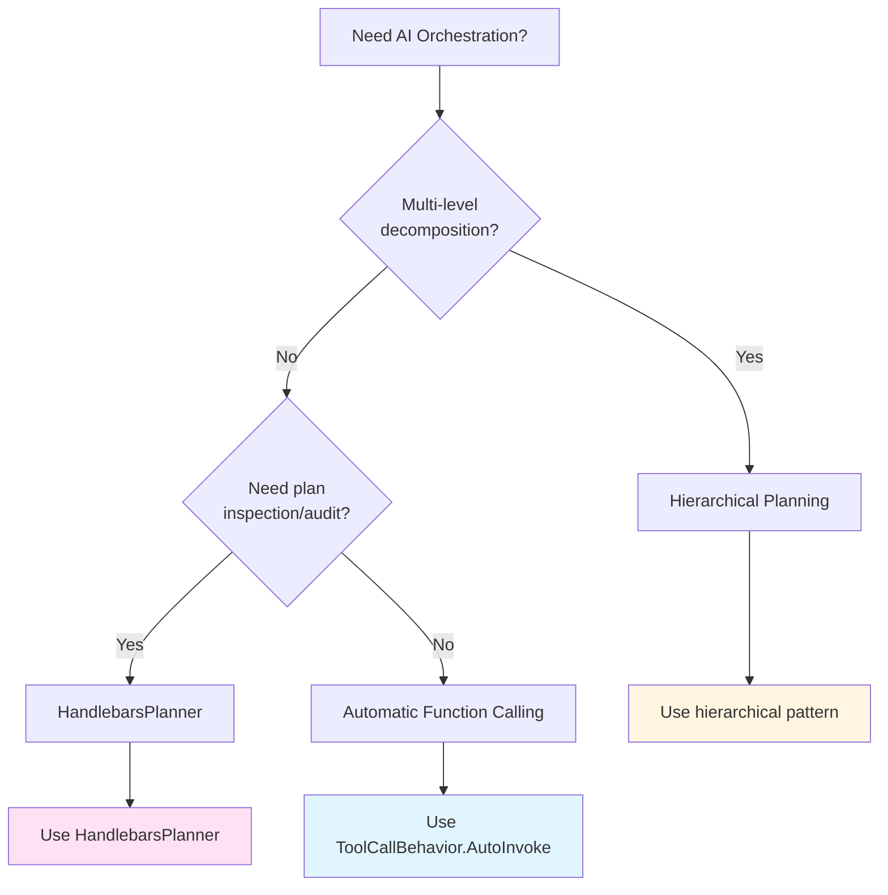

# Learning Materials: AI Orchestration & Multi-Step Planning

**Iteration**: 04  
**Topic**: AI Orchestration with Automatic Function Calling  
**Estimated Time**: ~25 minutes  
**Date**: December 10, 2025

---

## 📚 Overview

**AI Orchestration** in Semantic Kernel enables AI to automatically break down complex goals into executable multi-step workflows. Instead of manually chaining functions, the AI uses reasoning to dynamically discover, select, and sequence your plugin functions to achieve objectives.

Think of it as an **"AI project manager"** that:
- 🎯 Analyzes your natural language goal
- 🔍 Discovers which functions are available
- 🧩 Determines the optimal execution sequence
- ⚡ Executes steps and handles dependencies
- ✅ Returns the final result

### Why AI Orchestration Matters

**Without Orchestration** (Manual):
```csharp
// You hard-code every step
var weather = await kernel.InvokeAsync("WeatherPlugin", "GetWeather", args);
var flights = await kernel.InvokeAsync("TravelPlugin", "SearchFlights", args);
var hotels = await kernel.InvokeAsync("TravelPlugin", "FindHotels", args);
// Rigid, not adaptable to different goals
```

**With Orchestration** (AI-Driven):
```csharp
// AI decides what's needed and in what order
var result = await kernel.InvokePromptAsync(
    "Plan a 3-day trip to Paris with good weather",
    new(new OpenAIPromptExecutionSettings {
        ToolCallBehavior = ToolCallBehavior.AutoInvokeKernelFunctions
    })
);
// AI automatically: checks weather → searches flights → finds hotels → formats results
```

**Key Benefit**: The same plugin functions can solve completely different goals without changing code. Ask for "trip to Paris" or "meeting agenda for tomorrow" - the AI orchestrates appropriately

---

## 🚀 Modern Approach: Automatic Function Calling

**In Semantic Kernel 1.0+, there is no need for explicit "planner" classes.** Instead, AI orchestration is built directly into the prompt execution system through `ToolCallBehavior`.

### How It Works

1. **Register Functions**: Mark your C# methods with `[KernelFunction]` and `[Description]` attributes
2. **Enable Tool Calling**: Set `ToolCallBehavior = ToolCallBehavior.AutoInvokeKernelFunctions`
3. **Let AI Orchestrate**: The AI automatically discovers and chains your functions

```csharp
// Step 1: Define plugin functions
public class CalendarPlugin
{
    [KernelFunction]
    [Description("Gets today's schedule")]
    public string GetSchedule() => "9am: Team meeting, 2pm: Code review";
    
    [KernelFunction]
    [Description("Finds next available time slot for duration in minutes")]
    public string FindAvailableSlot(int durationMinutes) => "3:30 PM";
}

public class EmailPlugin
{
    [KernelFunction]
    [Description("Sends an email to specified recipient")]
    public string SendEmail(string to, string subject, string body) 
        => $"Email sent to {to}";
}

// Step 2: Register plugins
kernel.Plugins.AddFromType<CalendarPlugin>();
kernel.Plugins.AddFromType<EmailPlugin>();

// Step 3: Enable automatic orchestration
var settings = new OpenAIPromptExecutionSettings
{
    ToolCallBehavior = ToolCallBehavior.AutoInvokeKernelFunctions,
    Temperature = 0.0,  // Deterministic for function selection
    MaxTokens = 4000
};

// Step 4: Give AI a goal - it figures out the steps!
var goal = "Check my schedule and send a meeting invite for a 30-minute sync";
var result = await kernel.InvokePromptAsync(goal, new(settings));

// AI automatically:
// 1. Calls CalendarPlugin.GetSchedule() to see what's on the calendar
// 2. Calls CalendarPlugin.FindAvailableSlot(30) to find free time
// 3. Calls EmailPlugin.SendEmail(...) with meeting details
// 4. Returns formatted result
```

### Why This is Better Than Explicit Planners

✅ **Simpler Code**: No planner configuration, just enable tool calling  
✅ **More Flexible**: AI adapts to any goal without code changes  
✅ **Better Performance**: Direct function invocation without template generation  
✅ **Easier Debugging**: Clear function call sequence in execution  
✅ **Modern Standard**: Aligns with OpenAI function calling API

---

## 💡 Complete Real-World Example: Travel Planning Assistant

Let's build a complete travel planning assistant that demonstrates real AI orchestration:

```csharp
using Microsoft.SemanticKernel;
using System.ComponentModel;

// Define travel-related plugins
public class WeatherPlugin
{
    [KernelFunction]
    [Description("Gets weather forecast for a city and dates")]
    public string GetWeather(string city, string dates)
    {
        return $"Paris weather {dates}: 20°C, partly cloudy, 30% rain";
    }
}

public class FlightPlugin
{
    [KernelFunction]
    [Description("Searches for flights between cities on given dates")]
    public string SearchFlights(string from, string to, string dates)
    {
        return $"Found flights {from}→{to} on {dates}: $450-$680";
    }
}

public class HotelPlugin
{
    [KernelFunction]
    [Description("Finds hotels in a city with ratings and prices")]
    public string FindHotels(string city, int nights)
    {
        return $"Hotels in {city} for {nights} nights: $120-$300/night";
    }
}

public class BudgetPlugin
{
    [KernelFunction]
    [Description("Calculates if expenses fit within budget")]
    public string CheckBudget(string expenses, decimal budget)
    {
        return $"Total estimated: $2100. Budget: ${budget}. Status: Within budget";
    }
}

// Main orchestration
class Program
{
    static async Task Main(string[] args)
    {
        // Setup kernel with API key
        var builder = Kernel.CreateBuilder();
        builder.AddOpenAIChatCompletion(
            modelId: "gpt-4o-mini",
            apiKey: Environment.GetEnvironmentVariable("OPENAI_API_KEY")
        );
        
        // Register all plugins
        builder.Plugins.AddFromType<WeatherPlugin>();
        builder.Plugins.AddFromType<FlightPlugin>();
        builder.Plugins.AddFromType<HotelPlugin>();
        builder.Plugins.AddFromType<BudgetPlugin>();
        
        var kernel = builder.Build();
        
        // Configure automatic orchestration
        var settings = new OpenAIPromptExecutionSettings
        {
            ToolCallBehavior = ToolCallBehavior.AutoInvokeKernelFunctions,
            Temperature = 0.0,  // Deterministic for reliability
            MaxTokens = 4000
        };
        
        // Complex multi-step goal
        var goal = @"
            I want to plan a 3-day trip to Paris in May.
            Check the weather, find flights from New York,
            recommend hotels, and verify it fits my $3000 budget.
            Give me a summary with recommendations.
        ";
        
        Console.WriteLine("🎯 Goal: " + goal);
        Console.WriteLine("\n🤖 AI orchestrating...\n");
        
        var result = await kernel.InvokePromptAsync(goal, new(settings));
        
        Console.WriteLine("✅ Result:");
        Console.WriteLine(result);
    }
}
```

### What Happened Behind the Scenes

When you run this code, the AI automatically:

1. **Analyzes the goal**: Identifies need for weather, flights, hotels, and budget checks
2. **Plans function sequence**:
   - `WeatherPlugin.GetWeather("Paris", "May")` → Check if good weather
   - `FlightPlugin.SearchFlights("New York", "Paris", "May")` → Find flights
   - `HotelPlugin.FindHotels("Paris", 3)` → Find accommodations
   - `BudgetPlugin.CheckBudget(expenses, 3000)` → Verify budget
3. **Executes functions**: Calls each in optimal order
4. **Synthesizes results**: Formats a human-readable summary

**No manual coding of the workflow!** Change the goal to "Berlin in October with $2000 budget" and the same code adapts automatically.

---

## 🏗️ Step-by-Step: Build Your First Orchestration App

Let's build a personal assistant that manages your calendar and email.

### Step 1: Create Plugin Functions

Create well-described functions that the AI can discover:

```csharp
using System.ComponentModel;
using Microsoft.SemanticKernel;

public class CalendarPlugin
{
    [KernelFunction]
    [Description("Gets the user's schedule for today with event times and descriptions")]
    public string GetTodaySchedule()
    {
        return @"
            9:00 AM - Team Standup (30 min)
            11:00 AM - Client Presentation (60 min)
            2:00 PM - Code Review (45 min)
            4:00 PM - Free slot
        ";
    }
    
    [KernelFunction]
    [Description("Finds the next available time slot for a meeting of specified duration in minutes")]
    public string FindAvailableSlot(
        [Description("Meeting duration in minutes")] int durationMinutes)
    {
        // Simulate finding free time
        return $"Next available slot: 4:00 PM (can fit {durationMinutes} min meeting)";
    }
    
    [KernelFunction]
    [Description("Adds a meeting to the calendar with title, time, and duration")]
    public string AddMeeting(
        [Description("Meeting title")] string title,
        [Description("Start time (e.g., 4:00 PM)")] string startTime,
        [Description("Duration in minutes")] int duration)
    {
        return $"Added: '{title}' at {startTime} for {duration} minutes";
    }
}

public class EmailPlugin
{
    [KernelFunction]
    [Description("Sends an email to a recipient with subject and body")]
    public string SendEmail(
        [Description("Recipient email address")] string to,
        [Description("Email subject line")] string subject,
        [Description("Email body content")] string body)
    {
        return $"✉️ Email sent to {to}\nSubject: {subject}\nBody preview: {body.Substring(0, Math.Min(50, body.Length))}...";
    }
}
```

### Step 2: Setup Kernel and Register Plugins

```csharp
using Microsoft.SemanticKernel;

class Program
{
    static async Task Main(string[] args)
    {
        // Build kernel
        var builder = Kernel.CreateBuilder();
        builder.AddOpenAIChatCompletion(
            modelId: "gpt-4o-mini",
            apiKey: Environment.GetEnvironmentVariable("OPENAI_API_KEY")
        );
        
        var kernel = builder.Build();
        
        // Register plugins - AI will discover these functions
        kernel.Plugins.AddFromType<CalendarPlugin>();
        kernel.Plugins.AddFromType<EmailPlugin>();
        
        Console.WriteLine("✅ Plugins registered: CalendarPlugin, EmailPlugin\n");
```

### Step 3: Enable Automatic Orchestration

```csharp
        // Configure AI to automatically call functions
        var settings = new OpenAIPromptExecutionSettings
        {
            ToolCallBehavior = ToolCallBehavior.AutoInvokeKernelFunctions,
            Temperature = 0.0,  // Deterministic behavior
            MaxTokens = 4000
        };
```

### Step 4: Give AI Complex Goals

```csharp
        // Goal 1: Simple query
        var goal1 = "What's on my schedule today?";
        Console.WriteLine($"🎯 Goal: {goal1}");
        var result1 = await kernel.InvokePromptAsync(goal1, new(settings));
        Console.WriteLine($"🤖 {result1}\n");
        
        // Goal 2: Multi-step orchestration
        var goal2 = "Find a free slot for a 45-minute meeting and send an invite to alice@company.com";
        Console.WriteLine($"🎯 Goal: {goal2}");
        var result2 = await kernel.InvokePromptAsync(goal2, new(settings));
        Console.WriteLine($"🤖 {result2}\n");
        
        // Goal 3: Complex workflow
        var goal3 = @"
            Check my calendar, find a 30-minute slot, 
            add a meeting called 'Budget Review',
            and email the team at team@company.com with meeting details.
        ";
        Console.WriteLine($"🎯 Goal: {goal3}");
        var result3 = await kernel.InvokePromptAsync(goal3, new(settings));
        Console.WriteLine($"🤖 {result3}");
    }
}
```

### What Happens When You Run This

**Goal 1** (Simple):
- AI calls `CalendarPlugin.GetTodaySchedule()`
- Returns formatted schedule

**Goal 2** (Multi-step):
1. AI calls `CalendarPlugin.FindAvailableSlot(45)`
2. AI calls `EmailPlugin.SendEmail("alice@company.com", ...)`
3. Returns confirmation

**Goal 3** (Complex workflow):
1. AI calls `CalendarPlugin.GetTodaySchedule()` to understand availability
2. AI calls `CalendarPlugin.FindAvailableSlot(30)` to find free time
3. AI calls `CalendarPlugin.AddMeeting("Budget Review", ...)`
4. AI calls `EmailPlugin.SendEmail("team@company.com", ...)` with details
5. Returns comprehensive summary

**The AI figures out all these steps automatically!**

---

## 🎯 Common Orchestration Patterns

### Pattern 1: Data Processing Pipeline

**Use Case**: Extract → Transform → Load workflows

```csharp
public class DataPlugin
{
    [KernelFunction]
    [Description("Fetches raw data from database for a given table name")]
    public string FetchData(string tableName) 
        => $"[Raw data from {tableName}: 1000 rows]";

    [KernelFunction]
    [Description("Cleans and validates data removing duplicates and nulls")]
    public string CleanData(string rawData) 
        => "[Cleaned data: 950 valid rows]";

    [KernelFunction]
    [Description("Aggregates data by specified grouping column")]
    public string AggregateData(string cleanedData, string groupBy) 
        => $"[Aggregated by {groupBy}: 50 groups]";

    [KernelFunction]
    [Description("Exports processed data to CSV format")]
    public string ExportToCSV(string data, string filename) 
        => $"Exported to {filename}.csv";
}

// AI orchestrates entire ETL pipeline
var goal = "Get customer data, clean it, group by region, and export to customer_report.csv";
var result = await kernel.InvokePromptAsync(goal, new(settings));
// AI automatically: FetchData → CleanData → AggregateData → ExportToCSV
```

### Pattern 2: Customer Support Automation

**Use Case**: Intelligent ticket triage and response

```csharp
public class SupportPlugin
{
    [KernelFunction]
    [Description("Retrieves customer's account information and history")]
    public string GetCustomerInfo(string customerId)
        => $"Customer #{customerId}: Premium plan, 2 years tenure, 3 previous tickets";

    [KernelFunction]
    [Description("Searches knowledge base for solutions to customer issues")]
    public string SearchKnowledgeBase(string issue)
        => $"Found 3 articles about '{issue}'";

    [KernelFunction]
    [Description("Creates a support ticket with priority level")]
    public string CreateTicket(string customerId, string issue, string priority)
        => $"Ticket #{new Random().Next(1000, 9999)} created ({priority} priority)";

    [KernelFunction]
    [Description("Sends automated response email to customer")]
    public string SendResponse(string customerId, string message)
        => $"Email sent to customer #{customerId}";
}

// AI handles complex support scenarios
var goal = @"
    Customer #4521 reports 'app crashing on login'.
    Check their account, search for known solutions,
    create a high-priority ticket if needed,
    and send a response with troubleshooting steps.
";
var result = await kernel.InvokePromptAsync(goal, new(settings));
```

### Pattern 3: Content Moderation Workflow

**Use Case**: Multi-stage content review

```csharp
public class ModerationPlugin
{
    [KernelFunction]
    [Description("Analyzes content for policy violations and returns risk score")]
    public string AnalyzeContent(string content)
        => "Risk score: 0.3 (moderate), flags: language";

    [KernelFunction]
    [Description("Checks user's history for previous violations")]
    public string CheckUserHistory(string userId)
        => $"User #{userId}: 1 warning, 0 strikes";

    [KernelFunction]
    [Description("Applies moderation action: approve, flag for review, or remove")]
    public string ApplyAction(string contentId, string action)
        => $"Content #{contentId}: {action}";

    [KernelFunction]
    [Description("Notifies user about moderation decision")]
    public string NotifyUser(string userId, string decision, string reason)
        => $"User #{userId} notified: {decision} - {reason}";
}

// AI makes context-aware moderation decisions
var goal = @"
    Review content #7834 from user #2234.
    Analyze for violations, check user's history,
    decide appropriate action, and notify user with explanation.
";
var result = await kernel.InvokePromptAsync(goal, new(settings));
```

### Pattern 4: Multi-Source Research Synthesis

**Use Case**: Gather and synthesize information from multiple sources

```csharp
public class ResearchPlugin
{
    [KernelFunction]
    [Description("Searches academic papers and returns titles with summaries")]
    public string SearchPapers(string topic)
        => $"Found 5 papers on {topic}";

    [KernelFunction]
    [Description("Searches web for recent news articles on topic")]
    public string SearchNews(string topic)
        => $"Found 10 news articles on {topic}";

    [KernelFunction]
    [Description("Extracts key statistics and data points from source")]
    public string ExtractStats(string source)
        => "Key stats: 45% growth, $2.3B market size";

    [KernelFunction]
    [Description("Generates comprehensive report from gathered information")]
    public string GenerateReport(string topic, string sources)
        => $"Research report on {topic} (3 pages)";
}

// AI orchestrates comprehensive research
var goal = @"
    Research 'AI agent market trends'.
    Search academic papers and news, extract key statistics,
    and generate a comprehensive market report.
";
var result = await kernel.InvokePromptAsync(goal, new(settings));
```

---

## ⚙️ Configuration & Best Practices

### Configuration Options for Automatic Function Calling

```csharp
var settings = new OpenAIPromptExecutionSettings
{
    ToolCallBehavior = ToolCallBehavior.AutoInvokeKernelFunctions,
    
    Temperature = 0.0,        // 0.0 = Deterministic, 0.7 = Creative
    MaxTokens = 4000,         // Limit response length
    TopP = 1.0,               // Nucleus sampling
    FrequencyPenalty = 0.0,   // Reduce repetition
    PresencePenalty = 0.0     // Encourage topic diversity
};
```

**Recommended Settings**:
- **Temperature = 0.0**: For function calling (consistent, reliable behavior)
- **MaxTokens = 4000+**: Enough for multi-step workflows
- **TopP = 1.0**: Default nucleus sampling
- **Penalties = 0.0**: Not typically needed for function orchestration

### Best Practices

✅ **DO:**
- ✅ Write **detailed function descriptions** - AI uses these to select functions
- ✅ Use **clear parameter names** with `[Description]` attributes
- ✅ Keep functions **single-purpose** (one responsibility per function)
- ✅ Test functions **individually** before orchestration
- ✅ Use **Temperature = 0.0** for deterministic function selection
- ✅ **Log function calls** using kernel events for debugging
- ✅ **Handle errors gracefully** - return meaningful error messages
- ✅ **Validate inputs** in function implementations

❌ **DON'T:**
- ❌ Use vague descriptions like "Does stuff" or "Processes data"
- ❌ Create functions with **10+ parameters** (split into multiple functions)
- ❌ Mix unrelated functionality in one function
- ❌ Forget `[KernelFunction]` and `[Description]` attributes
- ❌ Use **high temperature** (>0.5) for function calling - causes inconsistency
- ❌ Expose sensitive operations without proper validation
- ❌ Return cryptic error messages - AI needs clear context

---

## 🔍 Debugging & Observability

### Tracing Function Calls

Use kernel events to see exactly what the AI is doing:

```csharp
// Add event handlers to trace execution
kernel.FunctionInvoking += (sender, e) =>
{
    Console.WriteLine($"🔧 Calling: {e.Function.PluginName}.{e.Function.Name}");
    var args = string.Join(", ", e.Arguments.Select(a => $"{a.Key}={a.Value}"));
    Console.WriteLine($"   Args: {args}");
};

kernel.FunctionInvoked += (sender, e) =>
{
    Console.WriteLine($"✅ Completed: {e.Function.Name}");
    Console.WriteLine($"   Result: {e.Result}\n");
};

// Now run orchestration
var result = await kernel.InvokePromptAsync(goal, new(settings));
```

**Example Output:**
```
🔧 Calling: CalendarPlugin.GetTodaySchedule
   Args: 
✅ Completed: GetTodaySchedule
   Result: 9:00 AM - Team Meeting...

🔧 Calling: CalendarPlugin.FindAvailableSlot
   Args: durationMinutes=30
✅ Completed: FindAvailableSlot
   Result: Next available: 4:00 PM

🔧 Calling: EmailPlugin.SendEmail
   Args: to=team@company.com, subject=Meeting Invite, body=...
✅ Completed: SendEmail
   Result: Email sent to team@company.com
```

### Error Handling

Always wrap orchestration in try-catch for production:

```csharp
try
{
    var result = await kernel.InvokePromptAsync(goal, new(settings));
    Console.WriteLine($"Success: {result}");
}
catch (HttpOperationException ex)
{
    Console.WriteLine($"API Error: {ex.Message}");
    // Handle rate limits, auth issues
}
catch (KernelException ex)
{
    Console.WriteLine($"Kernel Error: {ex.Message}");
    // Handle function invocation failures
}
catch (Exception ex)
{
    Console.WriteLine($"Unexpected Error: {ex.Message}");
    // Log and alert
}
```

**Example Output:**
```
🔧 Calling: MathPlugin.Add
   Args: a=5, b=3
✅ Completed: Add
   Result: 8

🔧 Calling: MathPlugin.Multiply
   Args: a=8, b=2
✅ Completed: Multiply
   Result: 16

```
🔧 Calling: MathPlugin.SquareRoot
   Args: number=16
✅ Completed: SquareRoot
   Result: 4
```

---

## 🛡️ Error Handling in Plans

### Handling Function Failures

```csharp
public class RobustPlugin
{
    [KernelFunction]
    [Description("Fetches data from an API with retry logic")]
    public async Task<string> FetchData(
        [Description("The API endpoint")] string endpoint)
    {
        int retries = 3;
        for (int i = 0; i < retries; i++)
        {
            try
            {
                return await CallApiAsync(endpoint);
            }
            catch (HttpRequestException) when (i < retries - 1)
            {
                await Task.Delay(1000 * (i + 1)); // Exponential backoff
            }
        }
        throw new Exception($"Failed to fetch from {endpoint} after {retries} retries");
    }
}
```

### Graceful Plan Failure

```csharp
try
{
    var result = await planner.ExecuteAsync(kernel, goal);
    Console.WriteLine($"Success: {result}");
}
catch (KernelException ex)
{
    Console.WriteLine($"Plan execution failed: {ex.Message}");
    
    // Optionally try a simpler goal
    var fallbackGoal = "Provide a general answer without using tools";
    var fallbackResult = await kernel.InvokePromptAsync(fallbackGoal);
    Console.WriteLine($"Fallback result: {fallbackResult}");
}
```

---

## 🔄 Advanced: Plan Inspection with HandlebarsPlanner

For scenarios requiring **auditability** or **plan modification**, use HandlebarsPlanner to generate explicit templates:

```csharp
using Microsoft.SemanticKernel.Planning.Handlebars;

// Create planner that generates templates
var planner = new HandlebarsPlanner(new HandlebarsPlannerOptions
{
    AllowLoops = true,  // Enable iterative processing
    ExecutionSettings = new OpenAIPromptExecutionSettings
    {
        Temperature = 0.0,
        MaxTokens = 4000
    }
});

// Generate plan template
var plan = await planner.CreatePlanAsync(kernel, "Your complex goal");

// Inspect the generated Handlebars template
Console.WriteLine("=== Generated Plan Template ===");
Console.WriteLine(plan.ToString());
Console.WriteLine("================================");

// Optionally save for auditing
await File.WriteAllTextAsync("audit_plan.hbs", plan.ToString());

// Ask user for confirmation
Console.Write("Execute this plan? (y/n): ");
if (Console.ReadLine()?.ToLower() == "y")
{
    var result = await plan.InvokeAsync(kernel);
    Console.WriteLine(result);
}
```

---

## 🧩 Advanced Pattern: Hierarchical Planning

For truly complex scenarios, you can implement **hierarchical planning** where a top-level plan generates sub-plans dynamically:

### Workflow Overview

1. **High-level decomposition**: Ask LLM: "Create a high-level plan for [complex goal]" - it returns steps like ["Research topic", "Draft outline", "Write sections"]
2. **Dynamic sub-planning**: For each high-level step, ask: "Generate a Handlebars plan for [this step]" - it creates detailed templates
3. **Function registration**: Dynamically register each generated template as a plugin function using `kernel.CreateFunctionFromPrompt()`
4. **Top-level orchestration**: Create a master Handlebars plan that calls these newly registered functions to orchestrate the overall goal

This pattern enables **hierarchical decomposition** where complex tasks are broken into manageable subtasks, each with its own specialized plan. The system builds its own "playbook" dynamically based on the problem at hand—a self-extending architecture where AI-generated plans become callable functions.

### Real-World Example

```csharp
// Step 1: Get high-level plan
var planningPrompt = "Break down 'Write technical documentation' into 3-5 major phases";
var highLevelSteps = await kernel.InvokePromptAsync(planningPrompt);
// Returns: ["Research APIs", "Draft structure", "Write content", "Review & polish"]

// Step 2: For each step, create detailed plan
foreach (var step in highLevelSteps)
{
    var detailedPlan = await handlebarsPlanner.CreatePlanAsync(
        kernel, 
        $"Create detailed plan for: {step}"
    );
    
    // Step 3: Register as function
    var function = kernel.CreateFunctionFromPrompt(
        detailedPlan.ToString(),
        functionName: step.Replace(" ", ""),
        description: $"Executes: {step}"
    );
    
    kernel.Plugins.AddFromFunctions("DynamicPlan", new[] { function });
}

// Step 4: Execute top-level orchestration
var masterPlan = await handlebarsPlanner.CreatePlanAsync(
    kernel,
    "Execute all documentation phases in sequence"
);
var result = await masterPlan.InvokeAsync(kernel);
```

This creates a **self-extending system** validated by research (see [Research & Further Reading](#-research--further-reading) section below).

---

## 📊 Approach Comparison

| Feature | Automatic Function Calling | HandlebarsPlanner | Hierarchical Planning |
|---------|---------------------------|-------------------|----------------------|
| **Ease of Use** | ✅ Simple | 🟡 Moderate | 🔴 Complex |
| **Performance** | ⚡ Fast | ⚡ Fast | 🟡 Multi-step |
| **Plan Inspection** | ❌ Opaque | ✅ Full visibility | ✅ Per-level visibility |
| **Loops/Conditionals** | ❌ No | ✅ Yes | ✅ Yes (nested) |
| **Use Case** | 90% of scenarios | Auditable workflows | Complex decomposition |
| **Setup Complexity** | 1 line | 5-10 lines | 20+ lines |

**Recommendation:**
- **Default choice (90% of cases):** `ToolCallBehavior.AutoInvokeKernelFunctions`
- **Auditing/compliance needs:** HandlebarsPlanner
- **Multi-level decomposition:** Hierarchical Planning pattern
- **Simple tasks:** Just use prompt without orchestration

---

## 🎯 Decision Tree: Which Approach to Use?



---

## 🚀 Production Patterns

### Pattern: Planner with Approval Gate

```csharp
public class ApprovedPlanner
{
    private readonly HandlebarsPlanner _planner;
    private readonly Kernel _kernel;

    public async Task<string> ExecuteWithApprovalAsync(string goal)
    {
        // Generate plan
        var plan = await _planner.CreatePlanAsync(_kernel, goal);
        
        // Show plan to user
        Console.WriteLine("=== Proposed Plan ===");
        Console.WriteLine(plan.ToString());
        Console.WriteLine("====================");
        
        // Get approval
        Console.Write("Approve? (yes/no/modify): ");
        var response = Console.ReadLine()?.ToLower();
        
        return response switch
        {
            "yes" => await plan.InvokeAsync(_kernel).ToString(),
            "modify" => await HandleModificationAsync(plan, goal),
            _ => "Plan rejected"
        };
    }
}
```

### Pattern: Cached Plans

```csharp
public class PlanCache
{
    private readonly Dictionary<string, HandlebarsPlan> _cache = new();
    private readonly HandlebarsPlanner _planner;

    public async Task<HandlebarsPlan> GetOrCreatePlanAsync(
        Kernel kernel, 
        string goal)
    {
        if (_cache.TryGetValue(goal, out var cachedPlan))
        {
            Console.WriteLine("Using cached plan");
            return cachedPlan;
        }

        var plan = await _planner.CreatePlanAsync(kernel, goal);
        _cache[goal] = plan;
        return plan;
    }
}

// Usage
var planCache = new PlanCache();
var plan = await planCache.GetOrCreatePlanAsync(kernel, "Recurring goal");
var result = await plan.InvokeAsync(kernel);
```

---

## 🎓 Key Takeaways

1. **Modern Orchestration** - Use `ToolCallBehavior.AutoInvokeKernelFunctions` for 90% of scenarios
2. **Function Descriptions are Critical** - AI selects functions based on `[Description]` attributes
3. **Temperature = 0.0** - Always use low temperature for reliable function calling
4. **Plugin Design Matters** - Keep functions single-purpose with clear parameters
5. **Debugging with Events** - Use `FunctionInvoking`/`FunctionInvoked` kernel events
6. **Error Handling** - Wrap orchestration in try-catch for production
7. **HandlebarsPlanner for Auditing** - Use only when you need explicit plan templates
8. **Test Functions Independently** - Verify functions work before orchestration
9. **Hierarchical Planning** - For complex multi-level decomposition
10. **Avoid Deprecated APIs** - No FunctionCallingStepwisePlanner, SequentialPlanner

---

## 📚 Additional Resources

### Official Documentation
- [Semantic Kernel Planners Guide](https://learn.microsoft.com/en-us/semantic-kernel/ai-orchestration/planners/)
- [Function Calling Documentation](https://learn.microsoft.com/en-us/semantic-kernel/concepts/ai-services/chat-completion/function-calling/)
- [Handlebars Planner Reference](https://github.com/microsoft/semantic-kernel/blob/main/dotnet/samples/Concepts/Planning/HandlebarsPlanning.cs)

### Video Tutorials
- [Introduction to Semantic Kernel Planners](https://www.youtube.com/results?search_query=semantic+kernel+planners)
- [Building AI Agents with Planners](https://www.youtube.com/results?search_query=semantic+kernel+ai+agents)

### Articles & Blogs
- [AI Orchestration Patterns with Semantic Kernel](https://devblogs.microsoft.com/semantic-kernel/)
- [Function Calling Best Practices](https://platform.openai.com/docs/guides/function-calling)

### GitHub Examples
- [Semantic Kernel Samples - Planning](https://github.com/microsoft/semantic-kernel/tree/main/dotnet/samples/Concepts/Planning)
- [Planner Examples Repository](https://github.com/microsoft/semantic-kernel/tree/main/python/samples/concepts/planning)

---

## 📖 Research & Further Reading

### AgentOrchestra: Academic Validation of Hierarchical Planning

The hierarchical meta-planning pattern described earlier is not merely theoretical—it has been validated in academic research. The **AgentOrchestra** paper ([Zhang et al., 2025, arXiv:2506.12508](https://arxiv.org/abs/2506.12508)) introduces the Tool-Environment-Agent (TEA) Protocol, which formalizes multi-agent systems with hierarchical orchestration. Their framework achieved state-of-the-art results on the GAIA benchmark (83.39% accuracy), demonstrating the effectiveness of coordinated planning agents working with specialized sub-agents.

The paper's **Tool Manager Agent** directly implements the meta-planning concept: it dynamically creates new MCP-compliant tools when existing capabilities are insufficient, validates them through automated testing, and registers them in a Tool Context Protocol (TCP) for reuse by other agents. During GAIA evaluation, the system generated over 50 tools with approximately 30% achieving cross-task reuse, proving that AI-generated functions can successfully generalize beyond their original context. This validates the "generate→validate→register→reuse" loop central to self-extending agent architectures.

AgentOrchestra's architecture mirrors Semantic Kernel's plugin model: a central **Planning Agent** decomposes complex objectives and delegates sub-tasks to specialized agents (deep researcher, browser automation, data analyzer, tool manager). Each agent operates with domain-specific capabilities while the planning agent maintains global context and adapts strategies dynamically—precisely the pattern you'd implement using `ToolCallBehavior.AutoInvokeKernelFunctions` with dynamically registered plugin functions in modern Semantic Kernel applications.

The TEA Protocol also formalizes bidirectional transformations between agents, tools, and environments (Agent-to-Tool, Tool-to-Agent, etc.), providing a theoretical foundation for treating agents as callable functions and vice versa. This research validates that the hierarchical planning patterns discussed in this tutorial represent production-ready architectural patterns, not experimental techniques.

### Additional Research & Frameworks

For those interested in exploring hierarchical AI agent systems further, the academic literature provides several relevant research directions. Papers on **task decomposition** explore how complex goals can be systematically broken into manageable sub-problems, while research on **multi-agent reinforcement learning** examines how specialized agents learn to coordinate effectively. The **AgentOrchestra paper** ([arXiv:2506.12508](https://arxiv.org/abs/2506.12508)) provides comprehensive implementation details including their React-based tool-calling architecture and systematic pipeline workflows for each specialized agent type.

Microsoft's **AutoGen** framework ([Wu et al., 2023, arXiv:2308.08155](https://arxiv.org/abs/2308.08155)) represents another production implementation of multi-agent orchestration, focusing on conversational agent coordination patterns. The **LangChain** ecosystem ([LangGraph documentation](https://docs.langchain.com/oss/python/langgraph/overview), [Deep Agents](https://docs.langchain.com/oss/python/deepagents/overview)) has extensively documented agent architectures with tools, including their "Deep Agents" framework that supports planning, subagents, and long-term memory—patterns similar to hierarchical orchestration. Microsoft Research has also published work on **Copilot Studio** orchestration patterns, which share conceptual similarities with the planning approaches discussed here, particularly around dynamic skill composition and context management across complex workflows.

---

## ✨ Practice Challenge

Before moving to the quiz, try building a simple planner application:

**Challenge:** Create a "Personal Assistant Planner" with these functions:
1. `GetCurrentTime()` - Returns current time
2. `SetReminder(message, minutes)` - Sets a reminder
3. `SearchWeb(query)` - Searches for information
4. `CalculateMath(expression)` - Evaluates math expressions

Then use a planner with goals like:
- "What time is it and set a reminder for a meeting in 30 minutes"
- "Search for weather in Seattle and calculate how many hours until 5 PM"

**When you're ready, type `next` to take the quiz! 🚀**
