# Learning Materials: Planners & AI Orchestration

**Iteration**: 04  
**Topic**: Planners & AI Orchestration  
**Estimated Time**: ~20 minutes  
**Date**: December 7, 2025

---

## 📚 Overview

**Planners** in Semantic Kernel are powerful orchestration tools that enable AI to automatically break down complex goals into executable multi-step plans. Instead of manually chaining functions, planners leverage AI reasoning to dynamically select and sequence the right functions to achieve an objective.

Think of a planner as an **"AI project manager"** that:
- Analyzes your goal
- Identifies which functions are needed
- Determines the optimal execution order
- Handles dependencies between steps
- Executes the plan and returns results


---

## 🎯 Core Concepts

### What is a Planner?

A **Planner** is a component that:
1. Takes a natural language goal from the user
2. Examines available kernel functions (your plugin library)
3. Creates a sequence of function calls to achieve that goal
4. Executes the plan step-by-step
5. Returns the final result

### Planner vs Manual Function Chaining


**Manual Chaining:**
```csharp
// You decide the order
var weather = await kernel.InvokeAsync(getWeather, args);
var flights = await kernel.InvokeAsync(searchFlights, args);
var hotels = await kernel.InvokeAsync(findHotels, args);
```

**Planner-Based:**
```csharp
// AI decides the order based on the goal
var plan = await planner.CreatePlanAsync("Plan a 3-day trip to Paris");
var result = await plan.InvokeAsync(kernel);
```

---

## 🔧 Types of Planners

### 1. Function Calling Planner (Recommended - Modern Approach)

The **FunctionCallingStepwisePlanner** uses native OpenAI/Azure function calling to orchestrate tasks. It's the most modern and efficient approach.

```csharp
using Microsoft.SemanticKernel;
using Microsoft.SemanticKernel.Planning;

var kernel = Kernel.CreateBuilder()
    .AddOpenAIChatCompletion("gpt-4", apiKey)
    .Build();

// Add plugins with functions
kernel.ImportPluginFromType<WeatherPlugin>();
kernel.ImportPluginFromType<TravelPlugin>();

// Create planner
var planner = new FunctionCallingStepwisePlanner();

// Create and execute plan
var result = await planner.ExecuteAsync(
    kernel, 
    "What's the weather in Paris and find me a 4-star hotel?"
);

Console.WriteLine(result);
```

**How it works:**

```mermaid
sequenceDiagram
    participant User
    participant Planner
    participant AI
    participant Functions
    
    User->>Planner: Goal: "Weather + Hotel"
    Planner->>AI: Here's the goal + available functions
    AI->>AI: Analyze & decide which functions needed
    AI->>Functions: Call GetWeather("Paris")
    Functions-->>AI: "Sunny, 22°C"
    AI->>Functions: Call FindHotel("Paris", "4-star")
    Functions-->>AI: "Hotel Ritz"
    AI->>Planner: Combined result
    Planner->>User: "Weather: Sunny, 22°C. Hotel: Hotel Ritz"
```


### 2. Handlebars Planner (Template-Based)

The **HandlebarsPlanner** generates a plan template using Handlebars syntax, allowing for complex control flow.

```csharp
using Microsoft.SemanticKernel.Planning.Handlebars;

var planner = new HandlebarsPlanner(
    new HandlebarsPlannerOptions
    {
        MaxTokens = 4000
    }
);

var plan = await planner.CreatePlanAsync(kernel, 
    "Send an email summarizing today's weather in Seattle");

// Inspect the plan template
Console.WriteLine(plan.ToString());

// Execute
var result = await plan.InvokeAsync(kernel);
```

**Generated Plan Example:**
```handlebars
{{!-- Step 1: Get weather --}}
{{set "weather" (WeatherPlugin-GetWeather location="Seattle")}}

{{!-- Step 2: Summarize weather --}}
{{set "summary" (TextPlugin-Summarize text=weather)}}

{{!-- Step 3: Send email --}}
{{EmailPlugin-SendEmail 
    to="user@example.com" 
    subject="Seattle Weather" 
    body=summary}}
```

### 3. Sequential Planner (Legacy - For Reference)

⚠️ **Note:** SequentialPlanner is older and less efficient. Use FunctionCallingStepwisePlanner for new projects.

```csharp
// Legacy approach (for reference only)
#pragma warning disable SKEXP0060
var planner = new SequentialPlanner(kernel);
var plan = await planner.CreatePlanAsync("Translate 'Hello' to French and Spanish");
var result = await kernel.InvokeAsync(plan);
#pragma warning restore SKEXP0060
```

---

## 🚀 Building Your First Planner Application

### Step 1: Set Up Kernel and Plugins

```csharp
using Microsoft.SemanticKernel;
using Microsoft.SemanticKernel.Planning;
using System.ComponentModel;

var builder = Kernel.CreateBuilder();
builder.AddOpenAIChatCompletion("gpt-4", Environment.GetEnvironmentVariable("OPENAI_API_KEY"));
var kernel = builder.Build();

// Create plugins with well-described functions
kernel.ImportPluginFromType<MathPlugin>();
kernel.ImportPluginFromType<TextPlugin>();
```

### Step 2: Create Function Plugins

```csharp
public class MathPlugin
{
    [KernelFunction]
    [Description("Adds two numbers together")]
    public double Add(
        [Description("The first number")] double a,
        [Description("The second number")] double b)
    {
        return a + b;
    }

    [KernelFunction]
    [Description("Multiplies two numbers")]
    public double Multiply(
        [Description("The first number")] double a,
        [Description("The second number")] double b)
    {
        return a * b;
    }

    [KernelFunction]
    [Description("Calculates the square root of a number")]
    public double SquareRoot(
        [Description("The number to find square root of")] double number)
    {
        return Math.Sqrt(number);
    }
}

public class TextPlugin
{
    [KernelFunction]
    [Description("Converts text to uppercase")]
    public string ToUpper([Description("The text to convert")] string text)
    {
        return text.ToUpper();
    }

    [KernelFunction]
    [Description("Counts the words in a text")]
    public int CountWords([Description("The text to count words in")] string text)
    {
        return text.Split(' ', StringSplitOptions.RemoveEmptyEntries).Length;
    }
}
```

### Step 3: Create and Execute Plan

```csharp
var planner = new FunctionCallingStepwisePlanner();

// Complex goal requiring multiple functions
var goal = "Calculate (5 + 3) * 2, then find its square root, and tell me the result in uppercase";

var result = await planner.ExecuteAsync(kernel, goal);

Console.WriteLine($"Result: {result}");
// Output: Result: 4.0 (formatted based on execution)
```

---

## 💡 Real-World Planning Patterns

### Pattern 1: Research Assistant

```csharp
public class ResearchPlugin
{
    [KernelFunction]
    [Description("Searches the web for information on a topic")]
    public async Task<string> WebSearch(
        [Description("The search query")] string query)
    {
        // Implementation using web search API
        return await SearchWebAsync(query);
    }

    [KernelFunction]
    [Description("Summarizes a long text into key points")]
    public string Summarize(
        [Description("The text to summarize")] string text,
        [Description("Maximum number of sentences")] int maxSentences = 3)
    {
        // Implementation
        return SummarizeText(text, maxSentences);
    }

    [KernelFunction]
    [Description("Saves content to a file")]
    public void SaveToFile(
        [Description("The content to save")] string content,
        [Description("The filename")] string filename)
    {
        File.WriteAllText(filename, content);
    }
}

// Usage
var planner = new FunctionCallingStepwisePlanner();
var result = await planner.ExecuteAsync(kernel, 
    "Research 'Semantic Kernel planners', summarize the findings in 3 sentences, and save to research.txt");
```

### Pattern 2: Data Processing Pipeline

```csharp
public class DataPlugin
{
    [KernelFunction]
    [Description("Reads data from a CSV file")]
    public string ReadCSV([Description("Path to CSV file")] string filePath)
    {
        return File.ReadAllText(filePath);
    }

    [KernelFunction]
    [Description("Filters data based on a condition")]
    public string FilterData(
        [Description("The data to filter")] string data,
        [Description("The filter condition")] string condition)
    {
        // Implementation
        return ApplyFilter(data, condition);
    }

    [KernelFunction]
    [Description("Calculates statistics on numeric data")]
    public string CalculateStats([Description("The numeric data")] string data)
    {
        // Implementation
        return ComputeStatistics(data);
    }

    [KernelFunction]
    [Description("Generates a visualization from data")]
    public string CreateChart(
        [Description("The data to visualize")] string data,
        [Description("Chart type (bar, line, pie)")] string chartType)
    {
        // Implementation
        return GenerateChart(data, chartType);
    }
}

// Usage
var goal = @"Read sales_data.csv, filter for sales > $1000, 
              calculate average and total, then create a bar chart";

var result = await planner.ExecuteAsync(kernel, goal);
```

### Pattern 3: Multi-Agent Collaboration

```csharp
public class AgentPlugin
{
    private readonly Kernel _kernel;

    [KernelFunction]
    [Description("Expert at writing technical documentation")]
    public async Task<string> TechnicalWriter(
        [Description("The topic to write about")] string topic)
    {
        return await _kernel.InvokePromptAsync($"Write technical documentation about: {topic}");
    }

    [KernelFunction]
    [Description("Expert at code review and quality assurance")]
    public async Task<string> CodeReviewer(
        [Description("The code or documentation to review")] string content)
    {
        return await _kernel.InvokePromptAsync($"Review this for technical accuracy: {content}");
    }

    [KernelFunction]
    [Description("Expert at editing for clarity and readability")]
    public async Task<string> Editor(
        [Description("The content to edit")] string content)
    {
        return await _kernel.InvokePromptAsync($"Edit for clarity: {content}");
    }
}

// Usage: Create polished documentation
var goal = "Write documentation about semantic kernel planners, have it reviewed, then edited for clarity";
var result = await planner.ExecuteAsync(kernel, goal);
```

---

## 🎨 Planner Configuration & Best Practices

### Configuration Options

```csharp
var planner = new FunctionCallingStepwisePlanner(
    new FunctionCallingStepwisePlannerOptions
    {
        MaxIterations = 10,              // Max steps in plan
        MaxTokens = 4000,                // Token limit for planning
        ExecutionSettings = new OpenAIPromptExecutionSettings
        {
            Temperature = 0.0,            // Deterministic planning
            TopP = 0.1
        }
    }
);
```

### Best Practices

✅ **DO:**
- Write detailed function descriptions (the AI uses these to select functions)
- Use clear, descriptive parameter names and descriptions
- Keep functions focused on single responsibilities
- Test functions individually before using with planners
- Set appropriate `MaxIterations` to prevent infinite loops
- Use low temperature (0.0-0.3) for consistent planning
- Log plan execution steps for debugging
- Handle errors gracefully in functions

❌ **DON'T:**
- Create overly complex functions with many parameters
- Use vague function descriptions like "Does stuff"
- Mix unrelated functionality in one function
- Forget to add [Description] attributes
- Allow unbounded recursion or loops
- Use high temperature for planning (leads to inconsistent results)
- Expose sensitive operations without validation

---

## 🔍 Debugging Plans

### Inspecting Plan Steps

```csharp
// With HandlebarsPlanner, you can see the generated plan
var planner = new HandlebarsPlanner();
var plan = await planner.CreatePlanAsync(kernel, "Your goal here");

Console.WriteLine("=== Generated Plan ===");
Console.WriteLine(plan.ToString());  // Shows Handlebars template
Console.WriteLine("=====================");

var result = await plan.InvokeAsync(kernel);
```

### Tracing Execution

```csharp
// Add a hook to trace function calls
kernel.FunctionInvoking += (sender, e) =>
{
    Console.WriteLine($"🔧 Calling: {e.Function.PluginName}.{e.Function.Name}");
    Console.WriteLine($"   Args: {string.Join(", ", e.Arguments.Select(a => $"{a.Key}={a.Value}"))}");
};

kernel.FunctionInvoked += (sender, e) =>
{
    Console.WriteLine($"✅ Completed: {e.Function.Name}");
    Console.WriteLine($"   Result: {e.Result}");
    Console.WriteLine();
};

// Now run your planner
var result = await planner.ExecuteAsync(kernel, goal);
```

**Example Output:**
```
🔧 Calling: MathPlugin.Add
   Args: a=5, b=3
✅ Completed: Add
   Result: 8

🔧 Calling: MathPlugin.Multiply
   Args: a=8, b=2
✅ Completed: Multiply
   Result: 16

```
🔧 Calling: MathPlugin.SquareRoot
   Args: number=16
✅ Completed: SquareRoot
   Result: 4
```

---

## Error Handling in Plans

### Handling Function Failures
```

---

## 🛡️ Error Handling in Plans

### Handling Function Failures

```csharp
public class RobustPlugin
{
    [KernelFunction]
    [Description("Fetches data from an API with retry logic")]
    public async Task<string> FetchData(
        [Description("The API endpoint")] string endpoint)
    {
        int retries = 3;
        for (int i = 0; i < retries; i++)
        {
            try
            {
                return await CallApiAsync(endpoint);
            }
            catch (HttpRequestException) when (i < retries - 1)
            {
                await Task.Delay(1000 * (i + 1)); // Exponential backoff
            }
        }
        throw new Exception($"Failed to fetch from {endpoint} after {retries} retries");
    }
}
```

### Graceful Plan Failure

```csharp
try
{
    var result = await planner.ExecuteAsync(kernel, goal);
    Console.WriteLine($"Success: {result}");
}
catch (KernelException ex)
{
    Console.WriteLine($"Plan execution failed: {ex.Message}");
    
    // Optionally try a simpler goal
    var fallbackGoal = "Provide a general answer without using tools";
    var fallbackResult = await kernel.InvokePromptAsync(fallbackGoal);
    Console.WriteLine($"Fallback result: {fallbackResult}");
}
```

---

## 🔄 Advanced: Manual Planning

Sometimes you want more control. You can manually inspect and modify plans:

```csharp
// Create plan without executing
var planner = new HandlebarsPlanner();
var plan = await planner.CreatePlanAsync(kernel, "Your goal");

// Inspect the plan
Console.WriteLine("Plan preview:");
Console.WriteLine(plan.ToString());

// Ask user for confirmation
Console.Write("Execute this plan? (y/n): ");
if (Console.ReadLine()?.ToLower() == "y")
{
    var result = await plan.InvokeAsync(kernel);
    Console.WriteLine(result);
}
```

---

## 📊 Comparison: When to Use Each Planner

| Feature | FunctionCallingStepwise | Handlebars | Sequential (Legacy) |
|---------|------------------------|------------|-------------------|
| **Modern** | ✅ Yes | ✅ Yes | ❌ No |
| **Performance** | ⚡ Fast | ⚡ Fast | 🐌 Slow |
| **Flexibility** | 🔥 High | 🔥 High | ⭐ Medium |
| **Loops/Conditionals** | ✅ Yes | ✅ Yes | ❌ No |
| **Inspection** | ⚠️ Limited | ✅ Easy | ✅ Easy |
| **Use Case** | General purpose, real-time | Complex workflows | Not recommended |

**Recommendation:**
- **Default choice:** FunctionCallingStepwisePlanner
- **Complex workflows with conditionals:** HandlebarsPlanner
- **Avoid:** SequentialPlanner (use others instead)

---

## 🎯 Planner Selection Decision Tree


---

## 🚀 Production Patterns

### Pattern: Planner with Approval Gate

```csharp
public class ApprovedPlanner
{
    private readonly HandlebarsPlanner _planner;
    private readonly Kernel _kernel;

    public async Task<string> ExecuteWithApprovalAsync(string goal)
    {
        // Generate plan
        var plan = await _planner.CreatePlanAsync(_kernel, goal);
        
        // Show plan to user
        Console.WriteLine("=== Proposed Plan ===");
        Console.WriteLine(plan.ToString());
        Console.WriteLine("====================");
        
        // Get approval
        Console.Write("Approve? (yes/no/modify): ");
        var response = Console.ReadLine()?.ToLower();
        
        return response switch
        {
            "yes" => await plan.InvokeAsync(_kernel).ToString(),
            "modify" => await HandleModificationAsync(plan, goal),
            _ => "Plan rejected"
        };
    }
}
```

### Pattern: Cached Plans

```csharp
public class PlanCache
{
    private readonly Dictionary<string, HandlebarsPlan> _cache = new();
    private readonly HandlebarsPlanner _planner;

    public async Task<HandlebarsPlan> GetOrCreatePlanAsync(
        Kernel kernel, 
        string goal)
    {
        if (_cache.TryGetValue(goal, out var cachedPlan))
        {
            Console.WriteLine("Using cached plan");
            return cachedPlan;
        }

        var plan = await _planner.CreatePlanAsync(kernel, goal);
        _cache[goal] = plan;
        return plan;
    }
}

// Usage
var planCache = new PlanCache();
var plan = await planCache.GetOrCreatePlanAsync(kernel, "Recurring goal");
var result = await plan.InvokeAsync(kernel);
```

---

## 🎓 Key Takeaways

1. **Planners = AI Orchestrators** - They automatically select and sequence functions to achieve goals
2. **Function Descriptions Matter** - Clear descriptions help AI choose the right functions
3. **FunctionCallingStepwisePlanner** - Best default choice for most scenarios
4. **HandlebarsPlanner** - Use for complex workflows with loops/conditionals
5. **Debug with Events** - Hook into `FunctionInvoking`/`FunctionInvoked` to trace execution
6. **Low Temperature** - Use 0.0-0.3 for consistent, deterministic planning
7. **Error Handling** - Always wrap plan execution in try-catch
8. **Test Functions First** - Verify individual functions work before planning
9. **Limit Iterations** - Set `MaxIterations` to prevent runaway plans
10. **Approval Gates** - For sensitive operations, review plans before execution

---

## 📚 Additional Resources

### Official Documentation
- [Semantic Kernel Planners Guide](https://learn.microsoft.com/en-us/semantic-kernel/ai-orchestration/planners/)
- [Function Calling Documentation](https://learn.microsoft.com/en-us/semantic-kernel/concepts/ai-services/chat-completion/function-calling/)
- [Handlebars Planner Reference](https://github.com/microsoft/semantic-kernel/blob/main/dotnet/samples/Concepts/Planning/HandlebarsPlanning.cs)

### Video Tutorials
- [Introduction to Semantic Kernel Planners](https://www.youtube.com/results?search_query=semantic+kernel+planners)
- [Building AI Agents with Planners](https://www.youtube.com/results?search_query=semantic+kernel+ai+agents)

### Articles & Blogs
- [AI Orchestration Patterns with Semantic Kernel](https://devblogs.microsoft.com/semantic-kernel/)
- [Function Calling Best Practices](https://platform.openai.com/docs/guides/function-calling)

### GitHub Examples
- [Semantic Kernel Samples - Planning](https://github.com/microsoft/semantic-kernel/tree/main/dotnet/samples/Concepts/Planning)
- [Planner Examples Repository](https://github.com/microsoft/semantic-kernel/tree/main/python/samples/concepts/planning)

---

## ✨ Practice Challenge

Before moving to the quiz, try building a simple planner application:

**Challenge:** Create a "Personal Assistant Planner" with these functions:
1. `GetCurrentTime()` - Returns current time
2. `SetReminder(message, minutes)` - Sets a reminder
3. `SearchWeb(query)` - Searches for information
4. `CalculateMath(expression)` - Evaluates math expressions

Then use a planner with goals like:
- "What time is it and set a reminder for a meeting in 30 minutes"
- "Search for weather in Seattle and calculate how many hours until 5 PM"

**When you're ready, type `next` to take the quiz! 🚀**
