# Learning Materials: Advanced Prompt Engineering Patterns

**Iteration**: 05  
**Topic**: Advanced Prompt Engineering Patterns  
**Estimated Time**: ~20 minutes  
**Date**: December 10, 2025

---

## 📚 Overview

Building on basic prompt engineering, this module explores advanced patterns that unlock sophisticated reasoning, consistency, and problem-solving capabilities in LLMs. You'll learn techniques used in production systems to handle complex tasks, reduce hallucinations, and improve output reliability.

**What You'll Learn:**
- Few-shot and zero-shot prompting strategies
- Chain-of-Thought (CoT) reasoning
- Self-Consistency for reliable outputs
- Tree-of-Thoughts (ToT) for complex problem-solving
- ReAct pattern for tool-using agents
- Meta-prompting and prompt composition
- Practical implementation in Semantic Kernel

---

## 🔍 Important Distinction: Prompt Patterns vs. Planning

**These are PROMPT PATTERNS** - techniques you apply within a **single prompt** to improve model reasoning and output quality. Each pattern is executed in one LLM invocation (or multiple independent invocations with the same prompt, as in Self-Consistency).

**This is NOT planning/orchestration** - which involves multiple sequential LLM calls where each call's output feeds into the next call's input, requiring programmatic coordination (like you learned in iteration 04).

### The Boundary:

| Single-Prompt Pattern | Multi-Step Planning/Orchestration |
|----------------------|----------------------------------|
| **Few-Shot**: Examples in one prompt | Sequential calls building on previous outputs |
| **CoT**: "Let's think step by step" in one prompt | Separate calls: analyze → plan → execute |
| **Self-Consistency**: Same prompt, multiple runs, vote | Different prompts: research → synthesize → validate |
| **ToT (Prompt-based)**: "Consider 3 approaches" in one prompt | True ToT: Generate → Evaluate → Select → Expand (multiple calls) |
| **ReAct (Prompt-based)**: "Think then act" structure | True ReAct: Reason → Call tool → Observe → Reason again (loop) |
| **Meta-Prompting**: One call to improve a prompt | Prompt chains: generate → test → refine → deploy |

**Key Insight**: Some patterns like ToT and ReAct have **both** single-prompt simplified versions (covered here) and full multi-step orchestrated implementations (which cross into planning territory from iteration 04). The patterns below focus on what you can achieve in a single, well-crafted prompt.

---

## 🎯 Core Patterns

### 1. Few-Shot Prompting

**Concept**: Few-shot prompting leverages the model's pattern recognition capabilities by providing concrete examples of the desired input-output behavior before presenting the actual task. Rather than relying solely on instructions (zero-shot), you demonstrate the expected format, style, and transformation through 2-5 carefully chosen examples. This approach works because large language models are trained on vast amounts of text and excel at identifying and replicating patterns. The examples serve as a mini-training set within the prompt itself, allowing the model to infer the underlying rules and apply them to novel inputs.

The effectiveness of few-shot prompting depends heavily on example quality and diversity. Examples should cover different variations of the input format, showcase edge cases, and maintain consistency in output structure. The model weights recent examples more heavily, so ordering matters - place your most representative or challenging examples last. This technique is particularly valuable when the task requires domain-specific knowledge, specialized terminology, or precise formatting that would be difficult to describe explicitly through instructions alone.


**When to Use**: Few-shot prompting is ideal when you need consistent, structured outputs that follow specific conventions or formats that are easier to show than to describe. Use this pattern when working with format-specific outputs like JSON, CSV, XML, or custom data structures where the schema or field names must follow exact specifications. It excels in scenarios involving domain-specific terminology - for example, medical documentation, legal contract generation, or technical API documentation - where the model needs to understand industry-specific jargon and usage patterns.

This approach is also highly effective for maintaining consistent style and tone across generated content, such as matching a brand's voice, replicating a particular writing style, or ensuring formal versus casual language choices. Apply few-shot prompting for complex transformations that involve multiple steps or nuanced rules, like code refactoring, data normalization, or text summarization with specific constraints. It's particularly valuable when zero-shot attempts produce inconsistent results or when you need to bridge the gap between general model knowledge and your specific application requirements. The investment in crafting good examples pays dividends in output quality and reduces the need for post-processing.

#### Example: Code Documentation Generator

```csharp
var fewShotPrompt = @"
Generate concise documentation for C# methods.

Examples:
Input: public int Add(int a, int b) { return a + b; }
Output: Adds two integers and returns their sum.

Input: public async Task<User> GetUserAsync(string id) { /* ... */ }
Output: Asynchronously retrieves a user by ID from the database.

Input: public void ValidateEmail(string email) { /* ... */ }
Output: Validates that the provided email address is in correct format.

Now document this method:
{{$code}}
";

var docGenerator = kernel.CreateFunctionFromPrompt(fewShotPrompt,
    new OpenAIPromptExecutionSettings { Temperature = 0.3 });
```

**💡 Key Insight**: Example order matters! The model is sensitive to the sequence. Put your best/most representative examples first.

---

### 2. Chain-of-Thought (CoT) Prompting

**Concept**: Chain-of-Thought prompting transforms how language models approach complex problems by explicitly requesting intermediate reasoning steps rather than jumping directly to conclusions. This technique mimics human problem-solving behavior where we naturally break down complicated questions into manageable sub-problems, solve each component, and then synthesize the results. By instructing the model to articulate its reasoning process - essentially "thinking aloud" - CoT prompting significantly improves accuracy on tasks requiring multi-step logic, mathematical reasoning, or causal analysis. The magic happens because the model uses its own generated reasoning steps as additional context, reducing errors that occur when trying to compress complex reasoning into a single-step prediction.

The simplest and most powerful form is zero-shot CoT, which requires nothing more than appending "Let's think step by step" or similar phrases to your prompt. This simple instruction triggers the model's emergent reasoning capabilities without requiring example demonstrations. For more controlled reasoning, few-shot CoT provides example problems with explicit step-by-step solutions, teaching the model both what to solve and how to structure its reasoning. CoT is particularly effective because it makes the model's reasoning transparent and debuggable - you can identify where logic breaks down and refine your prompts accordingly. The approach works across diverse domains, from mathematical word problems to code debugging to strategic planning.


#### Zero-Shot CoT (Simplest!)

Just add **"Let's think step by step"** to your prompt:

```csharp
var cotPrompt = @"
Question: {{$question}}

Let's think step by step:
";

var reasoner = kernel.CreateFunctionFromPrompt(cotPrompt,
    new OpenAIPromptExecutionSettings 
    { 
        Temperature = 0.0,  // Deterministic for reasoning
        MaxTokens = 1000    // Allow space for reasoning
    });

// Example use
var result = await kernel.InvokeAsync(reasoner, new()
{
    ["question"] = "If a train travels 60 mph for 2.5 hours, how far does it go?"
});
```

#### Few-Shot CoT (More Control)

Provide example reasoning chains:

```csharp
var fewShotCoTPrompt = @"
Solve math word problems by reasoning step-by-step.

Example:
Q: Sarah has 15 apples. She gives 4 to John. Then she buys 8 more. How many does she have?
A: Let's break this down:
1. Sarah starts with 15 apples
2. She gives away 4: 15 - 4 = 11 apples
3. She buys 8 more: 11 + 8 = 19 apples
Answer: 19 apples

Q: A car travels at 50 mph. How far in 3 hours?
A: Let's solve step-by-step:
1. Speed = 50 miles per hour
2. Time = 3 hours
3. Distance = Speed × Time = 50 × 3 = 150 miles
Answer: 150 miles

Now solve:
Q: {{$problem}}
A: Let's break this down:
";
```

**When to Use**: Chain-of-Thought prompting is essential whenever your task involves multi-step reasoning, mathematical calculations, or logical deduction where arriving at the correct answer requires intermediate steps. Apply CoT for mathematical word problems, quantitative reasoning, arithmetic operations, and algebraic manipulations where the model needs to track variables and perform sequential calculations. It's highly effective for logical deduction tasks such as puzzle solving, inference from multiple premises, causal reasoning, and scenario analysis where conclusions depend on chaining facts together systematically.

Use CoT for complex planning tasks that require considering dependencies, sequencing actions, or evaluating trade-offs across multiple dimensions. It's invaluable for code debugging and analysis, where the model must trace execution flow, identify logical errors, or reason about program behavior. CoT also excels in comprehension tasks involving lengthy passages, multi-part questions, or scenarios requiring careful interpretation of context. Whenever you notice the model jumping to incorrect conclusions or providing answers without justification, switching to CoT prompting often reveals and corrects the reasoning errors. The transparency of intermediate steps makes this pattern particularly valuable for high-stakes applications where you need to audit the model's decision-making process.

---

### 3. Self-Consistency

**Concept**: Self-consistency is a powerful technique that leverages the wisdom-of-crowds principle by generating multiple independent reasoning paths for the **same problem using the same prompt** and selecting the answer that appears most frequently through majority voting. This is still a single-prompt pattern - you run the identical prompt multiple times with temperature > 0 to get diverse reasoning paths, then programmatically aggregate the results. This approach recognizes a fundamental characteristic of language models: when using temperature > 0, they produce varied reasoning chains due to the stochastic sampling process, but correct answers tend to emerge more consistently than incorrect ones across multiple attempts. Think of it as asking several independent consultants to solve the same problem - while each might take a slightly different approach and make different mistakes, the correct conclusion typically achieves consensus.

The method works by running the same prompt (usually with Chain-of-Thought reasoning) multiple times with sampling diversity enabled, extracting the final answer from each reasoning path, and determining which answer receives the most votes. This redundancy-based approach is particularly effective for problems where there's a discrete set of possible answers and where reasoning errors are unlikely to correlate across samples. The statistical aggregation filters out random errors and hallucinations that might occur in any single run. While self-consistency requires significantly more computational resources (typically 5-20 samples), it can dramatically improve accuracy on difficult problems where single-path CoT reasoning is unreliable, making it a cost-effective trade-off for high-value or high-stakes decisions.

```mermaid
flowchart TD
    A[Complex Question] --> B[Generate Path 1]
    A --> C[Generate Path 2]
    A --> D[Generate Path 3]
    A --> E[Generate Path 4]
    A --> F[Generate Path 5]
    
    B --> G[Answer: 42]
    C --> G
    D --> H[Answer: 40]
    E --> G
    F --> G
    
    G --> I[Majority: 42 ✓]
    H --> I
    
    style A fill:#ffe1e1
    style I fill:#e1ffe1
```



**Why It Works**: Different reasoning paths may have different errors, but the correct answer tends to appear most frequently.

**When to Use**: Self-consistency is best suited for high-stakes decisions where accuracy is paramount and the additional computational cost is justified by the importance of getting the correct answer. Apply this pattern to problems with discrete answer spaces - multiple choice questions, yes/no decisions, numerical calculations, or classification tasks - where you can easily count votes and determine a winner. It's particularly valuable for complex reasoning problems that are at the edge of the model's capabilities, where single-attempt accuracy is unreliable but the model can reason correctly some of the time.

Use self-consistency for mathematical and logical reasoning tasks where small errors in intermediate steps can cascade into wrong answers, but multiple attempts with different reasoning paths can independently arrive at the truth. It's effective for critical decision support systems, automated grading or evaluation tasks, and situations where incorrect outputs have significant consequences. Consider this pattern when you need to increase confidence in model outputs without human review of every result - the consensus mechanism provides a built-in quality check. However, avoid self-consistency for open-ended creative tasks (where diversity is desirable), tasks with continuous answer spaces (where exact matches are unlikely), or high-volume, low-stakes operations where the 5-20x cost multiplier outweighs the accuracy gains.

#### Implementation in Semantic Kernel

```csharp
public class SelfConsistencyReasoner
{
    private readonly Kernel _kernel;
    private readonly KernelFunction _reasoningFunction;

    public async Task<string> ReasonWithConsistencyAsync(
        string question, 
        int samplingCount = 5)
    {
        var answers = new List<string>();
        
        // Generate multiple reasoning paths with temperature > 0 for diversity
        var settings = new OpenAIPromptExecutionSettings 
        { 
            Temperature = 0.7,  // Enable variation
            MaxTokens = 800 
        };
        
        for (int i = 0; i < samplingCount; i++)
        {
            var result = await _kernel.InvokePromptAsync(
                $"Question: {question}\n\nLet's think step by step:",
                new(settings)
            );
            
            // Extract final answer from reasoning
            var answer = ExtractFinalAnswer(result.ToString());
            answers.Add(answer);
        }
        
        // Find most common answer
        var mostCommon = answers
            .GroupBy(a => a)
            .OrderByDescending(g => g.Count())
            .First()
            .Key;
            
        return mostCommon;
    }
    
    private string ExtractFinalAnswer(string reasoning)
    {
        // Look for "Answer:", "Therefore", or last line
        var lines = reasoning.Split('\n');
        var answerLine = lines.FirstOrDefault(l => 
            l.Contains("Answer:") || l.Contains("Therefore")) 
            ?? lines.Last();
        
        return answerLine.Trim();
    }
}
```

**⚠️ Trade-off**: Uses 5x tokens but significantly improves accuracy on hard problems.

---

### 4. Tree-of-Thoughts (ToT)

**Concept**: Tree-of-Thoughts has two forms: **simplified prompt-based ToT** (single prompt asking the model to consider multiple approaches) and **full ToT** (multi-step orchestration with separate generate-evaluate-select calls). The prompt-based version covered here asks the model to mentally explore multiple solution strategies within a single prompt by instructing it to "generate 3 different approaches, evaluate each, then pick the best and solve." This leverages the model's ability to simulate tree-like reasoning in its internal forward pass. The full ToT implementation (which crosses into planning territory) requires multiple LLM calls to actually build and traverse a search tree, with explicit generation, evaluation, and selection steps controlled by your code.

The simplified ToT prompt pattern works by structuring your prompt to request explicit consideration of alternatives, evaluation of trade-offs, and justified selection before proceeding to the solution. This encourages more systematic problem-solving than linear CoT by forcing the model to compare approaches rather than committing to the first path it thinks of. While less powerful than full multi-step ToT (which can backtrack and explore deeply), the single-prompt version provides significant benefits for complex problems with 5-10x less implementation complexity and token cost. Think of it as asking someone to "consider your options" versus actually supervising a systematic exploration of every possibility.


**When to Use**: Tree-of-Thoughts is reserved for genuinely complex problems where exploring multiple solution strategies provides significant value and where simpler patterns like Chain-of-Thought or Self-Consistency prove insufficient. Apply ToT to strategic planning tasks that require evaluating multiple approaches with different trade-offs - for example, software architecture design where you need to consider various system structures, game playing strategies where lookahead and position evaluation matter, or algorithm design where different algorithmic paradigms might apply to the same problem. It excels in creative domains like story writing or puzzle construction where you need to explore different narrative branches or solution paths before committing to one.

Use ToT for problems with large search spaces where heuristic guidance can effectively prune poor options early, saving computation compared to exhaustive exploration. This includes mathematical theorem proving, optimization problems with constraints, or debugging complex systems where you need to systematically test multiple hypotheses about root causes. ToT is particularly valuable when intermediate states can be meaningfully evaluated - you can assess whether a partial solution is promising before investing in completing it. However, be mindful of the significant computational cost: ToT requires multiple model invocations per reasoning step and sophisticated orchestration logic. Reserve this pattern for high-value problems where the improved solution quality justifies the expense, and consider starting with prompt-based simplified ToT (where evaluation happens within a single prompt) before implementing full multi-call tree search.

#### Simplified ToT Pattern

```csharp
var totPrompt = @"
Problem: {{$problem}}

Let's explore this systematically:

Step 1: Generate 3 different approaches
- Approach A: [describe]
- Approach B: [describe]  
- Approach C: [describe]

Step 2: Evaluate each approach
- Approach A: Pros/Cons, Likelihood of success
- Approach B: Pros/Cons, Likelihood of success
- Approach C: Pros/Cons, Likelihood of success

Step 3: Pick the best approach and solve
- Best approach: [chosen]
- Solution: [step by step]

Final answer:
";

var totFunction = kernel.CreateFunctionFromPrompt(totPrompt,
    new OpenAIPromptExecutionSettings 
    { 
        Temperature = 0.4,  // Balance creativity and focus
        MaxTokens = 2000    // ToT needs more tokens
    });
```

**💡 Production Tip**: Full ToT requires multiple LLM calls and evaluation logic. Use simplified prompt-based ToT for most cases.

---

### 5. ReAct Pattern (Reasoning + Acting)

**Concept**: ReAct as a **prompt pattern** means structuring your single prompt to explicitly request "Thought → Action → Observation" formatting, teaching the model to articulate what it's thinking before declaring what action to take. However, **true ReAct** requires actual multi-step orchestration (planning territory) where the system executes real tool calls and feeds results back in a loop. The distinction is crucial: prompt-based ReAct asks the model to *simulate* the think-act-observe pattern in its output text, while full ReAct actually *performs* the cycle with real external interactions.

In the prompt-based version, you structure the prompt like: "For each step: 1) Thought: [reason about what to do], 2) Action: [what tool to call], 3) Observation: [simulate or describe expected result], 4) Repeat until goal achieved." This trains the model to break down its reasoning into actionable steps with clear decision points. In contrast, full ReAct (like Semantic Kernel's automatic function calling) actually executes: the model outputs a tool call, your system invokes the tool, the result feeds back into the next prompt, and the cycle continues until task completion. The prompt pattern is useful for teaching structured reasoning and planning behavior, while full ReAct is required when you need actual tool execution and real-world grounding.

```mermaid
sequenceDiagram
    participant User
    participant LLM
    participant Tools
    
    User->>LLM: Task: "Find weather in Seattle and book hotel"
    
    LLM->>LLM: Thought: I need weather first
    LLM->>Tools: Action: GetWeather("Seattle")
    Tools-->>LLM: Observation: 65°F, Sunny
    
    LLM->>LLM: Thought: Good weather, now find hotels
    LLM->>Tools: Action: SearchHotels("Seattle", budget=200)
    Tools-->>LLM: Observation: [Hotel A, Hotel B]
    
    LLM->>LLM: Thought: Hotel A is best match
    LLM->>Tools: Action: BookHotel("Hotel A")
    Tools-->>LLM: Observation: Booked successfully
    
    LLM-->>User: Answer: Booked Hotel A for sunny Seattle!
```



#### ReAct in Semantic Kernel (Built-in!)

```csharp
// Semantic Kernel's automatic function calling IS ReAct!

var settings = new OpenAIPromptExecutionSettings
{
    ToolCallBehavior = ToolCallBehavior.AutoInvokeKernelFunctions,
    MaxTokens = 4000
};

// The model will:
// 1. Reason about what function to call
// 2. Execute the function
// 3. Observe the result
// 4. Reason about next step
// 5. Repeat until task complete

var result = await kernel.InvokePromptAsync(
    "What's the weather in Seattle, and should I bring an umbrella?",
    new(settings)
);
```

**When to Use**: ReAct is essential whenever your AI application needs to interact with external systems, access real-time information, or perform actions beyond pure text generation. Use this pattern for building tool-using agents that must orchestrate multiple API calls, database queries, or service integrations to accomplish user goals. It's ideal for information retrieval tasks where the model needs to search knowledge bases, fetch current data, or look up facts that weren't in its training data - such as checking current weather, querying product inventories, or retrieving user account information.

Apply ReAct for task automation scenarios where the agent must execute a sequence of operations that depend on runtime conditions - for example, booking travel (check availability → compare options → make reservation), data analysis workflows (load data → compute statistics → generate visualization), or customer service bots (verify account → check order status → process refund). The pattern is particularly valuable when you need verifiable, grounded responses rather than model-generated speculation - the observe phase ensures reasoning is based on actual system state rather than hallucinated information. ReAct is the backbone of autonomous agent frameworks and is already built into Semantic Kernel's automatic function calling feature, making it straightforward to implement. Use this pattern whenever the task requires more than the model's internal knowledge and parametric memory can provide.

**🔥 Key Insight**: True ReAct with actual tool execution (like Semantic Kernel's automatic function calling from iteration 04) crosses into **orchestration/planning** territory - it's no longer a single-prompt pattern but a multi-step agent loop. The prompt pattern teaches the reasoning structure; the orchestration makes it real.

---

### 6. Meta-Prompting

**Concept**: Meta-prompting leverages the language model's sophisticated understanding of prompt engineering principles to create, optimize, or adapt prompts automatically, effectively using AI to improve AI interactions. This recursive application treats prompt engineering itself as a task that can be delegated to the model, moving beyond hand-crafted prompts to dynamically generated or iteratively refined instructions. The model acts as a prompt engineering expert, analyzing task requirements, identifying missing context or ambiguity in existing prompts, and suggesting improvements based on best practices it learned during training. This approach is particularly powerful because large language models have been trained on vast corpora that include numerous examples of effective instructions, prompt patterns, and task specifications.

Meta-prompting operates at a higher level of abstraction than direct task prompts - instead of asking the model to perform task X, you ask it to generate or improve the prompt that will make another model instance (or itself) perform task X more effectively. This enables several valuable patterns: prompt optimization for existing tasks, automatic prompt generation for new task specifications, adaptation of prompts across domains or languages, and even chain-of-thought prompts about prompting itself. The technique is especially useful for scaling prompt engineering efforts - rather than manually crafting prompts for dozens of similar tasks, you can use meta-prompting to generate task-specific variants from templates. It also helps non-experts create effective prompts by translating their natural language task descriptions into structured, well-formed prompts that incorporate relevant techniques like few-shot examples or chain-of-thought reasoning.

**When to Use**: Meta-prompting is valuable when you need to scale prompt engineering efforts across multiple similar tasks or when you want to systematically improve prompt quality without extensive manual iteration. Use this pattern to optimize existing prompts that aren't performing well - the model can identify vague instructions, missing context, or opportunities to incorporate advanced techniques like few-shot examples or structured output formats. It's particularly effective for generating task-specific prompts from high-level specifications, allowing you to describe what you want accomplished in natural language and let the model translate that into an effective prompt template.

Apply meta-prompting for building prompt libraries or frameworks where you need variants of similar prompts adapted to different domains, audiences, or output formats. It's useful for non-expert users who need help crafting effective prompts - the meta-prompt acts as a prompt engineering assistant that guides them toward better formulations. Use this approach when you need to automatically adapt prompts across languages or cultural contexts, or when building systems that learn and improve prompts based on user feedback. Meta-prompting is also valuable for rapid prototyping and exploration - quickly generate multiple prompt variations and test them to find what works best. However, always validate meta-generated prompts with actual task execution - the model's suggestions about what makes good prompts should be verified empirically rather than assumed to be optimal.

#### Prompt Optimizer

```csharp
var metaPrompt = @"
You are a prompt engineering expert. Improve this prompt:

Original prompt:
{{$originalPrompt}}

Task description: {{$taskDescription}}

Provide an improved version that:
1. Is more specific and clear
2. Includes relevant context
3. Specifies output format
4. Uses appropriate examples if needed

Improved prompt:
";

var optimizer = kernel.CreateFunctionFromPrompt(metaPrompt);

// Use it
var improvedPrompt = await kernel.InvokeAsync(optimizer, new()
{
    ["originalPrompt"] = "Summarize this text",
    ["taskDescription"] = "Create executive summaries of technical documents"
});
```

#### Prompt Generator for Repetitive Tasks

```csharp
var generatorPrompt = @"
Generate a prompt template for: {{$taskType}}

Requirements:
- Include necessary input variables as {{$variableName}}
- Specify output format
- Add constraints for quality

Template:
";

var result = await kernel.InvokePromptAsync(generatorPrompt,
    new() { ["taskType"] = "translating code documentation to plain English" });
```

---

## 🔄 Prompt Composition Patterns

**⚠️ Important**: These composition patterns involve **multiple LLM calls** where each call uses a different prompt or builds on previous outputs. This crosses from prompt engineering into **orchestration/planning territory** (iteration 04). We include them here to show how single-prompt patterns can be combined into larger workflows.

### Pattern 1: Sequential Refinement

Each prompt builds on the previous output (this is orchestration, not a single-prompt pattern):

```csharp
// Step 1: Generate draft
var draft = await kernel.InvokePromptAsync(
    "Write a draft email to {{$recipient}} about {{$topic}}",
    new() { ["recipient"] = "client", ["topic"] = "project delay" });

// Step 2: Improve tone
var improved = await kernel.InvokePromptAsync(
    "Improve the tone of this email to be more professional and empathetic:\n{{$draft}}",
    new() { ["draft"] = draft.ToString() });

// Step 3: Add specific details
var final = await kernel.InvokePromptAsync(
    "Add these details to the email:\n{{$email}}\n\nDetails: {{$details}}",
    new() 
    { 
        ["email"] = improved.ToString(),
        ["details"] = "New deadline: Jan 15. Reason: vendor delay"
    });
```

### Pattern 2: Multi-Perspective Analysis

Get different viewpoints on the same input:

```csharp
var perspectives = new[]
{
    ("Technical", "Analyze from a technical architecture perspective"),
    ("Business", "Analyze from a business value perspective"),
    ("Risk", "Analyze from a risk management perspective")
};

var analyses = new Dictionary<string, string>();

foreach (var (role, instruction) in perspectives)
{
    var result = await kernel.InvokePromptAsync(@$"
        Act as a {role} expert.
        
        {instruction} for this proposal:
        {{$proposal}}
        
        Provide 3-5 key points.
    ", new() { ["proposal"] = userProposal });
    
    analyses[role] = result.ToString();
}

// Synthesize
var synthesis = await kernel.InvokePromptAsync(@"
    Synthesize these perspectives into a balanced recommendation:
    
    Technical: {{$technical}}
    Business: {{$business}}
    Risk: {{$risk}}
", new()
{
    ["technical"] = analyses["Technical"],
    ["business"] = analyses["Business"],
    ["risk"] = analyses["Risk"]
});
```

### Pattern 3: Iterative Critique and Improve

```csharp
public async Task<string> IterativeImproveAsync(
    string initialOutput, 
    int iterations = 3)
{
    var current = initialOutput;
    
    for (int i = 0; i < iterations; i++)
    {
        // Critique
        var critique = await kernel.InvokePromptAsync(@"
            Critically review this output:
            {{$output}}
            
            Identify 2-3 specific issues with clarity, accuracy, or completeness.
            Be constructive.
        ", new() { ["output"] = current });
        
        // Improve
        var improved = await kernel.InvokePromptAsync(@"
            Improve this output based on the critique:
            
            Original: {{$output}}
            Critique: {{$critique}}
            
            Provide an improved version:
        ", new() 
        { 
            ["output"] = current,
            ["critique"] = critique.ToString()
        });
        
        current = improved.ToString();
    }
    
    return current;
}
```

---

## 🛠️ Production Patterns in Semantic Kernel

### Pattern: Templated CoT with Validation

```csharp
public class ValidatedReasoningFunction
{
    private readonly Kernel _kernel;
    
    public async Task<(string answer, bool isValid)> ReasonWithValidationAsync(
        string question,
        Func<string, bool> validator)
    {
        var cotPrompt = @"
Question: {{$question}}

Let's solve this step-by-step:
1. Understand the question
2. Identify key information
3. Apply relevant logic
4. Calculate or reason to conclusion
5. Verify answer makes sense

Final Answer:
";
        
        var result = await _kernel.InvokePromptAsync(cotPrompt,
            new() { ["question"] = question });
        
        var answer = result.ToString();
        var isValid = validator(answer);
        
        if (!isValid)
        {
            // Retry with explicit validation instruction
            var retryPrompt = @"
Previous attempt failed validation. Let's be more careful.

Question: {{$question}}
Previous answer: {{$previousAnswer}}

Re-solve step-by-step, paying attention to units, edge cases, and constraints:
";
            
            result = await _kernel.InvokePromptAsync(retryPrompt, new()
            {
                ["question"] = question,
                ["previousAnswer"] = answer
            });
            
            answer = result.ToString();
            isValid = validator(answer);
        }
        
        return (answer, isValid);
    }
}
```

### Pattern: Few-Shot Library Manager

```csharp
public class FewShotLibrary
{
    private readonly Dictionary<string, List<(string input, string output)>> _examples = new();
    
    public void AddExample(string taskType, string input, string output)
    {
        if (!_examples.ContainsKey(taskType))
            _examples[taskType] = new();
        
        _examples[taskType].Add((input, output));
    }
    
    public string BuildFewShotPrompt(string taskType, string instruction, string newInput)
    {
        if (!_examples.ContainsKey(taskType))
            throw new ArgumentException($"No examples for task type: {taskType}");
        
        var exampleText = string.Join("\n\n", _examples[taskType].Select((ex, i) => 
            $"Example {i + 1}:\nInput: {ex.input}\nOutput: {ex.output}"));
        
        return $@"{instruction}

{exampleText}

Now apply to:
Input: {newInput}
Output:";
    }
}

// Usage
var library = new FewShotLibrary();

library.AddExample("json_extraction",
    "Name: John Doe, Age: 30, City: NYC",
    "{\"name\": \"John Doe\", \"age\": 30, \"city\": \"NYC\"}");

library.AddExample("json_extraction",
    "Alice (25) lives in Boston",
    "{\"name\": \"Alice\", \"age\": 25, \"city\": \"Boston\"}");

var prompt = library.BuildFewShotPrompt(
    "json_extraction",
    "Extract person information as JSON:",
    "Bob, age 42, from Chicago");
```

---

## 📊 Pattern Selection Guide


**Quick Reference:**

| Pattern | Best For | Token Cost | Complexity |
|---------|----------|------------|------------|
| **Few-Shot** | Formatting, style consistency | Medium | Low |
| **Zero-Shot CoT** | Math, logic, simple reasoning | Low | Low |
| **Few-Shot CoT** | Complex reasoning with examples | Medium | Medium |
| **Self-Consistency** | High-stakes decisions, hard problems | High (5x) | Medium |
| **Tree-of-Thoughts** | Multi-path exploration, strategy | Very High | High |
| **ReAct** | Tool use, multi-step agents | High | Medium |
| **Meta-Prompting** | Prompt optimization, automation | Medium | Low |

---

## 🚀 Best Practices

### ✅ DO:

1. **Start Simple**: Try zero-shot CoT before complex patterns
2. **Match Pattern to Problem**: Don't use ToT for simple formatting tasks
3. **Validate Outputs**: Add programmatic checks for critical applications
4. **Version Your Prompts**: Track what works (and what doesn't)
5. **Use Low Temperature for Reasoning**: 0.0-0.3 for logic tasks
6. **Cache Few-Shot Examples**: Reuse good examples across similar tasks
7. **Monitor Token Usage**: Advanced patterns can be expensive
8. **Test Edge Cases**: Patterns may fail on unusual inputs

### ❌ DON'T:

1. **Over-engineer**: Basic prompts often suffice
2. **Ignore Context Limits**: ToT and Self-Consistency use lots of tokens
3. **Forget Error Handling**: LLMs can still fail with advanced patterns
4. **Use High Temperature for Reasoning**: Increases inconsistency
5. **Skip Validation**: Always verify critical outputs
6. **Mix Too Many Patterns**: Keep it focused
7. **Assume Perfect Reasoning**: Even CoT makes mistakes
8. **Neglect Cost**: Self-Consistency = 5x cost minimum

---

## 💡 Real-World Examples

### Example 1: Code Review with CoT

```csharp
var codeReviewPrompt = @"
Review this code for bugs and improvements.

Let's analyze systematically:

1. **Correctness**: Does it do what it's supposed to?
2. **Edge Cases**: What inputs could cause problems?
3. **Performance**: Any obvious inefficiencies?
4. **Security**: Any vulnerabilities?
5. **Best Practices**: Does it follow conventions?

Code:
{{$code}}

Detailed Review:
";

var reviewer = kernel.CreateFunctionFromPrompt(codeReviewPrompt,
    new OpenAIPromptExecutionSettings { Temperature = 0.2 });
```

### Example 2: Multi-Language Translation with Few-Shot

```csharp
var translationPrompt = @"
Translate technical terms accurately while keeping code keywords untouched.

Examples:
Input (EN): ""The function returns a promise that resolves when complete.""
Output (ES): ""La función devuelve una promise que se resuelve cuando completa.""

Input (EN): ""Set the API key in the config object.""
Output (ES): ""Establece el API key en el objeto config.""

Input (EN): ""Use async/await for asynchronous operations.""
Output (ES): ""Usa async/await para operaciones asíncronas.""

Now translate:
Input (EN): {{$text}}
Output ({{$targetLang}}):
";
```

### Example 3: Decision Analysis with Multi-Perspective

```csharp
public async Task<string> AnalyzeDecisionAsync(string decision, string context)
{
    var perspectives = new[]
    {
        "Financial impact (costs, revenue, ROI)",
        "Technical feasibility (complexity, resources, timeline)",
        "User experience (usability, adoption, satisfaction)",
        "Risk assessment (threats, dependencies, unknowns)"
    };
    
    var analyses = new List<string>();
    
    foreach (var perspective in perspectives)
    {
        var analysis = await _kernel.InvokePromptAsync($@"
            Analyze this decision from the perspective of: {perspective}
            
            Decision: {decision}
            Context: {context}
            
            Provide 3-4 key points with specific concerns or opportunities.
        ");
        
        analyses.Add(analysis.ToString());
    }
    
    // Synthesize
    return await _kernel.InvokePromptAsync($@"
        Create a balanced recommendation based on these analyses:
        
        {string.Join("\n\n---\n\n", analyses)}
        
        Provide:
        1. Summary of key findings
        2. Major trade-offs
        3. Recommendation (proceed / modify / reject)
        4. Next steps if proceeding
    ");
}
```

---

## 🎓 Key Takeaways

1. **Few-Shot = Teaching by Example** - Show 2-5 examples for consistent formatting and style
2. **CoT = Show Your Work** - Add "Let's think step by step" for reasoning tasks
3. **Self-Consistency = Majority Vote** - Generate multiple paths, pick most common answer
4. **ToT = Explore Options** - Try different approaches, evaluate, pick best path
5. **ReAct = Think → Act → Observe → Repeat** - Built into SK's function calling!
6. **Meta-Prompting = Prompts About Prompts** - Use LLMs to optimize prompts
7. **Composition = Chain Simple Patterns** - Combine patterns for complex workflows
8. **Match Pattern to Problem** - Don't over-engineer; start simple
9. **Validate Critical Outputs** - Advanced patterns reduce but don't eliminate errors
10. **Monitor Costs** - Some patterns use significantly more tokens

---

## 📚 Additional Resources

### Official Documentation
- [OpenAI Prompt Engineering Guide](https://platform.openai.com/docs/guides/prompt-engineering)
- [Semantic Kernel Prompt Templates](https://learn.microsoft.com/en-us/semantic-kernel/prompts/)
- [Anthropic Prompt Engineering Guide](https://docs.anthropic.com/claude/docs/prompt-engineering)

### Research Papers
- [Chain-of-Thought Prompting (2022)](https://arxiv.org/abs/2201.11903) - Original CoT paper
- [Self-Consistency Improves Chain-of-Thought (2022)](https://arxiv.org/abs/2203.11171)
- [Tree of Thoughts (2023)](https://arxiv.org/abs/2305.10601)
- [ReAct: Synergizing Reasoning and Acting (2023)](https://arxiv.org/abs/2210.03629)

### Interactive Guides
- [Prompt Engineering Guide](https://www.promptingguide.ai/) - Comprehensive guide with examples
- [Learn Prompting](https://learnprompting.org/) - Interactive course on prompt engineering
- [PromptHub - Few-Shot Guide](https://www.prompthub.us/blog/the-few-shot-prompting-guide)

### Video Tutorials
- [OpenAI Developer Day: Prompt Engineering Best Practices](https://www.youtube.com/results?search_query=openai+prompt+engineering)
- [DeepLearning.AI: ChatGPT Prompt Engineering Course](https://www.deeplearning.ai/short-courses/chatgpt-prompt-engineering-for-developers/)

### Articles & Blogs
- [Daily Dose of Data Science: 3 Prompting Techniques for Reasoning](https://blog.dailydoseofds.com/p/3-prompting-techniques-for-reasoning)
- [IBM Tree-of-Thoughts Guide](https://www.ibm.com/think/topics/tree-of-thoughts)
- [2025 Prompt Engineering Cheat Sheet](https://myriamtisler.com/prompt-engineering-guide)

---

## ✨ Practice Challenge

Before moving to the quiz, try implementing one of these:

1. **Few-Shot Formatter** - Create a function that converts natural language into SQL queries using 3-4 examples
2. **CoT Debugger** - Build a code debugger that explains issues step-by-step
3. **Self-Consistency Voter** - Implement the self-consistency pattern for math problems
4. **Multi-Perspective Analyzer** - Analyze a technical decision from 3 different viewpoints

When you're ready, type `next` to take the quiz!
