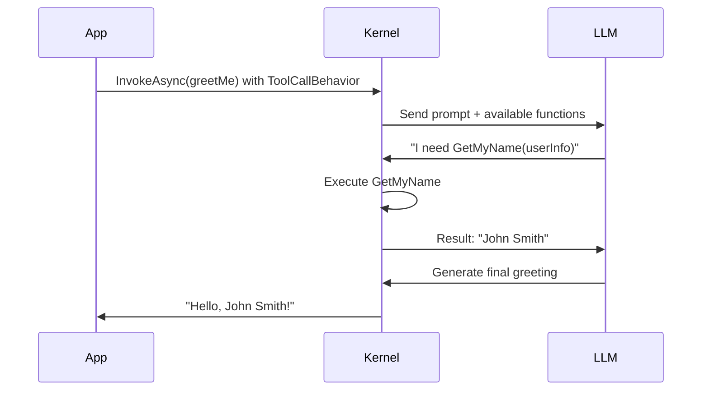

# How to Invoke Functions and Prompts in Semantic Kernel

**Topic**: Function Invocation Patterns  
**Audience**: Developers learning Semantic Kernel  
**Estimated Time**: ~20 minutes  
**Date**: December 13, 2025

---

## 📚 Overview

Semantic Kernel offers multiple ways to work with prompts and functions. Understanding when and how to use each approach is crucial for building effective AI applications. This guide compares four main patterns:

1. **Direct Prompts with ChatHistory** - Low-level, maximum control
2. **InvokePromptAsync** - Simple, one-off prompt execution
3. **Functions with InvokeAsync** - Structured, reusable prompt templates
4. **Automatic Function Calling (Tool Use)** - Intelligent, LLM-orchestrated execution

---

## 🎯 Quick Comparison Table

| Pattern | Control | Reusability | LLM Decision | Complexity | Use Case |
|---------|---------|-------------|--------------|------------|----------|
| **ChatHistory** | ✅✅✅ High | ❌ Low | ❌ No | Low | Raw conversations |
| **InvokePromptAsync** | ✅✅ Medium | ❌ Low | ❌ No | Very Low | Quick tests |
| **InvokeAsync** | ✅✅ Medium | ✅✅✅ High | ❌ No | Medium | Structured workflows |
| **Tool Use** | ✅ Low | ✅✅✅ High | ✅✅✅ Yes | High | Intelligent agents |

---

## 🤔 Why InvokePromptAsync vs ChatHistory?

### The Key Difference

**ChatHistory (Chat Completion):**
```csharp
// For CONVERSATIONS - multi-turn back-and-forth
var history = new ChatHistory();
history.AddUserMessage("What's 2+2?");
var response = await chatService.GetChatMessageContentAsync(history);
history.AddAssistantMessage(response.Content);

// Next turn - AI remembers previous context
history.AddUserMessage("Now multiply that by 3");
var response2 = await chatService.GetChatMessageContentAsync(history);
// AI knows "that" = 4, returns 12
```

**InvokePromptAsync:**
```csharp
// For TASKS - single operations, no conversation memory
var result = await kernel.InvokePromptAsync("What's 2+2?");
// Returns: "4"

// Next call is INDEPENDENT - no memory
var result2 = await kernel.InvokePromptAsync("Now multiply that by 3");
// AI doesn't know what "that" is! ❌
```

### When to Use Each

| Use ChatHistory When: | Use InvokePromptAsync When: |
|----------------------|----------------------------|
| ✅ Building chatbots | ✅ One-off queries |
| ✅ Multi-turn conversations | ✅ Independent tasks |
| ✅ Context matters across turns | ✅ Quick testing/prototyping |
| ✅ "Remember what I said earlier" | ✅ Batch processing (each item separate) |
| ✅ Interactive Q&A sessions | ✅ Simple transformations |

### Example: Conversation vs Task

**Conversation (needs ChatHistory):**
```csharp
// User wants back-and-forth dialogue
var history = new ChatHistory();
history.AddUserMessage("My name is Alice");
var r1 = await chatService.GetChatMessageContentAsync(history);
history.AddAssistantMessage(r1.Content);

history.AddUserMessage("What's my name?");
var r2 = await chatService.GetChatMessageContentAsync(history);
// Returns: "Your name is Alice" ✅
```

**Task (InvokePromptAsync is fine):**
```csharp
// User wants to process independent items
var texts = new[] { "doc1.txt", "doc2.txt", "doc3.txt" };

foreach (var text in texts)
{
    var summary = await kernel.InvokePromptAsync(
        $"Summarize in 2 sentences: {text}"
    );
    Console.WriteLine(summary);
    // Each summary is independent - no conversation needed
}
```

### Why InvokePromptAsync with Tool Use?

Even though there's no conversation, you can still use function calling:

```csharp
kernel.Plugins.AddFromType<MathPlugin>();

var settings = new OpenAIPromptExecutionSettings
{
    ToolCallBehavior = ToolCallBehavior.AutoInvokeKernelFunctions
};

// Single task, but LLM can call functions to help
var result = await kernel.InvokePromptAsync(
    "Calculate square root of 144, then add 10",
    new KernelArguments(settings)
);
// LLM calls: SquareRoot(144) → 12, then Add(12, 10) → 22
// Returns: "The result is 22"
```

### The Bottom Line

- **ChatHistory**: "Let's have a conversation" 💬
- **InvokePromptAsync**: "Do this task" ⚡
- **Both can use function calling** - it's about whether context persists across calls!

---

## 1️⃣ Direct Prompts with ChatHistory

### What It Is

Direct interaction with chat completion services using `ChatHistory` to manage conversation context.

### Characteristics

- **Maximum Control** - You directly manage the entire conversation
- **No Abstraction** - Work directly with the chat completion service
- **Manual Context Management** - You add each message to history
- **Stateful** - History persists across multiple turns

### Code Example

```csharp
using Microsoft.SemanticKernel;
using Microsoft.SemanticKernel.ChatCompletion;

var kernel = Kernel.CreateBuilder()
    .AddOpenAIChatCompletion("gpt-4o-mini", apiKey)
    .Build();

var chatService = kernel.GetRequiredService<IChatCompletionService>();
var history = new ChatHistory();

// Add system message
history.AddSystemMessage("You are a helpful math tutor.");

// First turn
history.AddUserMessage("What is 15 + 27?");
var response1 = await chatService.GetChatMessageContentAsync(history);
history.AddAssistantMessage(response1.Content);
Console.WriteLine($"AI: {response1.Content}");

// Second turn - AI remembers previous context
history.AddUserMessage("Now multiply that by 2");
var response2 = await chatService.GetChatMessageContentAsync(history);
history.AddAssistantMessage(response2.Content);
Console.WriteLine($"AI: {response2.Content}"); // "84" (42 * 2)
```

### With Multi-Modal Content

```csharp
// ChatHistory supports multi-modal content
history.AddUserMessage(new ChatMessageContentItemCollection
{
    new TextContent("What's in this image?"),
    new ImageContent("photo.jpg")
});

var response = await chatService.GetChatMessageContentAsync(history);
Console.WriteLine(response.Content);
```

### When to Use

✅ **Use when:**
- Building conversational chatbots
- Need full control over conversation flow
- Managing complex multi-turn dialogues
- Streaming responses token-by-token
- Working with multi-modal inputs (images + text)

❌ **Don't use when:**
- Simple one-off prompts suffice
- Need reusable prompt templates
- Want LLM to orchestrate function calls

### Key Methods

```csharp
// Adding messages
history.AddSystemMessage("system prompt");
history.AddUserMessage("user input");
history.AddAssistantMessage("AI response");

// Getting responses
var response = await chatService.GetChatMessageContentAsync(history);

// Streaming responses
await foreach (var chunk in chatService.GetStreamingChatMessageContentsAsync(history))
{
    Console.Write(chunk.Content);
}
```

---

## 2️⃣ InvokePromptAsync - Simple Direct Execution

### What It Is

A convenient method to execute a prompt string directly without creating a formal function.

### Characteristics

- **Simplest Approach** - One-liner prompt execution
- **No Function Creation** - Pass prompt as string
- **Stateless** - Each call is independent
- **No Reusability** - Prompt is not saved as a function

### Code Example

```csharp
using Microsoft.SemanticKernel;

var kernel = Kernel.CreateBuilder()
    .AddOpenAIChatCompletion("gpt-4o-mini", apiKey)
    .Build();

// Method 1: Simple prompt
var result1 = await kernel.InvokePromptAsync("What is 2 + 2?");
Console.WriteLine(result1);

// Method 2: With variables using KernelArguments
var result2 = await kernel.InvokePromptAsync(
    "Translate '{{$text}}' to {{$language}}",
    new KernelArguments
    {
        ["text"] = "Hello",
        ["language"] = "Spanish"
    }
);
Console.WriteLine(result2); // "Hola"

// Method 3: With execution settings
var settings = new OpenAIPromptExecutionSettings
{
    Temperature = 0.7,
    MaxTokens = 100
};

var result3 = await kernel.InvokePromptAsync(
    "Write a haiku about {{$topic}}",
    new KernelArguments(settings)
    {
        ["topic"] = "coding"
    }
);
Console.WriteLine(result3);
```

### With Tool Use (Function Calling)

```csharp
// Register plugins
kernel.Plugins.AddFromType<MathPlugin>();

// Enable automatic function calling
var settings = new OpenAIPromptExecutionSettings
{
    ToolCallBehavior = ToolCallBehavior.AutoInvokeKernelFunctions
};

// LLM can call registered functions
var result = await kernel.InvokePromptAsync(
    "Calculate the square root of 144, then add 10",
    new KernelArguments(settings)
);
Console.WriteLine(result); // LLM calls MathPlugin functions
```

### When to Use

✅ **Use when:**
- Quick testing or prototyping
- One-off prompts that won't be reused
- Simple queries without complex templates
- Rapid experimentation

❌ **Don't use when:**
- Need to reuse the same prompt multiple times
- Building production applications
- Require structured prompt templates
- Need explicit function naming/descriptions

### Key Points

- **Return Type**: Returns `FunctionResult` (can `.ToString()`)
- **Variables**: Use `{{$variableName}}` syntax
- **Settings**: Pass via `KernelArguments`
- **Context**: No built-in conversation history

---

## 3️⃣ Functions with InvokeAsync - Structured Templates

### What It Is

Create reusable, named functions from prompt templates, then invoke them explicitly.

### Characteristics

- **Reusable** - Create once, use many times
- **Named & Described** - Functions have identity
- **Parameterized** - Clear input schema with `{{$variables}}`
- **Explicit Invocation** - You decide when to call
- **Can Be Registered** - Add to plugins for organization

### Code Example

```csharp
using Microsoft.SemanticKernel;
using Microsoft.SemanticKernel.Connectors.OpenAI;

var kernel = Kernel.CreateBuilder()
    .AddOpenAIChatCompletion("gpt-4o-mini", apiKey)
    .Build();

// Create a function from prompt template
var translateFunc = kernel.CreateFunctionFromPrompt(
    promptTemplate: @"
        Translate the following text to {{$targetLanguage}}.
        Preserve meaning, tone, and formatting.
        
        Text: {{$text}}
    ",
    functionName: "TranslateText",
    description: "Translates text to a target language",
    executionSettings: new OpenAIPromptExecutionSettings
    {
        Temperature = 0.3,
        MaxTokens = 500
    }
);

// Invoke the function directly
var result = await kernel.InvokeAsync(translateFunc, new KernelArguments
{
    ["text"] = "Good morning!",
    ["targetLanguage"] = "French"
});

Console.WriteLine(result); // "Bonjour !"

// Reuse the same function
var result2 = await kernel.InvokeAsync(translateFunc, new KernelArguments
{
    ["text"] = "Thank you",
    ["targetLanguage"] = "Japanese"
});

Console.WriteLine(result2); // "ありがとうございます"
```

### Multi-Modal Function Example

```csharp
// IMPORTANT: For multi-modal prompts, implement as a C# method with ChatHistory
public class VisionFunctions
{
    private readonly Kernel _kernel;

    public VisionFunctions(Kernel kernel)
    {
        _kernel = kernel;
    }

    [KernelFunction]
    [Description("Analyzes an image based on specified criteria")]
    public async Task<string> AnalyzeImage(
        [Description("Path or URL to the image")] string imageUrl,
        [Description("What to analyze: objects, colors, mood, etc")] string analysisType)
    {
        // Create proper ChatHistory for multi-modal content
        var history = new ChatHistory();
        history.AddSystemMessage("You are an expert image analyst.");
        history.AddUserMessage(new ChatMessageContentItemCollection
        {
            new TextContent($"Analyze this image and describe: {analysisType}"),
            new ImageContent(imageUrl)
        });

        var chatService = _kernel.GetRequiredService<IChatCompletionService>();
        var response = await chatService.GetChatMessageContentAsync(history);
        return response.Content ?? "";
    }
}

// Register and use
kernel.Plugins.AddFromType<VisionFunctions>();

var settings = new OpenAIPromptExecutionSettings
{
    ToolCallBehavior = ToolCallBehavior.AutoInvokeKernelFunctions
};

var result = await kernel.InvokePromptAsync(
    "Analyze photo.jpg for objects, colors, and mood",
    new KernelArguments(settings)
);
// LLM calls: AnalyzeImage(imageUrl="photo.jpg", analysisType="objects, colors, and mood")
```

### Organizing Functions in Plugins

```csharp
// Create multiple related functions
var summarize = kernel.CreateFunctionFromPrompt(
    "Summarize this in 2 sentences: {{$text}}",
    functionName: "Summarize"
);

var elaborate = kernel.CreateFunctionFromPrompt(
    "Expand this into 3 paragraphs: {{$text}}",
    functionName: "Elaborate"
);

// Register as plugin
kernel.Plugins.AddFromFunctions("TextPlugin", new[] { summarize, elaborate });

// Access via plugin
var func = kernel.Plugins.GetFunction("TextPlugin", "Summarize");
var result = await kernel.InvokeAsync(func, new KernelArguments
{
    ["text"] = "Long article..."
});
```

### When to Use

✅ **Use when:**
- Building reusable prompt templates
- Need clear function names and descriptions
- Want to organize related functions into plugins
- Require explicit control over execution flow
- Creating production-ready applications
- Chaining multiple operations

❌ **Don't use when:**
- Only need a quick one-off prompt
- Want LLM to decide which function to call
- Simple queries without parameters

### Key Methods

```csharp
// Creating functions
var func = kernel.CreateFunctionFromPrompt(
    promptTemplate: "...",
    functionName: "MyFunction",
    description: "What this does",
    executionSettings: settings
);

// Invoking functions
var result = await kernel.InvokeAsync(func, arguments);
var result = await kernel.InvokeAsync("PluginName", "FunctionName", arguments);

// Chaining functions
var step1 = await kernel.InvokeAsync(func1, args1);
var step2 = await kernel.InvokeAsync(func2, new() { ["input"] = step1.ToString() });
```

---

## 4️⃣ Automatic Function Calling (Tool Use)

### What It Is

Register functions as "tools" that the LLM can discover and invoke automatically based on user intent.

### Characteristics

- **LLM Orchestrates** - AI decides which functions to call
- **Intelligent Selection** - Based on function descriptions
- **Multi-Function** - Can call multiple functions in sequence
- **Context Aware** - LLM determines arguments from conversation
- **Autonomous** - Minimal manual orchestration needed

### Code Example

```csharp
using System.ComponentModel;
using Microsoft.SemanticKernel;
using Microsoft.SemanticKernel.Connectors.OpenAI;

// Step 1: Define plugin with functions
public class MathPlugin
{
    [KernelFunction]
    [Description("Adds two numbers together")]
    public int Add(
        [Description("First number")] int a,
        [Description("Second number")] int b)
    {
        return a + b;
    }

    [KernelFunction]
    [Description("Multiplies two numbers")]
    public int Multiply(
        [Description("First number")] int a,
        [Description("Second number")] int b)
    {
        return a * b;
    }

    [KernelFunction]
    [Description("Calculates the square root of a number")]
    public double SquareRoot([Description("The number")] double value)
    {
        return Math.Sqrt(value);
    }
}

// Step 2: Register plugin
var kernel = Kernel.CreateBuilder()
    .AddOpenAIChatCompletion("gpt-4o-mini", apiKey)
    .Build();

kernel.Plugins.AddFromType<MathPlugin>();

// Step 3: Enable automatic function calling
var settings = new OpenAIPromptExecutionSettings
{
    ToolCallBehavior = ToolCallBehavior.AutoInvokeKernelFunctions
};

// Step 4: Ask in natural language - LLM decides what to call
var result = await kernel.InvokePromptAsync(
    "What is the square root of 144, then multiply it by 5?",
    new KernelArguments(settings)
);

Console.WriteLine(result);
// LLM automatically:
// 1. Calls SquareRoot(144) → 12
// 2. Calls Multiply(12, 5) → 60
// 3. Returns "The result is 60"
```

### 🌟 CRITICAL PATTERN: Prompt Templates as Callable Tools

This is one of the **most powerful and essential patterns** in Semantic Kernel - registering **prompt templates themselves** as function tools that the LLM can call.

#### Why This Matters

When you create a prompt with `CreateFunctionFromPrompt`, you can register it as a tool. The LLM then:
1. **Sees the function description** in its tool list
2. **Decides when to call it** based on user intent
3. **Executes the prompt** with appropriate parameters
4. **Uses the result** to continue reasoning

**This is different from:**
- ❌ C# methods that happen to use prompts internally
- ✅ **Pure prompt templates registered as LLM-callable tools**

#### Essential Use Cases

**Use this pattern when:**
- ✅ You want the LLM to delegate specific tasks to specialized prompts
- ✅ Different prompts have different expertise (translation, summarization, analysis)
- ✅ You need complex prompt logic that LLM shouldn't handle directly
- ✅ You want to control prompt templates (temperature, tokens) per function
- ✅ Building AI agents with specialized capabilities

**Don't use when:**
- ❌ Simple one-off queries (use InvokePromptAsync)
- ❌ Fixed sequential workflow (use InvokeAsync chaining)
- ❌ No decision-making needed (direct invocation is simpler)

#### Complete Example: Text Processing Agent

```csharp
using Microsoft.SemanticKernel;
using Microsoft.SemanticKernel.ChatCompletion;
using Microsoft.SemanticKernel.Connectors.OpenAI;

// Step 1: Create prompt functions with specialized capabilities
var summarizer = kernel.CreateFunctionFromPrompt(
    promptTemplate: @"
You are an expert at concise summarization.
Summarize the following text in exactly {{$sentenceCount}} sentences.
Focus on key points and maintain factual accuracy.

Text: {{$text}}
    ",
    functionName: "Summarize",
    description: "Summarizes text to specified number of sentences. Use when user wants a shorter version.",
    executionSettings: new OpenAIPromptExecutionSettings
    {
        Temperature = 0.3,  // Low for consistency
        MaxTokens = 500
    }
);

var translator = kernel.CreateFunctionFromPrompt(
    promptTemplate: @"
You are a professional translator.
Translate the following text to {{$targetLanguage}}.
Preserve tone, style, and cultural context.

Text: {{$text}}
    ",
    functionName: "Translate",
    description: "Translates text to any target language. Use when user wants text in different language.",
    executionSettings: new OpenAIPromptExecutionSettings
    {
        Temperature = 0.2,  // Very low for accuracy
        MaxTokens = 1000
    }
);

var analyzer = kernel.CreateFunctionFromPrompt(
    promptTemplate: @"
You are a sentiment and tone analyzer.
Analyze the following text and provide:
1. Overall sentiment (positive/negative/neutral)
2. Tone (formal/casual/aggressive/friendly)
3. Key themes
4. Emotional intensity (1-10)

Text: {{$text}}

Format as JSON.
    ",
    functionName: "AnalyzeText",
    description: "Analyzes sentiment, tone, themes of text. Use when user asks about mood, feeling, or style.",
    executionSettings: new OpenAIPromptExecutionSettings
    {
        Temperature = 0.1,  // Very precise
        MaxTokens = 300
    }
);

var paraphraser = kernel.CreateFunctionFromPrompt(
    promptTemplate: @"
Rewrite the following text to be more {{$style}}.
Preserve the original meaning but adjust the writing style.

Original: {{$text}}
    ",
    functionName: "Rewrite",
    description: "Rewrites text in different style (formal, casual, professional, simple). Use when user wants text rephrased.",
    executionSettings: new OpenAIPromptExecutionSettings
    {
        Temperature = 0.7,  // Creative rewriting
        MaxTokens = 600
    }
);

// Step 2: Register ALL prompt functions as a plugin
kernel.Plugins.AddFromFunctions("TextProcessing", new[]
{
    summarizer,
    translator,
    analyzer,
    paraphraser
});

// Step 3: Enable automatic function calling
var settings = new OpenAIPromptExecutionSettings
{
    ToolCallBehavior = ToolCallBehavior.AutoInvokeKernelFunctions,
    Temperature = 0.0  // LLM makes deterministic tool choices
};

var chatService = kernel.GetRequiredService<IChatCompletionService>();
var history = new ChatHistory();

// Example 1: LLM calls Summarize prompt
history.AddUserMessage("Summarize this article in 3 sentences: [long article text...]");
var response1 = await chatService.GetChatMessageContentAsync(history, settings, kernel);
// LLM automatically:
// 1. Sees "Summarize" tool with description
// 2. Calls Summarize(text="[article]", sentenceCount="3")
// 3. Prompt executes with Temperature=0.3
// 4. Returns summary to LLM
// 5. LLM presents result to user

// Example 2: LLM calls Translate prompt
history.AddUserMessage("Convert this to Spanish: Hello, how are you?");
var response2 = await chatService.GetChatMessageContentAsync(history, settings, kernel);
// LLM automatically calls: Translate(text="Hello, how are you?", targetLanguage="Spanish")

// Example 3: LLM calls AnalyzeText prompt
history.AddUserMessage("What's the tone of this email: [email text]");
var response3 = await chatService.GetChatMessageContentAsync(history, settings, kernel);
// LLM automatically calls: AnalyzeText(text="[email]")

// Example 4: LLM chains multiple prompts
history.AddUserMessage("Translate this to French and then summarize it in 2 sentences: [text]");
var response4 = await chatService.GetChatMessageContentAsync(history, settings, kernel);
// LLM automatically:
// 1. Calls Translate(text="[text]", targetLanguage="French")
// 2. Takes translated result
// 3. Calls Summarize(text="[translated]", sentenceCount="2")
// 4. Returns final summary
```

#### Real-World Example: Customer Support Agent

```csharp
// Create specialized prompt functions for customer support
var sentimentChecker = kernel.CreateFunctionFromPrompt(
    promptTemplate: @"
Analyze if this customer message is urgent or angry.
Return 'URGENT' if immediate attention needed, 'NORMAL' otherwise.

Message: {{$message}}

Return ONLY the classification.
    ",
    functionName: "CheckUrgency",
    description: "Determines if customer message requires urgent response",
    executionSettings: new OpenAIPromptExecutionSettings
    {
        Temperature = 0.0,
        MaxTokens = 50
    }
);

var responseGenerator = kernel.CreateFunctionFromPrompt(
    promptTemplate: @"
You are a professional customer support agent.
Generate a {{$tone}} response to this customer inquiry.

Customer message: {{$message}}

Be empathetic, clear, and solution-oriented.
    ",
    functionName: "GenerateResponse",
    description: "Creates customer support response in specified tone (professional, friendly, apologetic)",
    executionSettings: new OpenAIPromptExecutionSettings
    {
        Temperature = 0.7,
        MaxTokens = 400
    }
);

var knowledgeSearch = kernel.CreateFunctionFromPrompt(
    promptTemplate: @"
Based on this customer question, identify the relevant help article topics.
Return comma-separated topics.

Question: {{$question}}
    ",
    functionName: "FindHelpTopics",
    description: "Identifies which help articles are relevant to customer question",
    executionSettings: new OpenAIPromptExecutionSettings
    {
        Temperature = 0.2,
        MaxTokens = 100
    }
);

// Register support functions
kernel.Plugins.AddFromFunctions("CustomerSupport", new[]
{
    sentimentChecker,
    responseGenerator,
    knowledgeSearch
});

var settings = new OpenAIPromptExecutionSettings
{
    ToolCallBehavior = ToolCallBehavior.AutoInvokeKernelFunctions
};

// The AI agent automatically orchestrates these prompts
var customerMessage = "I've been waiting 3 days for my refund! This is unacceptable!";
var result = await kernel.InvokePromptAsync(
    $"Handle this customer message: {customerMessage}",
    new KernelArguments(settings)
);

// LLM automatically:
// 1. Calls CheckUrgency(message) → "URGENT"
// 2. Calls FindHelpTopics(question) → "refunds, processing-time"
// 3. Calls GenerateResponse(message, tone="apologetic")
// 4. Combines everything into final response
```

#### Multi-Modal Prompts as Tools

```csharp
// Create C# methods for multi-modal prompts (can't use CreateFunctionFromPrompt for images)
public class VisionTools
{
    private readonly Kernel _kernel;

    public VisionTools(Kernel kernel) => _kernel = kernel;

    [KernelFunction]
    [Description("Analyzes images for specific purpose (safety, quality, content, text extraction)")]
    public async Task<string> AnalyzeImage(
        [Description("Path or URL to the image")] string imageUrl,
        [Description("Analysis purpose: safety, quality, content, etc")] string purpose)
    {
        var history = new ChatHistory();
        history.AddSystemMessage($"You are an expert at analyzing images for {purpose}. Provide detailed, structured analysis.");
        history.AddUserMessage(new ChatMessageContentItemCollection
        {
            new TextContent($"Analyze this image for: {purpose}"),
            new ImageContent(imageUrl)
        });

        var chatService = _kernel.GetRequiredService<IChatCompletionService>();
        var response = await chatService.GetChatMessageContentAsync(history);
        return response.Content ?? "";
    }

    [KernelFunction]
    [Description("OCR - extracts all text visible in an image")]
    public async Task<string> ExtractText(
        [Description("Path or URL to the image with text")] string imageUrl)
    {
        var history = new ChatHistory();
        history.AddUserMessage(new ChatMessageContentItemCollection
        {
            new TextContent("Extract all visible text from this image. Return only the text."),
            new ImageContent(imageUrl)
        });

        var chatService = _kernel.GetRequiredService<IChatCompletionService>();
        var response = await chatService.GetChatMessageContentAsync(history);
        return response.Content ?? "";
    }
}

kernel.Plugins.AddFromFunctions("VisionTools", new[] { imageAnalyzer, textExtractor });

var settings = new OpenAIPromptExecutionSettings
{
    ToolCallBehavior = ToolCallBehavior.AutoInvokeKernelFunctions
};

// LLM decides which vision prompt to use
var result = await kernel.InvokePromptAsync(
    "What does the sign in photo.jpg say?",
    new KernelArguments(settings)
);
// LLM calls: ExtractText(imageUrl="photo.jpg")

var result2 = await kernel.InvokePromptAsync(
    "Check photo.jpg for safety violations",
    new KernelArguments(settings)
);
// LLM calls: AnalyzeImage(imageUrl="photo.jpg", purpose="safety")
```

#### Why This Pattern is Essential

**1. Specialized Expertise**
```csharp
// Each prompt is an expert in its domain
var legalReviewer = kernel.CreateFunctionFromPrompt(
    "Review this contract clause for legal issues: {{$clause}}",
    functionName: "ReviewLegalClause",
    description: "Legal expert that reviews contract clauses"
);

var technicalReviewer = kernel.CreateFunctionFromPrompt(
    "Review this code for bugs and best practices: {{$code}}",
    functionName: "ReviewCode", 
    description: "Senior developer that reviews code quality"
);

// LLM routes to correct expert automatically
```

**2. Controlled Execution Settings**
```csharp
// Translation needs consistency (low temp)
var translator = kernel.CreateFunctionFromPrompt(
    "Translate to {{$lang}}: {{$text}}",
    executionSettings: new OpenAIPromptExecutionSettings { Temperature = 0.1 }
);

// Creative writing needs variety (high temp)
var storyteller = kernel.CreateFunctionFromPrompt(
    "Write a {{$genre}} story about {{$topic}}",
    executionSettings: new OpenAIPromptExecutionSettings { Temperature = 0.9 }
);
```

**3. Composability**
```csharp
// LLM can chain prompts intelligently
var result = await kernel.InvokePromptAsync(
    "Translate this to French, then check if the tone is professional",
    new KernelArguments(settings)
);
// Calls: Translate → AnalyzeText (automatically!)
```

**4. Reusability Across Conversations**
```csharp
// Same prompt functions work in any context
var history = new ChatHistory();
history.AddUserMessage("Summarize this...");
var r1 = await chatService.GetChatMessageContentAsync(history, settings, kernel);

history.AddUserMessage("Now translate it to Spanish");
var r2 = await chatService.GetChatMessageContentAsync(history, settings, kernel);
// Same Summarize and Translate tools available throughout conversation
```

#### Best Practices

```csharp
// ✅ GOOD: Clear, specific descriptions
var func = kernel.CreateFunctionFromPrompt(
    "Summarize text in {{$count}} sentences: {{$text}}",
    functionName: "Summarize",
    description: "Summarizes text to exact number of sentences. Use when user wants shorter version or summary."
);

// ❌ BAD: Vague description
var func = kernel.CreateFunctionFromPrompt(
    "Summarize text in {{$count}} sentences: {{$text}}",
    functionName: "Summarize",
    description: "Does summarization"  // LLM won't know when to use this
);

// ✅ GOOD: Appropriate temperature per function
kernel.CreateFunctionFromPrompt(
    "Translate to {{$lang}}: {{$text}}",
    executionSettings: new OpenAIPromptExecutionSettings { Temperature = 0.1 }  // Consistent
);

kernel.CreateFunctionFromPrompt(
    "Write creative poem about {{$topic}}",
    executionSettings: new OpenAIPromptExecutionSettings { Temperature = 0.9 }  // Creative
);

// ✅ GOOD: Well-defined parameters
"Analyze sentiment of: {{$text}}"  // Clear what goes where

// ❌ BAD: Ambiguous parameters  
"Analyze: {{$input}}"  // What is 'input'?
```

#### Debugging Tool Calls

```csharp
// See which prompt functions are being called
kernel.FunctionInvoking += (sender, e) =>
{
    Console.WriteLine($"🔧 LLM calling prompt function: {e.Function.Name}");
    var args = string.Join(", ", e.Arguments.Select(a => $"{a.Key}={a.Value}"));
    Console.WriteLine($"   Arguments: {args}");
};

kernel.FunctionInvoked += (sender, e) =>
{
    Console.WriteLine($"✅ Result: {e.Result}\n");
};

var result = await kernel.InvokePromptAsync(
    "Translate 'Hello' to Spanish and French",
    new KernelArguments(settings)
);

// Output:
// 🔧 LLM calling prompt function: Translate
//    Arguments: text=Hello, targetLanguage=Spanish
// ✅ Result: Hola
// 🔧 LLM calling prompt function: Translate
//    Arguments: text=Hello, targetLanguage=French
// ✅ Result: Bonjour
```

#### Key Takeaways

1. **Prompt templates ARE functions** - They can be called by the LLM just like C# methods
2. **Descriptions are critical** - LLM uses them to decide which tool to call
3. **Each prompt = specialized capability** - Translation, analysis, generation, etc.
4. **Control per function** - Each prompt has its own temperature, tokens, settings
5. **LLM orchestrates** - Automatically chains prompts based on user intent
6. **Reusable across conversations** - Register once, use throughout entire session
7. **Essential for agents** - Building AI agents with specialized skills requires this pattern

---

### Multi-Modal Function Calling (C# Methods)

For comparison, here's the pattern using C# methods that internally use prompts:

```csharp
public class VisionPlugin
{
    private readonly Kernel _kernel;

    public VisionPlugin(Kernel kernel)
    {
        _kernel = kernel;
    }

    [KernelFunction]
    [Description("Analyzes an image and provides a detailed description")]
    public async Task<string> AnalyzeImage(
        [Description("Path or URL to the image")] string imagePath)
    {
        var history = new ChatHistory();
        history.AddUserMessage(new ChatMessageContentItemCollection
        {
            new TextContent("Describe this image in detail"),
            new ImageContent(imagePath)
        });

        var chatService = _kernel.GetRequiredService<IChatCompletionService>();
        var response = await chatService.GetChatMessageContentAsync(history);
        return response.Content ?? "";
    }

    [KernelFunction]
    [Description("Extracts all text from an image using OCR")]
    public async Task<string> ExtractText(
        [Description("Path to image with text")] string imagePath)
    {
        var history = new ChatHistory();
        history.AddUserMessage(new ChatMessageContentItemCollection
        {
            new TextContent("Extract all visible text"),
            new ImageContent(imagePath)
        });

        var chatService = _kernel.GetRequiredService<IChatCompletionService>();
        var response = await chatService.GetChatMessageContentAsync(history);
        return response.Content ?? "";
    }
}

// Usage
kernel.Plugins.AddFromType<VisionPlugin>();

var settings = new OpenAIPromptExecutionSettings
{
    ToolCallBehavior = ToolCallBehavior.AutoInvokeKernelFunctions
};

var result = await kernel.InvokePromptAsync(
    "Look at photo.jpg and tell me what text is visible",
    new KernelArguments(settings)
);
// LLM automatically calls ExtractText("photo.jpg")
```

### Function Calling with ChatHistory

```csharp
var chatService = kernel.GetRequiredService<IChatCompletionService>();
var history = new ChatHistory();

history.AddSystemMessage("You are a helpful assistant with access to tools.");

var settings = new OpenAIPromptExecutionSettings
{
    ToolCallBehavior = ToolCallBehavior.AutoInvokeKernelFunctions
};

// Multi-turn conversation with function calling
history.AddUserMessage("I have photos: day1.jpg, day2.jpg, day3.jpg");
var response1 = await chatService.GetChatMessageContentAsync(history, settings, kernel);
history.AddAssistantMessage(response1.Content);

history.AddUserMessage("Compare them and tell me what activities happened each day");
var response2 = await chatService.GetChatMessageContentAsync(history, settings, kernel);
// LLM calls AnalyzeImage for each photo, then synthesizes comparison
```

### Important: Context for Function Calls

**Key Insight**: When the LLM calls a function, it does NOT automatically pass the entire ChatHistory to that function.

```csharp
// ❌ WRONG ASSUMPTION
// The function does NOT receive the conversation history automatically
[KernelFunction]
public string MyFunction(string param)
{
    // This function has NO ACCESS to previous conversation turns
    // It only receives the explicit parameters
    return "result";
}

// ✅ CORRECT APPROACH 1: Function manages its own context
[KernelFunction]
public async Task<string> AnalyzeImage(string imagePath)
{
    // Create NEW ChatHistory specifically for this function
    var history = new ChatHistory();
    history.AddUserMessage(new ChatMessageContentItemCollection
    {
        new TextContent("Analyze this image"),
        new ImageContent(imagePath)
    });
    
    var chatService = _kernel.GetRequiredService<IChatCompletionService>();
    var response = await chatService.GetChatMessageContentAsync(history);
    return response.Content;
}

// ✅ CORRECT APPROACH 2: Pass context as parameter
[KernelFunction]
[Description("Analyzes content with given context")]
public string AnalyzeWithContext(
    [Description("The content to analyze")] string content,
    [Description("Previous conversation context")] string context)
{
    // Use the context parameter
    return $"Based on context '{context}', analyzing: {content}";
}
```

**How Context Works:**

1. **Main Conversation** - Has ChatHistory with full context
2. **LLM Decision** - LLM sees function descriptions and decides to call one
3. **Function Execution** - Function receives ONLY its declared parameters
4. **Function Result** - Returned to main conversation as a "tool call result"
5. **LLM Synthesis** - LLM uses the result in context of the conversation

```csharp
// Example flow
history.AddUserMessage("My favorite color is blue. Analyze image.jpg");

// LLM calls AnalyzeImage("image.jpg")
// → Function does NOT know "favorite color is blue"
// → Function creates its own ChatHistory for image analysis
// → Function returns: "Image shows a red car"

// LLM receives tool result and can combine:
// "The image shows a red car, which is different from your favorite color blue."
```

### Tool Call Behavior Options

```csharp
// Option 1: Auto-invoke (most common)
ToolCallBehavior.AutoInvokeKernelFunctions
// LLM calls functions automatically and gets results

// Option 2: Enable but don't auto-invoke
ToolCallBehavior.EnableKernelFunctions
// LLM suggests functions but YOU invoke them manually

// Option 3: Require specific functions
ToolCallBehavior.RequireFunction(kernel.Plugins["Math"]["Add"])
// LLM MUST use specified function
```

### When to Use

✅ **Use when:**
- Building intelligent agents that decide actions
- User requests are open-ended and varied
- Want LLM to orchestrate complex workflows
- Need dynamic function selection
- Creating AI assistants with tools/capabilities
- LLM should determine the best approach

❌ **Don't use when:**
- Workflow is predetermined and fixed
- Simple linear execution is sufficient
- Need guaranteed execution order
- Debugging/testing specific function behavior
- Cost is a major concern (more LLM calls)

---

## 🔄 Comparison Examples: Same Task, Different Approaches

### Task: Translate text and count words

#### Approach 1: ChatHistory (Manual)

```csharp
var history = new ChatHistory();
history.AddUserMessage("Translate 'Hello world' to Spanish");
var translation = await chatService.GetChatMessageContentAsync(history);
history.AddAssistantMessage(translation.Content);

history.AddUserMessage($"Count words in: {translation.Content}");
var count = await chatService.GetChatMessageContentAsync(history);
Console.WriteLine(count.Content);
```

#### Approach 2: InvokePromptAsync (Quick)

```csharp
var translation = await kernel.InvokePromptAsync(
    "Translate 'Hello world' to Spanish"
);

var count = await kernel.InvokePromptAsync(
    $"Count words in: {translation}"
);

Console.WriteLine(count);
```

#### Approach 3: InvokeAsync (Structured)

```csharp
var translateFunc = kernel.CreateFunctionFromPrompt(
    "Translate '{{$text}}' to {{$language}}",
    functionName: "Translate"
);

var countFunc = kernel.CreateFunctionFromPrompt(
    "Count words in: {{$text}}",
    functionName: "CountWords"
);

var translation = await kernel.InvokeAsync(translateFunc, new()
{
    ["text"] = "Hello world",
    ["language"] = "Spanish"
});

var count = await kernel.InvokeAsync(countFunc, new()
{
    ["text"] = translation.ToString()
});

Console.WriteLine(count);
```

#### Approach 4: Tool Use (Intelligent)

```csharp
public class TextPlugin
{
    [KernelFunction]
    [Description("Translates text to target language")]
    public string Translate(
        [Description("Text to translate")] string text,
        [Description("Target language")] string language)
    {
        // Implementation
        return translated;
    }

    [KernelFunction]
    [Description("Counts words in text")]
    public int CountWords([Description("The text")] string text)
    {
        return text.Split(' ').Length;
    }
}

kernel.Plugins.AddFromType<TextPlugin>();

var settings = new OpenAIPromptExecutionSettings
{
    ToolCallBehavior = ToolCallBehavior.AutoInvokeKernelFunctions
};

var result = await kernel.InvokePromptAsync(
    "Translate 'Hello world' to Spanish and count the words",
    new KernelArguments(settings)
);
// LLM automatically: Translate → CountWords → synthesize answer
Console.WriteLine(result);
```

---

## 🎓 Key Differences: InvokePromptAsync vs InvokeAsync

### InvokePromptAsync

```csharp
// Direct prompt execution
await kernel.InvokePromptAsync("What is 2+2?");
await kernel.InvokePromptAsync("Translate {{$text}}", args);
```

**Characteristics:**
- ✅ Takes a **prompt string** directly
- ✅ No function creation needed
- ✅ Quickest for one-off queries
- ❌ Not reusable
- ❌ No function name/description
- ❌ Cannot be added to plugins

### InvokeAsync

```csharp
// Function execution
var func = kernel.CreateFunctionFromPrompt("What is 2+2?");
await kernel.InvokeAsync(func);
await kernel.InvokeAsync(func, args);
```

**Characteristics:**
- ✅ Takes a **KernelFunction** object
- ✅ Reusable across multiple calls
- ✅ Has name and description
- ✅ Can be registered in plugins
- ✅ Better for LLM function calling
- ⚠️ Requires function creation first

### When to Use Each

| Scenario | Use |
|----------|-----|
| Quick test/prototype | `InvokePromptAsync` |
| One-time query | `InvokePromptAsync` |
| Reusable operation | Create function + `InvokeAsync` |
| Plugin function | Create function + `InvokeAsync` |
| LLM should call it | Create function + Tool Use |
| Production code | Create function + `InvokeAsync` |

---

## 🔗 InvokeAsync with Automatic Function Calling

### Can InvokeAsync Trigger Other Functions?

**YES!** When you call `InvokeAsync`, you can enable `ToolCallBehavior` so the **LLM can discover and call other registered functions** to help complete the task.

#### Simple Example: GreetMe Calling GetMyName

```csharp
// 1. Create a main function
var greetMe = kernel.CreateFunctionFromPrompt(
    "Generate a personalized greeting for {{$name}}",
    functionName: "GreetMe",
    description: "Generates a personalized greeting"
);

// 2. Create helper function
var getMyName = kernel.CreateFunctionFromPrompt(
    "Extract the full name from: {{$userInfo}}",
    functionName: "GetMyName",
    description: "Extracts name from user information"
);

// 3. Register both as plugin
kernel.Plugins.AddFromFunctions("GreetingPlugin", [greetMe, getMyName]);

// 4. Enable automatic function calling
var settings = new OpenAIPromptExecutionSettings
{
    ToolCallBehavior = ToolCallBehavior.AutoInvokeKernelFunctions
};

// 5. Call GreetMe - LLM automatically calls GetMyName!
var result = await kernel.InvokeAsync(
    greetMe,
    new KernelArguments(settings)
    {
        ["userInfo"] = "John Smith, age 35"
    }
);

// Behind the scenes:
// 1. LLM sees it needs a name to greet
// 2. LLM calls GetMyName(userInfo) → "John Smith"
// 3. LLM generates: "Hello, John Smith! How are you today?"

Console.WriteLine(result);
```

#### Real-World Example: Customer Support

```csharp
// Main function
var handleQuery = kernel.CreateFunctionFromPrompt(@"
Handle this customer query professionally:
Customer: {{$query}}
Order ID: {{$orderId}}",
    functionName: "HandleCustomerQuery",
    description: "Handles customer support queries"
);

// Helper functions the LLM can call
var getOrderStatus = kernel.CreateFunctionFromPrompt(
    "Return status for order {{$orderId}}: 'Shipped', 'Processing', or 'Delivered'",
    functionName: "GetOrderStatus",
    description: "Gets order status"
);

var initiateRefund = kernel.CreateFunctionFromPrompt(
    "Start refund for order {{$orderId}} with reason: {{$reason}}",
    functionName: "InitiateRefund",
    description: "Initiates refund process"
);

// Register as plugin
kernel.Plugins.AddFromFunctions("SupportPlugin", [
    handleQuery, getOrderStatus, initiateRefund
]);

// Enable auto calling
var settings = new OpenAIPromptExecutionSettings
{
    ToolCallBehavior = ToolCallBehavior.AutoInvokeKernelFunctions
};

// Query 1: Status check
var result1 = await kernel.InvokeAsync(
    handleQuery,
    new KernelArguments(settings)
    {
        ["query"] = "Where is my order?",
        ["orderId"] = "ORD-12345"
    }
);
// LLM calls: GetOrderStatus("ORD-12345") → "Shipped"
// Response: "Your order has been shipped!"

// Query 2: Refund request
var result2 = await kernel.InvokeAsync(
    handleQuery,
    new KernelArguments(settings)
    {
        ["query"] = "I want to return this",
        ["orderId"] = "ORD-67890"
    }
);
// LLM calls: InitiateRefund("ORD-67890", "customer request")
// Response: "I've initiated your refund for order ORD-67890."
```

### How It Works



### Key Requirements

1. **Register as Plugin**: `kernel.Plugins.AddFromFunctions("Name", [functions])`
2. **Enable Tool Calling**: `ToolCallBehavior.AutoInvokeKernelFunctions`
3. **Good Descriptions**: Clear `description` for each function

### Why This is Powerful

✅ **Composability**: Break complex tasks into reusable functions  
✅ **Intelligence**: LLM decides which functions to call  
✅ **Flexibility**: Same function solves different problems  
✅ **Testability**: Test each function independently  

---

## 🎯 Decision Tree: Which Pattern to Use?

```text
Start: Need to execute a prompt
│
├─ Is this a multi-turn conversation?
│  └─ YES → Use ChatHistory
│     └─ Need function calling?
│        ├─ YES → ChatHistory + ToolCallBehavior
│        └─ NO → ChatHistory alone
│
├─ Is this a one-off quick test?
│  └─ YES → Use InvokePromptAsync
│
├─ Will this prompt be reused?
│  └─ YES → Create function + InvokeAsync
│     └─ Should LLM decide when to call it?
│        ├─ YES → Register plugin + ToolCallBehavior
│        └─ NO → Direct InvokeAsync
│
└─ Do you want LLM to orchestrate multiple operations?
   └─ YES → Register plugins + InvokePromptAsync with ToolCallBehavior
```

---

## 📊 Summary Table

| Aspect | ChatHistory | InvokePromptAsync | InvokeAsync | Tool Use |
|--------|-------------|-------------------|-------------|----------|
| **Setup Complexity** | Low | Very Low | Medium | High |
| **Conversation Memory** | ✅ Yes | ❌ No | ❌ No | ✅ Yes (with ChatHistory) |
| **Reusability** | ❌ Manual | ❌ No | ✅ Yes | ✅ Yes |
| **LLM Orchestration** | ❌ No | ❌ No | ❌ No | ✅ Yes |
| **Multi-Turn** | ✅ Native | ❌ Single | ❌ Single | ✅ Native |
| **Plugin Integration** | N/A | ❌ No | ✅ Yes | ✅ Yes |
| **Debugging** | Hard | Easy | Medium | Very Hard |
| **Cost** | Low | Low | Low | Higher |
| **Best For** | Chatbots | Quick tests | Workflows | Agents |

---

## 💡 Best Practices

### 1. Start Simple, Scale Up

```csharp
// Development: Quick testing
var result = await kernel.InvokePromptAsync("Test prompt");

// Production: Structured
var func = kernel.CreateFunctionFromPrompt("Test prompt", "TestFunc");
var result = await kernel.InvokeAsync(func);

// Advanced: Intelligent
kernel.Plugins.AddFromFunctions("Test", new[] { func });
var result = await kernel.InvokePromptAsync(
    "User request",
    new(new OpenAIPromptExecutionSettings {
        ToolCallBehavior = ToolCallBehavior.AutoInvokeKernelFunctions
    })
);
```

### 2. Use ChatHistory for Conversations

```csharp
// ✅ GOOD: Persistent context
var history = new ChatHistory();
history.AddSystemMessage("You are a tutor");
history.AddUserMessage("Explain recursion");
var r1 = await chatService.GetChatMessageContentAsync(history);
history.AddAssistantMessage(r1.Content);
history.AddUserMessage("Give me an example");  // Knows context
var r2 = await chatService.GetChatMessageContentAsync(history);

// ❌ BAD: No context
var r1 = await kernel.InvokePromptAsync("Explain recursion");
var r2 = await kernel.InvokePromptAsync("Give me an example");  // Lost context!
```

### 3. Clear Function Descriptions for Tool Use

```csharp
// ✅ GOOD: Clear, detailed descriptions
[KernelFunction]
[Description("Calculates the area of a rectangle by multiplying width and height")]
public double CalculateRectangleArea(
    [Description("Width of the rectangle in meters")] double width,
    [Description("Height of the rectangle in meters")] double height)
{
    return width * height;
}

// ❌ BAD: Vague descriptions
[KernelFunction]
[Description("Does calculation")]
public double Calculate(double a, double b)
{
    return a * b;
}
```

### 4. Function Context Management

```csharp
// ✅ GOOD: Function creates its own context when needed
[KernelFunction]
public async Task<string> AnalyzeImage(string path)
{
    var localHistory = new ChatHistory();
    localHistory.AddUserMessage(new ChatMessageContentItemCollection
    {
        new TextContent("Analyze this"),
        new ImageContent(path)
    });
    var response = await chatService.GetChatMessageContentAsync(localHistory);
    return response.Content;
}

// ❌ BAD: Assuming global context exists
[KernelFunction]
public string AnalyzeImage(string path)
{
    // Where is the context coming from?
    return "Analysis...";
}
```

---

## 🎓 Key Takeaways

1. **ChatHistory** - Use for multi-turn conversations with full control
2. **InvokePromptAsync** - Use for quick, one-off prompts without reusability needs
3. **InvokeAsync** - Use for structured, reusable prompt templates
4. **Tool Use** - Use when LLM should intelligently select and orchestrate functions
5. **Context** - Functions don't automatically inherit conversation context; manage it explicitly
6. **Descriptions** - Clear function descriptions are crucial for effective tool use
7. **Trade-offs** - Balance control vs convenience vs intelligence based on requirements

---

## 📚 Additional Resources

- [Semantic Kernel Function Calling](https://learn.microsoft.com/en-us/semantic-kernel/concepts/plugins/)
- [ChatHistory Documentation](https://learn.microsoft.com/en-us/semantic-kernel/concepts/chat-history/)
- [OpenAI Function Calling](https://platform.openai.com/docs/guides/function-calling)
- [Prompt Engineering Guide](https://www.promptingguide.ai/)

---

**Next**: Apply these patterns in lab exercises to solidify understanding! 🚀
